# COVE — Entity Relationship Diagram v2.1

**Jenis:** Target Logical Data Model  
**Tanggal:** 7 September 2026  
**Pasangan dokumen:** `COVE_PRD_v2.0_Product_End_State.md`  
**Database target:** PostgreSQL/Supabase  
**Revisi isi:** 2.1 — tambahan Growth, Feedback & Recovery Center  

> ERD ini menjelaskan bentuk data akhir yang dibutuhkan produk. Ini bukan klaim bahwa seluruh tabel sudah sama persis di repository. Sebelum migration baru dibuat, tabel target wajib dipetakan ke tabel aktual dan perubahan dilakukan secara aditif tanpa menghapus data pelanggan.

> **Pembaruan 7 September 2026:** §1–§22 dan diagram inti dipertahankan. §23–§31 menambahkan model logical untuk 52 requirement tambahan pada Addendum A PRD; total requirement pasangan dokumen adalah 149. Nama berkas v2.0 dipertahankan agar tautan lama tetap berlaku; versi isi sekarang v2.1. Entitas baru berstatus PLANNED, bukan migration yang telah dieksekusi.

---

## 1. Tujuan Model Data

Model data harus menjamin:

1. isolasi tenant;
2. keterlacakan setiap Rupiah dari progres sampai kas;
3. dukungan alokasi parsial antartahap;
4. pencegahan double-count;
5. audit trail immutable;
6. pemisahan invoice proyek dari invoice SaaS;
7. subscription dan entitlement yang ditegakkan server-side;
8. import, dokumen, tindakan, dan snapshot yang dapat diaudit.

---

## 2. Peta Domain

| Domain | Prefix/kelompok | Fungsi |
|---|---|---|
| Identity & Tenant | `organizations`, `profiles`, `*_memberships` | pengguna, organisasi, role |
| Project Commercial | `projects`, `contracts`, stage records | Progress-to-Cash pelanggan |
| Action & Evidence | `action_*`, `documents`, `imports`, `audit_logs` | tindakan, bukti, histori |
| SaaS Billing | `plans`, `subscriptions`, `billing_*`, `payments` | penagihan COVE kepada pelanggan |
| Platform Operations | `platform_admins`, `reconciliation_*`, metrics | operasi internal COVE |
| Growth & Recovery | `growth_*`, `checkout_attempts`, `recovery_*` | prospek SaaS COVE dan follow-up berizin; platform-scoped |
| Marketing Measurement | `marketing_destinations`, `conversion_*` | pengiriman event dan atribusi, bukan ledger pembayaran |
| Customer Feedback | `support_*`, `feature_*`, `feedback_*` | permukaan customer privat dan proses internal support/product |

### Pemisahan yang tidak boleh dilanggar

| Data pelanggan | Data bisnis COVE |
|---|---|
| `project_invoices` | `billing_invoices` |
| `cash_receipts` | `payments` |
| collection owner proyek | payment provider Mayar |
| nilai pekerjaan konstruksi | biaya langganan SaaS |

Tidak boleh ada webhook pembayaran subscription yang mencatat penerimaan pada `cash_receipts`.

Tidak boleh mengambil kontak owner/MK dari domain project sebagai lead marketing COVE. Status growth, support, atau feature request tidak boleh mengaktifkan subscription atau memperbarui project invoice.

---

## 3. ERD Domain Identity, Tenant, dan Project Access

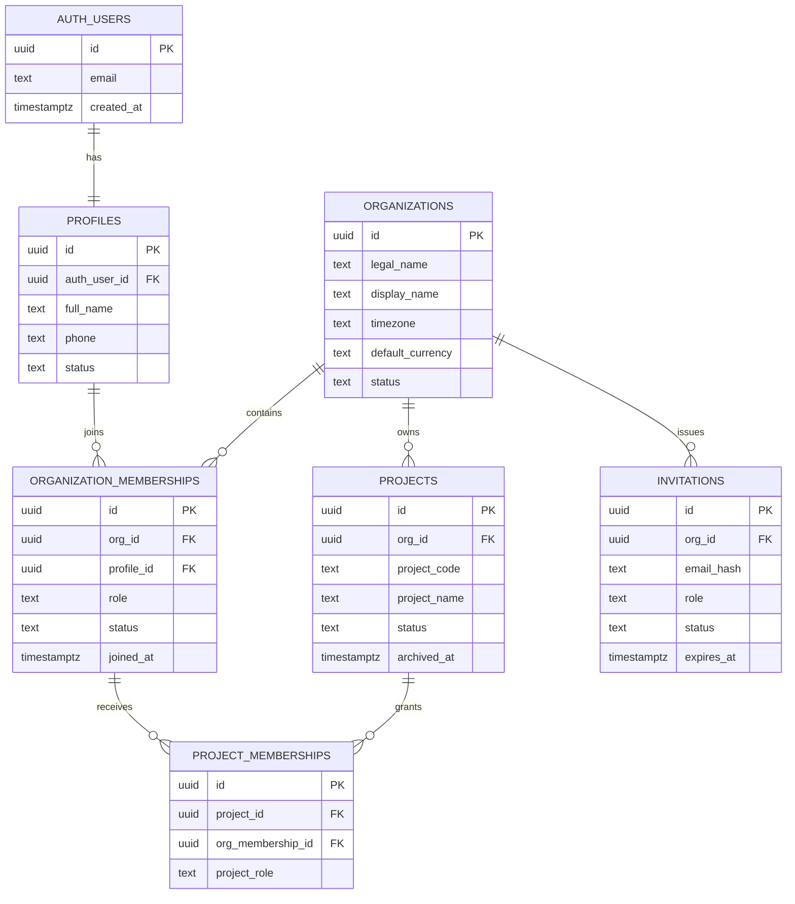
```mermaid
erDiagram
    AUTH_USERS ||--|| PROFILES : has
    ORGANIZATIONS ||--o{ ORGANIZATION_MEMBERSHIPS : contains
    PROFILES ||--o{ ORGANIZATION_MEMBERSHIPS : joins
    ORGANIZATIONS ||--o{ PROJECTS : owns
    PROJECTS ||--o{ PROJECT_MEMBERSHIPS : grants
    ORGANIZATION_MEMBERSHIPS ||--o{ PROJECT_MEMBERSHIPS : receives
    ORGANIZATIONS ||--o{ INVITATIONS : issues

    AUTH_USERS {
      uuid id PK
      text email
      timestamptz created_at
    }
    PROFILES {
      uuid id PK
      uuid auth_user_id FK
      text full_name
      text phone
      text status
    }
    ORGANIZATIONS {
      uuid id PK
      text legal_name
      text display_name
      text timezone
      text default_currency
      text status
    }
    ORGANIZATION_MEMBERSHIPS {
      uuid id PK
      uuid org_id FK
      uuid profile_id FK
      text role
      text status
      timestamptz joined_at
    }
    PROJECTS {
      uuid id PK
      uuid org_id FK
      text project_code
      text project_name
      text status
      timestamptz archived_at
    }
    PROJECT_MEMBERSHIPS {
      uuid id PK
      uuid project_id FK
      uuid org_membership_id FK
      text project_role
    }
    INVITATIONS {
      uuid id PK
      uuid org_id FK
      text email_hash
      text role
      text status
      timestamptz expires_at
    }
```

### Constraint utama

- `profiles.auth_user_id` unik.
- `(org_id, profile_id)` unik pada membership aktif.
- `(org_id, project_code)` unik.
- project membership hanya boleh menunjuk membership dari organisasi yang memiliki proyek.
- status user/membership nonaktif memblokir mutasi tanpa menghapus histori.

---

## 4. ERD Domain Contract dan Commercial Baseline

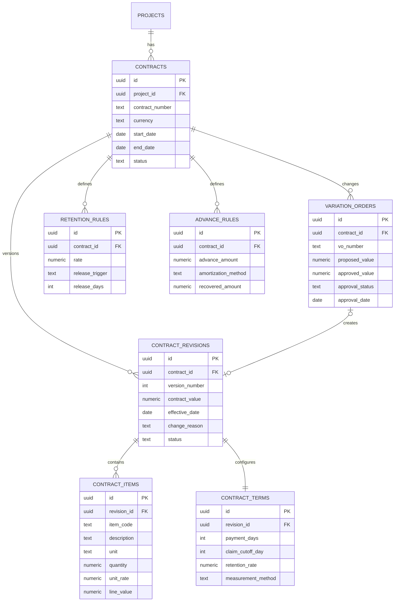
```mermaid
erDiagram
    PROJECTS ||--o{ CONTRACTS : has
    CONTRACTS ||--o{ CONTRACT_REVISIONS : versions
    CONTRACT_REVISIONS ||--o{ CONTRACT_ITEMS : contains
    CONTRACT_REVISIONS ||--|| CONTRACT_TERMS : configures
    CONTRACTS ||--o{ VARIATION_ORDERS : changes
    VARIATION_ORDERS o|--o| CONTRACT_REVISIONS : creates
    CONTRACTS ||--o{ RETENTION_RULES : defines
    CONTRACTS ||--o{ ADVANCE_RULES : defines

    CONTRACTS {
      uuid id PK
      uuid project_id FK
      text contract_number
      text currency
      date start_date
      date end_date
      text status
    }
    CONTRACT_REVISIONS {
      uuid id PK
      uuid contract_id FK
      int version_number
      numeric contract_value
      date effective_date
      text change_reason
      text status
    }
    CONTRACT_ITEMS {
      uuid id PK
      uuid revision_id FK
      text item_code
      text description
      text unit
      numeric quantity
      numeric unit_rate
      numeric line_value
    }
    CONTRACT_TERMS {
      uuid id PK
      uuid revision_id FK
      int payment_days
      int claim_cutoff_day
      numeric retention_rate
      text measurement_method
    }
    VARIATION_ORDERS {
      uuid id PK
      uuid contract_id FK
      text vo_number
      numeric proposed_value
      numeric approved_value
      text approval_status
      date approval_date
    }
    RETENTION_RULES {
      uuid id PK
      uuid contract_id FK
      numeric rate
      text release_trigger
      int release_days
    }
    ADVANCE_RULES {
      uuid id PK
      uuid contract_id FK
      numeric advance_amount
      text amortization_method
      numeric recovered_amount
    }
```

### Baseline rule

Hanya satu `contract_revision` berstatus `ACTIVE` pada satu waktu. Revisi baru tidak mengubah record lama; histori harus tetap tersedia.

---

## 5. ERD Progress-to-Cash Lineage

Model menggunakan alokasi antartahap. Dengan demikian, satu progres dapat diukur sebagian, satu measurement dapat diklaim dalam beberapa klaim, dan satu invoice dapat dibayar oleh beberapa receipt tanpa menggandakan nilai.

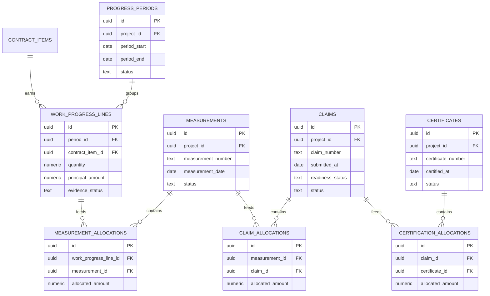
```mermaid
erDiagram
    CONTRACT_ITEMS ||--o{ WORK_PROGRESS_LINES : earns
    PROGRESS_PERIODS ||--o{ WORK_PROGRESS_LINES : groups
    WORK_PROGRESS_LINES ||--o{ MEASUREMENT_ALLOCATIONS : feeds
    MEASUREMENTS ||--o{ MEASUREMENT_ALLOCATIONS : contains
    MEASUREMENTS ||--o{ CLAIM_ALLOCATIONS : feeds
    CLAIMS ||--o{ CLAIM_ALLOCATIONS : contains
    CLAIMS ||--o{ CERTIFICATION_ALLOCATIONS : feeds
    CERTIFICATES ||--o{ CERTIFICATION_ALLOCATIONS : contains

    PROGRESS_PERIODS {
      uuid id PK
      uuid project_id FK
      date period_start
      date period_end
      text status
    }
    WORK_PROGRESS_LINES {
      uuid id PK
      uuid period_id FK
      uuid contract_item_id FK
      numeric quantity
      numeric principal_amount
      text evidence_status
    }
    MEASUREMENTS {
      uuid id PK
      uuid project_id FK
      text measurement_number
      date measurement_date
      text status
    }
    MEASUREMENT_ALLOCATIONS {
      uuid id PK
      uuid work_progress_line_id FK
      uuid measurement_id FK
      numeric allocated_amount
    }
    CLAIMS {
      uuid id PK
      uuid project_id FK
      text claim_number
      date submitted_at
      text readiness_status
      text status
    }
    CLAIM_ALLOCATIONS {
      uuid id PK
      uuid measurement_id FK
      uuid claim_id FK
      numeric allocated_amount
    }
    CERTIFICATES {
      uuid id PK
      uuid project_id FK
      text certificate_number
      date certified_at
      text status
    }
    CERTIFICATION_ALLOCATIONS {
      uuid id PK
      uuid claim_id FK
      uuid certificate_id FK
      numeric allocated_amount
    }
```

---

## 6. ERD Project Invoice, Collection, dan Retention

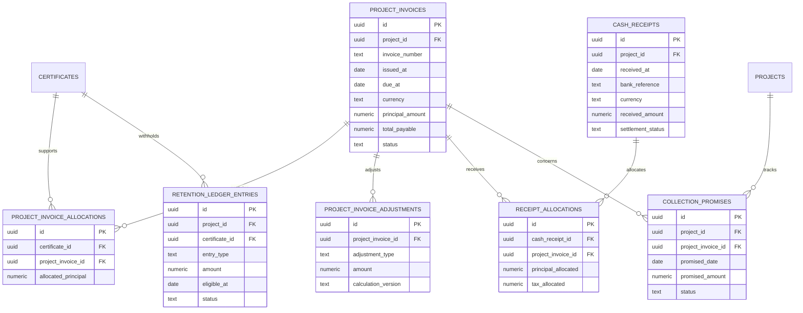
```mermaid
erDiagram
    CERTIFICATES ||--o{ PROJECT_INVOICE_ALLOCATIONS : supports
    PROJECT_INVOICES ||--o{ PROJECT_INVOICE_ALLOCATIONS : contains
    PROJECT_INVOICES ||--o{ PROJECT_INVOICE_ADJUSTMENTS : adjusts
    PROJECT_INVOICES ||--o{ RECEIPT_ALLOCATIONS : receives
    CASH_RECEIPTS ||--o{ RECEIPT_ALLOCATIONS : allocates
    CERTIFICATES ||--o{ RETENTION_LEDGER_ENTRIES : withholds
    PROJECTS ||--o{ COLLECTION_PROMISES : tracks
    PROJECT_INVOICES ||--o{ COLLECTION_PROMISES : concerns

    PROJECT_INVOICES {
      uuid id PK
      uuid project_id FK
      text invoice_number
      date issued_at
      date due_at
      text currency
      numeric principal_amount
      numeric total_payable
      text status
    }
    PROJECT_INVOICE_ALLOCATIONS {
      uuid id PK
      uuid certificate_id FK
      uuid project_invoice_id FK
      numeric allocated_principal
    }
    PROJECT_INVOICE_ADJUSTMENTS {
      uuid id PK
      uuid project_invoice_id FK
      text adjustment_type
      numeric amount
      text calculation_version
    }
    CASH_RECEIPTS {
      uuid id PK
      uuid project_id FK
      date received_at
      text bank_reference
      text currency
      numeric received_amount
      text settlement_status
    }
    RECEIPT_ALLOCATIONS {
      uuid id PK
      uuid cash_receipt_id FK
      uuid project_invoice_id FK
      numeric principal_allocated
      numeric tax_allocated
    }
    RETENTION_LEDGER_ENTRIES {
      uuid id PK
      uuid project_id FK
      uuid certificate_id FK
      text entry_type
      numeric amount
      date eligible_at
      text status
    }
    COLLECTION_PROMISES {
      uuid id PK
      uuid project_id FK
      uuid project_invoice_id FK
      date promised_date
      numeric promised_amount
      text status
    }
```

### Adjustment type

`PPN`, `PPh_withholding`, `RETENTION`, `ADVANCE_AMORTIZATION`, `OTHER_DEDUCTION`, atau `REVERSAL`. Leakage principal dihitung dari `allocated_principal`, bukan `total_payable`.

---

## 7. ERD Stage Snapshot, Leakage, dan Exception

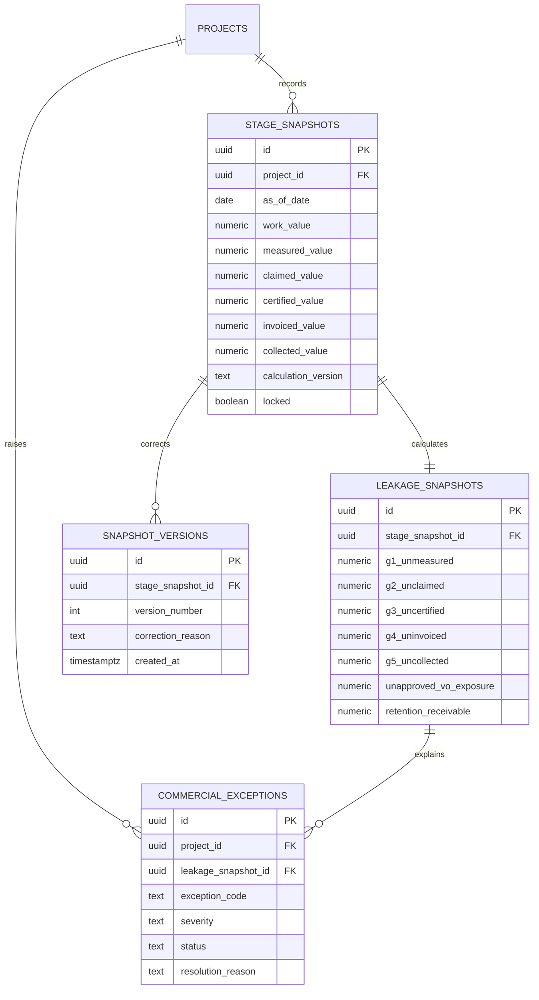
```mermaid
erDiagram
    PROJECTS ||--o{ STAGE_SNAPSHOTS : records
    STAGE_SNAPSHOTS ||--|| LEAKAGE_SNAPSHOTS : calculates
    PROJECTS ||--o{ COMMERCIAL_EXCEPTIONS : raises
    LEAKAGE_SNAPSHOTS ||--o{ COMMERCIAL_EXCEPTIONS : explains
    STAGE_SNAPSHOTS ||--o{ SNAPSHOT_VERSIONS : corrects

    STAGE_SNAPSHOTS {
      uuid id PK
      uuid project_id FK
      date as_of_date
      numeric work_value
      numeric measured_value
      numeric claimed_value
      numeric certified_value
      numeric invoiced_value
      numeric collected_value
      text calculation_version
      boolean locked
    }
    LEAKAGE_SNAPSHOTS {
      uuid id PK
      uuid stage_snapshot_id FK
      numeric g1_unmeasured
      numeric g2_unclaimed
      numeric g3_uncertified
      numeric g4_uninvoiced
      numeric g5_uncollected
      numeric unapproved_vo_exposure
      numeric retention_receivable
    }
    COMMERCIAL_EXCEPTIONS {
      uuid id PK
      uuid project_id FK
      uuid leakage_snapshot_id FK
      text exception_code
      text severity
      text status
      text resolution_reason
    }
    SNAPSHOT_VERSIONS {
      uuid id PK
      uuid stage_snapshot_id FK
      int version_number
      text correction_reason
      timestamptz created_at
    }
```

### Invarian snapshot

Untuk setiap `project_id`, `as_of_date`, `currency`, dan `calculation_version`:

`G1 + G2 + G3 + G4 + G5 = Work Performed − Collected`

Overlay `unapproved_vo_exposure` dan `retention_receivable` tidak ditambahkan ke identitas tersebut.

---

## 8. ERD Action, Document, Import, dan Audit

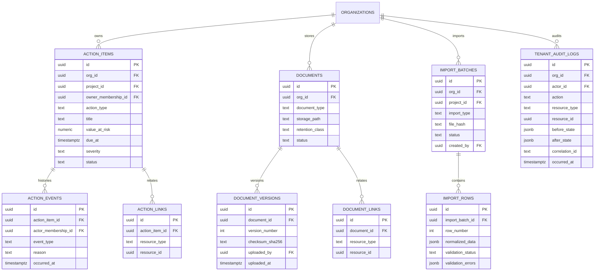
```mermaid
erDiagram
    ORGANIZATIONS ||--o{ ACTION_ITEMS : owns
    ACTION_ITEMS ||--o{ ACTION_EVENTS : histories
    ACTION_ITEMS ||--o{ ACTION_LINKS : relates
    ORGANIZATIONS ||--o{ DOCUMENTS : stores
    DOCUMENTS ||--o{ DOCUMENT_VERSIONS : versions
    DOCUMENTS ||--o{ DOCUMENT_LINKS : relates
    ORGANIZATIONS ||--o{ IMPORT_BATCHES : imports
    IMPORT_BATCHES ||--o{ IMPORT_ROWS : contains
    ORGANIZATIONS ||--o{ TENANT_AUDIT_LOGS : audits

    ACTION_ITEMS {
      uuid id PK
      uuid org_id FK
      uuid project_id FK
      uuid owner_membership_id FK
      text action_type
      text title
      numeric value_at_risk
      timestamptz due_at
      text severity
      text status
    }
    ACTION_EVENTS {
      uuid id PK
      uuid action_item_id FK
      uuid actor_membership_id FK
      text event_type
      text reason
      timestamptz occurred_at
    }
    ACTION_LINKS {
      uuid id PK
      uuid action_item_id FK
      text resource_type
      uuid resource_id
    }
    DOCUMENTS {
      uuid id PK
      uuid org_id FK
      text document_type
      text storage_path
      text retention_class
      text status
    }
    DOCUMENT_VERSIONS {
      uuid id PK
      uuid document_id FK
      int version_number
      text checksum_sha256
      uuid uploaded_by FK
      timestamptz uploaded_at
    }
    DOCUMENT_LINKS {
      uuid id PK
      uuid document_id FK
      text resource_type
      uuid resource_id
    }
    IMPORT_BATCHES {
      uuid id PK
      uuid org_id FK
      uuid project_id FK
      text import_type
      text file_hash
      text status
      uuid created_by FK
    }
    IMPORT_ROWS {
      uuid id PK
      uuid import_batch_id FK
      int row_number
      jsonb normalized_data
      text validation_status
      jsonb validation_errors
    }
    TENANT_AUDIT_LOGS {
      uuid id PK
      uuid org_id FK
      uuid actor_id FK
      text action
      text resource_type
      uuid resource_id
      jsonb before_state
      jsonb after_state
      text correlation_id
      timestamptz occurred_at
    }
```

### Polymorphic link rule

`resource_type/resource_id` memudahkan satu dokumen atau action terhubung ke banyak domain, tetapi tidak memiliki FK native lintas tabel. Karena itu kombinasi tersebut wajib divalidasi service-side dan diperiksa oleh integrity job.

---

## 9. ERD SaaS Subscription dan Payment

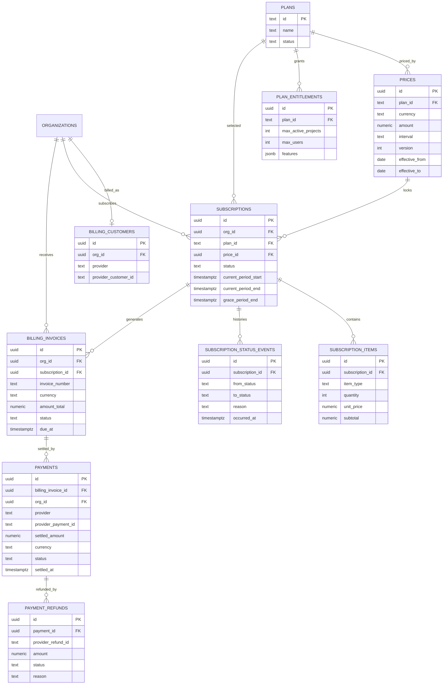
```mermaid
erDiagram
    ORGANIZATIONS ||--o| BILLING_CUSTOMERS : billed_as
    PLANS ||--o{ PRICES : priced_by
    PLANS ||--o{ PLAN_ENTITLEMENTS : grants
    ORGANIZATIONS ||--o{ SUBSCRIPTIONS : subscribes
    PLANS ||--o{ SUBSCRIPTIONS : selected
    PRICES ||--o{ SUBSCRIPTIONS : locks
    SUBSCRIPTIONS ||--o{ SUBSCRIPTION_ITEMS : contains
    SUBSCRIPTIONS ||--o{ SUBSCRIPTION_STATUS_EVENTS : histories
    ORGANIZATIONS ||--o{ BILLING_INVOICES : receives
    SUBSCRIPTIONS ||--o{ BILLING_INVOICES : generates
    BILLING_INVOICES ||--o{ PAYMENTS : settled_by
    PAYMENTS ||--o{ PAYMENT_REFUNDS : refunded_by

    PLANS {
      text id PK
      text name
      text status
    }
    PRICES {
      uuid id PK
      text plan_id FK
      text currency
      numeric amount
      text interval
      int version
      date effective_from
      date effective_to
    }
    PLAN_ENTITLEMENTS {
      uuid id PK
      text plan_id FK
      int max_active_projects
      int max_users
      jsonb features
    }
    BILLING_CUSTOMERS {
      uuid id PK
      uuid org_id FK
      text provider
      text provider_customer_id
    }
    SUBSCRIPTIONS {
      uuid id PK
      uuid org_id FK
      text plan_id FK
      uuid price_id FK
      text status
      timestamptz current_period_start
      timestamptz current_period_end
      timestamptz grace_period_end
    }
    SUBSCRIPTION_ITEMS {
      uuid id PK
      uuid subscription_id FK
      text item_type
      int quantity
      numeric unit_price
      numeric subtotal
    }
    SUBSCRIPTION_STATUS_EVENTS {
      uuid id PK
      uuid subscription_id FK
      text from_status
      text to_status
      text reason
      timestamptz occurred_at
    }
    BILLING_INVOICES {
      uuid id PK
      uuid org_id FK
      uuid subscription_id FK
      text invoice_number
      text currency
      numeric amount_total
      text status
      timestamptz due_at
    }
    PAYMENTS {
      uuid id PK
      uuid billing_invoice_id FK
      uuid org_id FK
      text provider
      text provider_payment_id
      numeric settled_amount
      text currency
      text status
      timestamptz settled_at
    }
    PAYMENT_REFUNDS {
      uuid id PK
      uuid payment_id FK
      text provider_refund_id
      numeric amount
      text status
      text reason
    }
```

---

## 10. ERD Webhook, Entitlement, dan Dunning

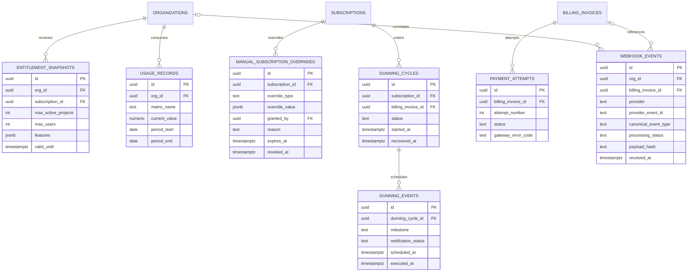
```mermaid
erDiagram
    ORGANIZATIONS ||--o{ ENTITLEMENT_SNAPSHOTS : receives
    ORGANIZATIONS ||--o{ USAGE_RECORDS : consumes
    SUBSCRIPTIONS ||--o{ MANUAL_SUBSCRIPTION_OVERRIDES : overrides
    SUBSCRIPTIONS ||--o{ DUNNING_CYCLES : enters
    DUNNING_CYCLES ||--o{ DUNNING_EVENTS : schedules
    BILLING_INVOICES ||--o{ PAYMENT_ATTEMPTS : attempts
    ORGANIZATIONS o|--o{ WEBHOOK_EVENTS : correlates
    BILLING_INVOICES o|--o{ WEBHOOK_EVENTS : references

    ENTITLEMENT_SNAPSHOTS {
      uuid id PK
      uuid org_id FK
      uuid subscription_id FK
      int max_active_projects
      int max_users
      jsonb features
      timestamptz valid_until
    }
    USAGE_RECORDS {
      uuid id PK
      uuid org_id FK
      text metric_name
      numeric current_value
      date period_start
      date period_end
    }
    MANUAL_SUBSCRIPTION_OVERRIDES {
      uuid id PK
      uuid subscription_id FK
      text override_type
      jsonb override_value
      uuid granted_by FK
      text reason
      timestamptz expires_at
      timestamptz revoked_at
    }
    DUNNING_CYCLES {
      uuid id PK
      uuid subscription_id FK
      uuid billing_invoice_id FK
      text status
      timestamptz started_at
      timestamptz recovered_at
    }
    DUNNING_EVENTS {
      uuid id PK
      uuid dunning_cycle_id FK
      text milestone
      text notification_status
      timestamptz scheduled_at
      timestamptz executed_at
    }
    PAYMENT_ATTEMPTS {
      uuid id PK
      uuid billing_invoice_id FK
      int attempt_number
      text status
      text gateway_error_code
    }
    WEBHOOK_EVENTS {
      uuid id PK
      uuid org_id FK
      uuid billing_invoice_id FK
      text provider
      text provider_event_id
      text canonical_event_type
      text processing_status
      text payload_hash
      timestamptz received_at
    }
```

### Mayar contract

- callback authentication header: `x-callback-token`;
- unique `(provider, provider_event_id)`;
- raw payload hanya disimpan jika dibutuhkan, dienkripsi/diringkas, dan disanitasi;
- `TEST_EVENT` boleh membuat webhook receipt tetapi tidak boleh membuat payment atau mengubah subscription.

---

## 11. ERD Platform Admin, Reconciliation, dan Metrics

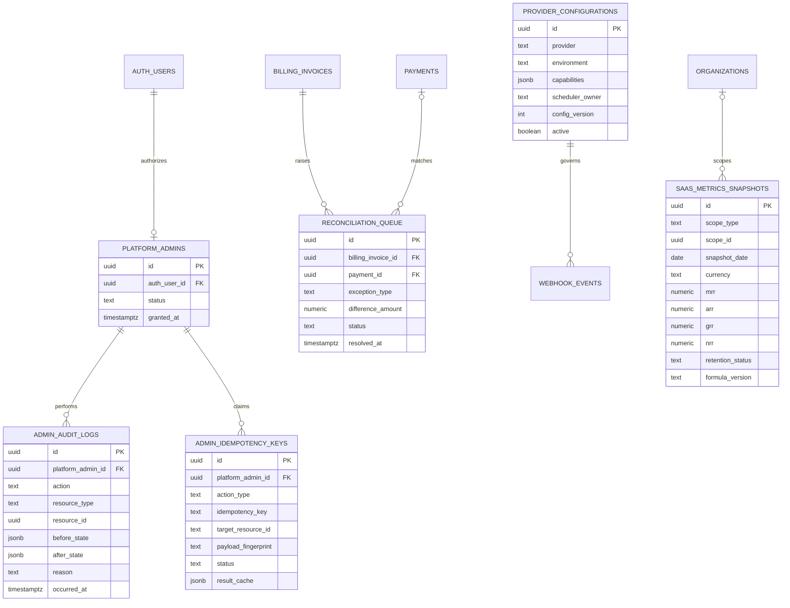
```mermaid
erDiagram
    AUTH_USERS ||--o| PLATFORM_ADMINS : authorizes
    PLATFORM_ADMINS ||--o{ ADMIN_AUDIT_LOGS : performs
    PLATFORM_ADMINS ||--o{ ADMIN_IDEMPOTENCY_KEYS : claims
    BILLING_INVOICES ||--o{ RECONCILIATION_QUEUE : raises
    PAYMENTS o|--o{ RECONCILIATION_QUEUE : matches
    PROVIDER_CONFIGURATIONS ||--o{ WEBHOOK_EVENTS : governs
    ORGANIZATIONS o|--o{ SAAS_METRICS_SNAPSHOTS : scopes

    PLATFORM_ADMINS {
      uuid id PK
      uuid auth_user_id FK
      text status
      timestamptz granted_at
    }
    ADMIN_AUDIT_LOGS {
      uuid id PK
      uuid platform_admin_id FK
      text action
      text resource_type
      uuid resource_id
      jsonb before_state
      jsonb after_state
      text reason
      timestamptz occurred_at
    }
    ADMIN_IDEMPOTENCY_KEYS {
      uuid id PK
      uuid platform_admin_id FK
      text action_type
      text idempotency_key
      text target_resource_id
      text payload_fingerprint
      text status
      jsonb result_cache
    }
    RECONCILIATION_QUEUE {
      uuid id PK
      uuid billing_invoice_id FK
      uuid payment_id FK
      text exception_type
      numeric difference_amount
      text status
      timestamptz resolved_at
    }
    PROVIDER_CONFIGURATIONS {
      uuid id PK
      text provider
      text environment
      jsonb capabilities
      text scheduler_owner
      int config_version
      boolean active
    }
    SAAS_METRICS_SNAPSHOTS {
      uuid id PK
      text scope_type
      uuid scope_id
      date snapshot_date
      text currency
      numeric mrr
      numeric arr
      numeric grr
      numeric nrr
      text retention_status
      text formula_version
    }
```

### Platform boundary

Tenant `OWNER` atau `ADMIN` bukan `PLATFORM_ADMIN`. Hak platform hanya berasal dari relasi server-side `auth.users.id → platform_admins.auth_user_id`.

---

## 12. Kamus Entitas Ringkas

| Entitas | Sumber kebenaran | Retensi | Catatan |
|---|---|---|---|
| organizations | identitas tenant | selama akun + kebijakan arsip | root seluruh data tenant |
| organization_memberships | role tenant | histori | soft deactivate |
| projects | proyek aktif/arsip | kontraktual | tidak dihapus saat downgrade |
| contracts/revisions | baseline komersial | jangka panjang | versioned |
| work_progress_lines | earned value | jangka proyek | basis Work Performed |
| measurements | opname | jangka proyek | partial allocation |
| claims | submission | jangka proyek | readiness gate |
| certificates | certified value | jangka proyek | approval evidence |
| project_invoices | AR proyek pelanggan | finansial | bukan SaaS billing |
| cash_receipts | kas proyek pelanggan | finansial | settlement + allocation |
| leakage_snapshots | gap periodik | analitik | immutable snapshot |
| action_items | tindakan | operasional | wajib PIC/tenggat |
| documents | metadata dokumen | policy-based | object storage terpisah |
| tenant_audit_logs | audit tenant | minimum sesuai kontrak | append-only |
| subscriptions | hak berlangganan | finansial SaaS | lifecycle state machine |
| billing_invoices | tagihan COVE | finansial SaaS | terpisah mutlak |
| payments | pembayaran COVE | finansial SaaS | provider id unik |
| webhook_events | callback provider | security/ops | idempotency |
| entitlement_snapshots | hak akses efektif | histori | server-enforced |
| admin_audit_logs | tindakan platform | minimum 7 tahun | immutable |
| saas_metrics_snapshots | metrik bisnis COVE | analitik | formula versioned |

---

## 13. Constraint Finansial Kritis

### Alokasi antartahap

Untuk setiap upstream record:

- `Σ measurement_allocations ≤ work_progress_line.principal_amount`
- `Σ claim_allocations ≤ measurement accepted amount`
- `Σ certification_allocations ≤ claim submitted amount`
- `Σ project_invoice_allocations ≤ certificate approved amount`
- `Σ receipt_allocations ≤ project_invoice outstanding principal`
- `Σ allocations from one cash_receipt ≤ cash_receipt.received_amount`

Pengecekan harus terjadi dalam transaksi dengan row lock untuk mencegah dua request paralel melampaui nilai sumber.

### Refund SaaS

- `Σ successful refunds ≤ settled payment amount`
- refund current-period dapat memengaruhi entitlement;
- refund historical-period tidak otomatis membatalkan current subscription;
- pending/failed refund tidak mengurangi recognized settlement.

### Currency

Tidak ada penjumlahan lintas mata uang tanpa FX rate, FX source, rate date, dan calculation version eksplisit.

---

## 14. Unique Index dan Idempotency

| Tabel | Unique key minimum |
|---|---|
| projects | `(org_id, project_code)` |
| contract_revisions | `(contract_id, version_number)` |
| project_invoices | `(project_id, invoice_number)` |
| cash_receipts | `(project_id, bank_reference)` bila referensi tersedia |
| import_batches | `(org_id, import_type, file_hash)` |
| stage_snapshots | `(project_id, as_of_date, currency, calculation_version, version)` |
| webhook_events | `(provider, provider_event_id)` |
| payments | `(provider, provider_payment_id)` |
| billing_invoices | `(invoice_number)` atau `(provider, provider_invoice_id)` |
| manual overrides | satu override aktif per `(subscription_id, override_type)` |
| admin idempotency | `(action_type, idempotency_key, target_resource_id)` |
| metrics snapshots | `(scope_type, scope_id, snapshot_date, currency, formula_version)` |

---

## 15. RLS dan Authorization Model

### Tenant tables

Kebijakan konseptual:

```sql
EXISTS (
  SELECT 1
  FROM organization_memberships m
  WHERE m.org_id = target.org_id
    AND m.profile_id = current_profile_id()
    AND m.status = 'ACTIVE'
)
```

Tambahkan pemeriksaan role untuk mutasi. Project-scoped table mewarisi tenant melalui `project_id → projects.org_id`; untuk query kritis, simpan `org_id` eksplisit sebagai defense-in-depth dan validasi konsistensinya.

### Billing tables

Tenant dapat membaca billing miliknya sesuai role. Mutasi plan, cancel, reactivate, dan checkout memerlukan `OWNER/ADMIN` yang diverifikasi server.

### Platform tables

Hanya service role dan `platform_admin` terverifikasi yang dapat menjalankan operasi. RPC finansial direvoke dari `PUBLIC`, `anon`, dan `authenticated`.

---

## 16. Audit Event Schema

Minimal payload audit:

```json
{
  "org_id": "uuid-or-null-for-platform",
  "actor_id": "uuid",
  "actor_role": "role",
  "action": "RESOURCE_ACTION",
  "resource_type": "type",
  "resource_id": "uuid",
  "before_state": {},
  "after_state": {},
  "reason": "required-for-sensitive-action",
  "correlation_id": "opaque-id",
  "occurred_at": "server-timestamp",
  "source": "WEB|IMPORT|API|WEBHOOK|CRON|ADMIN"
}
```

Nilai rahasia, password, JWT, cookie, API key, dan full webhook token tidak boleh masuk audit.

---

## 17. Lifecycle State Machines

### Claim

`DRAFT → READY → SUBMITTED → UNDER_REVIEW → PARTIALLY_CERTIFIED/CERTIFIED → CLOSED`

Transisi ke belakang menggunakan `REVISED` atau `VOIDED` event, bukan menghapus status historis.

### Project invoice

`DRAFT → ISSUED → PARTIALLY_PAID → PAID`, dengan cabang `VOID` atau `DISPUTED` yang terkontrol.

### Subscription

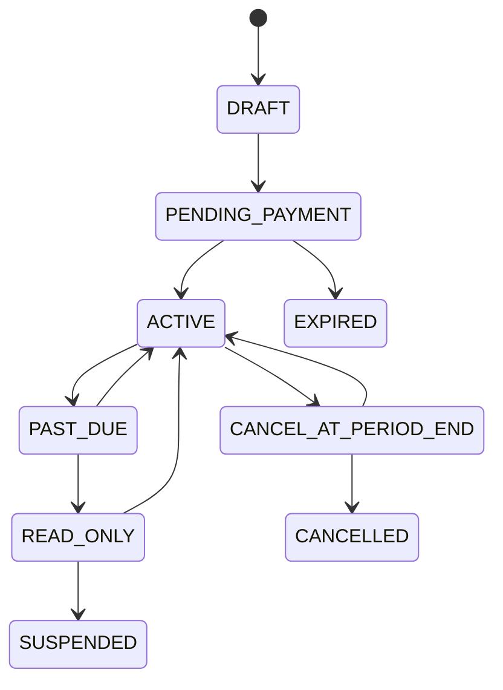
```mermaid
stateDiagram-v2
    [*] --> DRAFT
    DRAFT --> PENDING_PAYMENT
    PENDING_PAYMENT --> ACTIVE
    PENDING_PAYMENT --> EXPIRED
    ACTIVE --> CANCEL_AT_PERIOD_END
    ACTIVE --> PAST_DUE
    PAST_DUE --> ACTIVE
    PAST_DUE --> READ_ONLY
    READ_ONLY --> ACTIVE
    READ_ONLY --> SUSPENDED
    CANCEL_AT_PERIOD_END --> ACTIVE
    CANCEL_AT_PERIOD_END --> CANCELLED
```

---

## 18. Calculation Views

Gunakan SQL view/materialized view untuk pembacaan, sedangkan event dan allocation table tetap menjadi sumber kebenaran.

### View minimum

- `v_project_stage_totals`
- `v_project_leakage_current`
- `v_portfolio_leakage`
- `v_project_invoice_outstanding`
- `v_receivable_aging`
- `v_action_queue_priority`
- `v_effective_entitlements`
- `v_subscription_health`
- `v_saas_mrr_bridge`

View tidak boleh menyembunyikan exception melalui `COALESCE` atau `max()` tanpa flag kualitas data.

---

## 19. Storage dan Document Security

Object binary disimpan di bucket privat; database menyimpan metadata dan versi. Akses melalui signed URL berumur pendek. Path minimum memasukkan `org_id/project_id/document_id/version` tetapi tidak memuat data pribadi yang tidak diperlukan.

Quota dibedakan berdasarkan:

- ukuran per file;
- total storage tenant;
- jenis dokumen/foto;
- retention class;
- status arsip.

Penghapusan mengikuti soft-delete, legal hold, dan retention job; audit tetap dipertahankan.

---

## 20. Migration Strategy dari Model Aktual

1. Inventarisasi seluruh tabel dan migration aktual.
2. Buat mapping `existing_table → target_entity`.
3. Tandai `KEEP`, `RENAME_LATER`, `MERGE`, `DEPRECATE`, atau `NEW`.
4. Jangan rename/drop pada migration pertama; gunakan view/adapter kompatibilitas.
5. Backfill `org_id`, currency, version, dan source reference secara terkontrol.
6. Jalankan reconciliation count dan checksum.
7. Aktifkan constraint sebagai `NOT VALID`, bersihkan exception, lalu `VALIDATE CONSTRAINT`.
8. Pindahkan read path, kemudian write path.
9. Bekukan legacy table sebelum deprecation final.
10. Simpan rollback plan dan backup teruji.

### Larangan

- tidak menjalankan remote reset;
- tidak menggabungkan `project_invoices` dan `billing_invoices`;
- tidak memigrasikan mock user menjadi Supabase Auth tanpa identity mapping;
- tidak menghapus legacy data hanya agar test lulus.

---

## 21. ERD Acceptance Checklist

ERD dianggap siap diimplementasikan jika:

- [ ] seluruh 97 requirement baseline PRD serta 52 tambahan v2.1 dapat dipetakan ke entitas/service, dengan Later ditandai;
- [ ] setiap tenant table memiliki jalur ke `organizations`;
- [ ] setiap Rupiah stage memiliki upstream/downstream lineage;
- [ ] partial allocation dan concurrency mempunyai constraint;
- [ ] G1–G5 dapat direkonstruksi tanpa field manual;
- [ ] VO dan retention tidak menggandakan leakage;
- [ ] project invoice dan SaaS billing invoice terpisah;
- [ ] webhook idempotency mempunyai unique index;
- [ ] subscription state mempunyai event ledger;
- [ ] audit admin immutable;
- [ ] export data tetap mungkin pada READ_ONLY/SUSPENDED;
- [ ] migration dari schema aktual mempunyai mapping dan rollback;
- [ ] RLS positive/negative tests lulus;
- [ ] backup/restore mempertahankan constraint dan audit;
- [ ] production UAT dilakukan tanpa menggunakan mock authentication.

---

## 22. Keputusan Desain Final

Model inti COVE bukan sekadar tabel status klaim. Model inti adalah **rantai alokasi nilai**:

> Work Progress → Measurement Allocation → Claim Allocation → Certification Allocation → Project Invoice Allocation → Receipt Allocation

Rantai tersebut membuat COVE mampu menjawab bukan hanya “statusnya apa”, tetapi:

- nilai mana yang belum bergerak;
- berapa sisanya;
- berasal dari transaksi apa;
- tertahan karena apa;
- siapa pemilik tindakan;
- dan apakah angka dashboard dapat direkonsiliasi sampai bukti sumber.

---

## 23. Perluasan v2.1 — Batas Model dan Reuse

Pasangan requirement: Addendum A pada `COVE_PRD_v2.0_Product_End_State.md`, revisi isi v2.1. Model tambahan tidak mengubah rantai alokasi Progress-to-Cash, rumus G1–G5, payment settlement atau otorisasi billing. Tidak ada SQL migration, panggilan gateway, pengiriman pesan, atau deployment yang diizinkan oleh dokumen ini.

### Konvensi tambahan

- Diagram adalah model logical; inventaris schema aktual menentukan apakah entitas berupa tabel baru, ekstensi tabel, atau view atas entitas yang sudah ada. Jangan menggandakan checkout, consent, notification atau RBAC table yang telah tersedia.
- Entitas baru menggunakan UUID, waktu server `timestamptz` UTC, serta `created_at/updated_at` untuk record mutable. Event menyimpan `occurred_at`, `recorded_at`, `schema_version` dan immutable identifier. Field umum tersebut boleh tidak diulang pada semua diagram.
- Environment `TEST/PRODUCTION` wajib pada data akuisisi/konversi/konfigurasi. Relasi lintas environment ditolak. Nilai uang `numeric`, currency eksplisit, tanpa float; integer minor units diperbolehkan bila seluruh adapter konsisten.
- FK ke organisasi/profil/provider invoice tidak boleh berasal dari klaim browser yang belum divalidasi. Otorisasi dan consent bukan hal yang sama: data billing penting tetap dapat disimpan tanpa consent iklan, tetapi tidak otomatis boleh diekspor ke Meta.
- Relasi opsional disebut eksplisit di constraint setelah diagram; field `FK` pada Mermaid tidak berarti otomatis NOT NULL.
- Data platform tanpa `org_id` tetap privat. Jalur akses customer dan internal menggunakan policy/view berbeda. Shared cache harus menyertakan actor/tenant/permission scope.

| Entitas yang digunakan ulang | Ketetapan |
|---|---|
| `auth.users`, `profiles`, `organization_memberships` | sumber identitas; lead/link tidak membuat membership |
| `plans`, `prices` | sumber katalog/harga; modul growth tidak menerima perubahan nominal |
| `subscriptions`, `billing_invoices`, `payments`, `payment_refunds` | satu sumber settlement, gross purchase dan net cash |
| `webhook_events`, `admin_idempotency_keys` | keamanan dan idempotency finansial lama tetap berlaku |
| `platform_admins`, `admin_audit_logs` | identitas internal dan audit; permission set diperluas, bukan akses blanket |
| `dunning_cycles` | renewal recovery tetap di sini; initial acquisition recovery terpisah |
| Object storage privat | dapat memakai infrastruktur lama, dengan path/policy khusus feedback |

## 24. Identity, Session, Consent, dan Suppression

### 24.1. Kontak bukan tenant

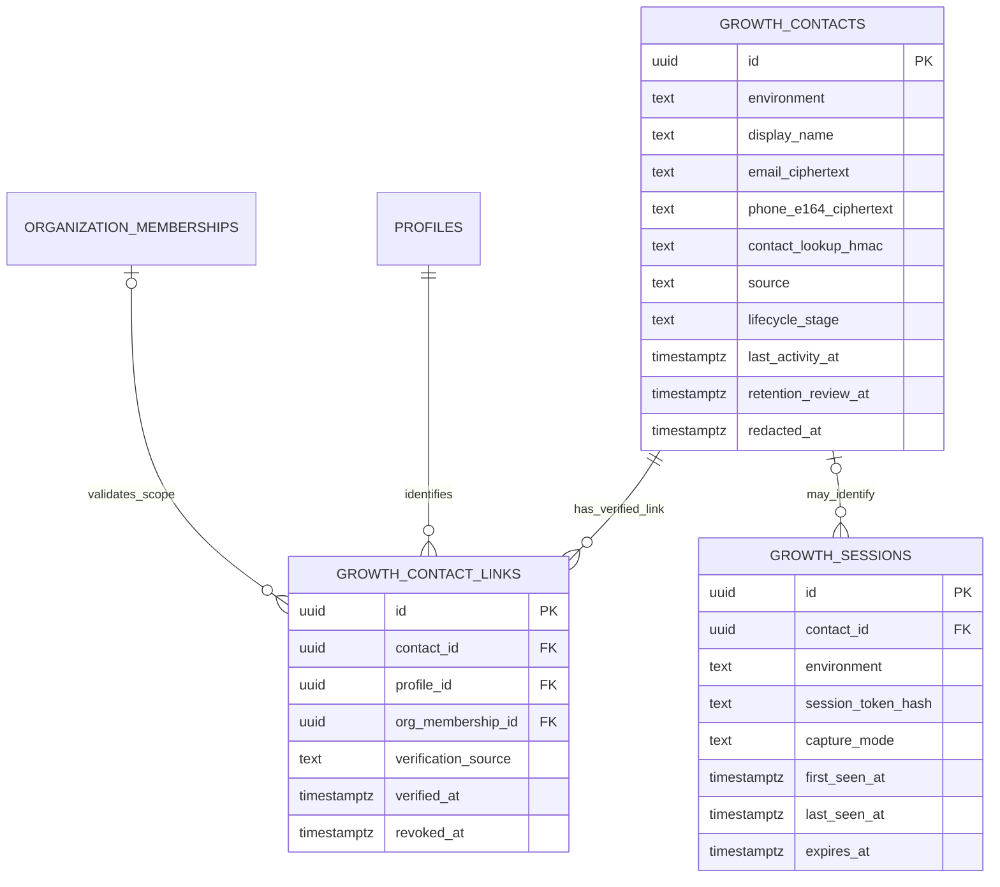
```mermaid
erDiagram
    direction TB
    GROWTH_CONTACTS ||--o{ GROWTH_CONTACT_LINKS : has_verified_link
    PROFILES ||--o{ GROWTH_CONTACT_LINKS : identifies
    ORGANIZATION_MEMBERSHIPS o|--o{ GROWTH_CONTACT_LINKS : validates_scope
    GROWTH_CONTACTS o|--o{ GROWTH_SESSIONS : may_identify

    GROWTH_CONTACTS {
      uuid id PK
      text environment
      text display_name
      text email_ciphertext
      text phone_e164_ciphertext
      text contact_lookup_hmac
      text source
      text lifecycle_stage
      timestamptz last_activity_at
      timestamptz retention_review_at
      timestamptz redacted_at
    }
    GROWTH_CONTACT_LINKS {
      uuid id PK
      uuid contact_id FK
      uuid profile_id FK
      uuid org_membership_id FK
      text verification_source
      timestamptz verified_at
      timestamptz revoked_at
    }
    GROWTH_SESSIONS {
      uuid id PK
      uuid contact_id FK
      text environment
      text session_token_hash
      text capture_mode
      timestamptz first_seen_at
      timestamptz last_seen_at
      timestamptz expires_at
    }
```

Constraint:

- `contact_id` pada session dan `org_membership_id` pada link boleh null. Link selalu menunjuk profile nyata; bila ada membership, profile-nya harus cocok. Membership nonaktif tidak memberikan scope aktif.
- Session sebelum izin analytics hanya berfungsi menyimpan preferensi consent dengan `capture_mode=CONSENT_ONLY`; tidak mencatat clickstream/attribution. Analytics session tidak membuat identitas nyata.
- Kontak ditulis setelah submit form. Browser tidak dapat enumerate email/phone yang sudah terdaftar. Lookup HMAC berkunci server adalah bantuan dedup dan tetap data terbatas, bukan anonymous data.
- Email/nomor sama tidak otomatis menyatukan orang, memberikan tenant access, atau mewariskan consent. Merge hanya oleh proses terkontrol dengan audit dan preservation link/event; default pilihan consent paling membatasi sampai ada izin baru yang sah.
- Satu profile bisa berkaitan dengan beberapa organisasi yang sah. Link tidak boleh mengubah tabel membership. Consent iklan per browser tidak otomatis diambil dari perangkat lain.

### 24.2. Ledger pilihan komunikasi

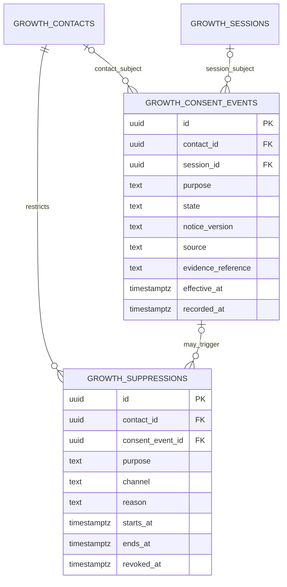
```mermaid
erDiagram
    direction TB
    GROWTH_CONTACTS o|--o{ GROWTH_CONSENT_EVENTS : contact_subject
    GROWTH_SESSIONS o|--o{ GROWTH_CONSENT_EVENTS : session_subject
    GROWTH_CONTACTS ||--o{ GROWTH_SUPPRESSIONS : restricts
    GROWTH_CONSENT_EVENTS o|--o{ GROWTH_SUPPRESSIONS : may_trigger

    GROWTH_CONSENT_EVENTS {
      uuid id PK
      uuid contact_id FK
      uuid session_id FK
      text purpose
      text state
      text notice_version
      text source
      text evidence_reference
      timestamptz effective_at
      timestamptz recorded_at
    }
    GROWTH_SUPPRESSIONS {
      uuid id PK
      uuid contact_id FK
      uuid consent_event_id FK
      text purpose
      text channel
      text reason
      timestamptz starts_at
      timestamptz ends_at
      timestamptz revoked_at
    }
```

Constraint:

- Consent event memiliki **tepat satu** subject: contact atau session. Purpose: `ANALYTICS`, `ADS_MEASUREMENT`, `WHATSAPP_MARKETING`, `FEATURE_RESEARCH`. State: `GRANTED/DENIED/WITHDRAWN`. Pembaruan membuat event baru, tidak overwrite histori.
- Effective permission mengambil event terakhir dalam subject/purpose yang sama, ditambah suppression aktif dan expiry. Missing proof atau keadaan ambigu → deny. Capture-time consent tidak cukup untuk mengirim setelah withdrawal.
- Suppression tidak hanya opt-out: `CUSTOMER_DECLINED`, `INVALID_CONTACT`, `COMPLAINT`, `MANUAL_HOLD` bisa memblokir channel. Membayar menghentikan case invoice terkait, tetapi tidak menulis consent GRANTED atau WITHDRAWN baru.
- Saat contact terhubung ke session, histori lama tidak diberi identitas secara retroaktif tanpa izin yang sesuai. Marketing contact consent tidak menggantikan session ads consent.
- Unsubscribe token disimpan hash, purpose-bound, expired, tidak mengandung PII. Reuse capability-token store jika sudah ada; endpoint tidak memakai token sebagai login atau izin membaca tenant. GET hanya membuka konfirmasi.

## 25. Attribution, Checkout Projection, dan Event Canonical

### 25.1. Checkouts bersumber dari billing

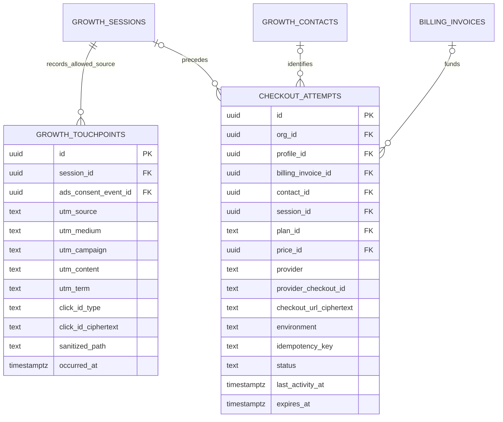
```mermaid
erDiagram
    direction TB
    GROWTH_SESSIONS ||--o{ GROWTH_TOUCHPOINTS : records_allowed_source
    GROWTH_CONTACTS o|--o{ CHECKOUT_ATTEMPTS : identifies
    GROWTH_SESSIONS o|--o{ CHECKOUT_ATTEMPTS : precedes
    BILLING_INVOICES o|--o{ CHECKOUT_ATTEMPTS : funds

    GROWTH_TOUCHPOINTS {
      uuid id PK
      uuid session_id FK
      uuid ads_consent_event_id FK
      text utm_source
      text utm_medium
      text utm_campaign
      text utm_content
      text utm_term
      text click_id_type
      text click_id_ciphertext
      text sanitized_path
      timestamptz occurred_at
    }
    CHECKOUT_ATTEMPTS {
      uuid id PK
      uuid org_id FK
      uuid profile_id FK
      uuid billing_invoice_id FK
      uuid contact_id FK
      uuid session_id FK
      text plan_id FK
      uuid price_id FK
      text provider
      text provider_checkout_id
      text checkout_url_ciphertext
      text environment
      text idempotency_key
      text status
      timestamptz last_activity_at
      timestamptz expires_at
    }
```

- Checkout attempt wajib org dan profile berizin; boleh tanpa growth contact/session/marketing consent. Invoice FK boleh null hanya selama checkout belum dipetakan ke billing; transaksi tidak boleh dianggap paid sebelum linkage sah.
- `billing_invoice_id` FK khusus `billing_invoices`, **bukan polymorphic ID** yang menerima project invoice. Jika populated, org attempt harus sama dengan org invoice/subscription. `price_id/plan_id` harus saling cocok dengan versi penawaran server.
- Checkout URL diperlakukan sensitif, bukan payload analytics. Akses hanya sesudah auth/eligibility; destination URL wajib allowlist provider dan tidak mengandung redirect terbuka.
- Status `CREATED/PENDING/FAILED/EXPIRED/CANCELLED/SUCCEEDED/SUPERSEDED` berasal dari service/payment ledger. `abandoned_candidate_at` adalah hasil view/derived signal, bukan menggantikan status provider.
- Touchpoint hanya dibuat jika consent sesuai; UTM boleh disimpan dengan izin analytics, tetapi click identifier iklan memerlukan consent iklan terpisah. Field `ads_consent_event_id` nullable bila tidak ada click ID dan hanya analytics yang diizinkan; bukti analytics direferensikan melalui session/consent ledger. Default minimisasi 90 hari.
- Tidak ada input yang menimpa payment status atau server price melalui endpoint tracking.

### 25.2. Satu kejadian bisnis, banyak kanal delivery

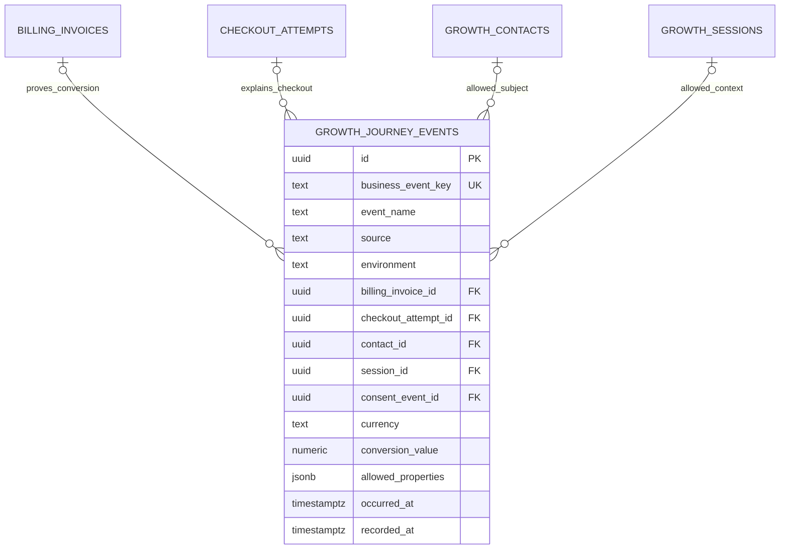
```mermaid
erDiagram
    direction TB
    BILLING_INVOICES o|--o{ GROWTH_JOURNEY_EVENTS : proves_conversion
    CHECKOUT_ATTEMPTS o|--o{ GROWTH_JOURNEY_EVENTS : explains_checkout
    GROWTH_CONTACTS o|--o{ GROWTH_JOURNEY_EVENTS : allowed_subject
    GROWTH_SESSIONS o|--o{ GROWTH_JOURNEY_EVENTS : allowed_context

    GROWTH_JOURNEY_EVENTS {
      uuid id PK
      text business_event_key UK
      text event_name
      text source
      text environment
      uuid billing_invoice_id FK
      uuid checkout_attempt_id FK
      uuid contact_id FK
      uuid session_id FK
      uuid consent_event_id FK
      text currency
      numeric conversion_value
      jsonb allowed_properties
      timestamptz occurred_at
      timestamptz recorded_at
    }
```

Event name map mengikuti PRD A.6. Purchase uniqueness: satu canonical event per `(environment, PURCHASE, billing_invoice_id)` ketika invoice pertama kali lunas sah. Dua partial payment atau beberapa provider callback tetap satu Purchase. Event ID yang dikirim ke Meta adalah `id` opaque, bukan email atau invoice URL.

Menyimpan fakta billing internal tidak berarti izin dispatch ke Meta. Event tanpa consent yang dibutuhkan tetap tidak dikirim. Financial value hanya SaaS invoice; `allowed_properties` menggunakan schema allowlist, bukan JSON dump request/body. Source browser dilarang menciptakan Purchase/server-verified event. Retention/pseudonymization boleh menghapus context PII; minimal dedup key finansial dipertahankan sesuai policy.

## 26. Recovery Case, Template, dan Activity

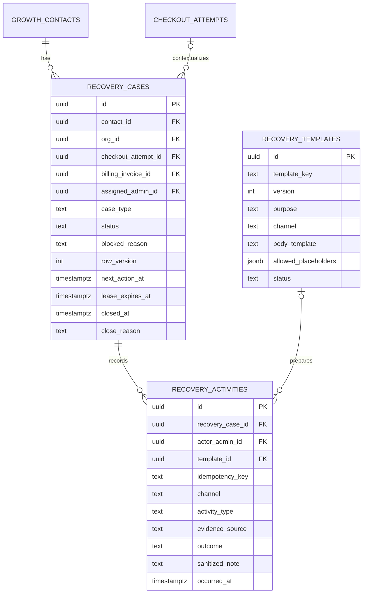
```mermaid
erDiagram
    direction TB
    GROWTH_CONTACTS ||--o{ RECOVERY_CASES : has
    CHECKOUT_ATTEMPTS o|--o{ RECOVERY_CASES : contextualizes
    RECOVERY_CASES ||--o{ RECOVERY_ACTIVITIES : records
    RECOVERY_TEMPLATES o|--o{ RECOVERY_ACTIVITIES : prepares

    RECOVERY_CASES {
      uuid id PK
      uuid contact_id FK
      uuid org_id FK
      uuid checkout_attempt_id FK
      uuid billing_invoice_id FK
      uuid assigned_admin_id FK
      text case_type
      text status
      text blocked_reason
      int row_version
      timestamptz next_action_at
      timestamptz lease_expires_at
      timestamptz closed_at
      text close_reason
    }
    RECOVERY_ACTIVITIES {
      uuid id PK
      uuid recovery_case_id FK
      uuid actor_admin_id FK
      uuid template_id FK
      text idempotency_key
      text channel
      text activity_type
      text evidence_source
      text outcome
      text sanitized_note
      timestamptz occurred_at
    }
    RECOVERY_TEMPLATES {
      uuid id PK
      text template_key
      int version
      text purpose
      text channel
      text body_template
      jsonb allowed_placeholders
      text status
    }
```

Case type awal `LEAD_NURTURE/CHECKOUT_RECOVERY`; bukan renewal dunning. Lead nurture boleh tanpa org/checkout/invoice. Case terkait invoice wajib matching org/contact link. Beberapa attempts pada invoice sama tidak membuat beberapa open case; gunakan unique active invoice case, bukan hanya unique attempt ID. Lead-nurture case aktif maksimal satu per contact/type.

Lifecycle: `OPEN → ASSIGNED → WAITING_CUSTOMER → CLOSED_CONVERTED/CLOSED_DECLINED/SUPPRESSED`; assignment lease kedaluwarsa boleh direclaim secara atomik. Pembayaran memicu close hanya dari settlement sah. Reopen karena kebutuhan baru memakai case/ref baru, bukan menghapus bukti penolakan atau suppression lama.

Evaluasi eligibility dilakukan saat membuka link dan sebelum setiap dispatch nantinya. Gabungkan consent, suppression, recent activities, status invoice/provider uncertainty, validitas URL, jam kontak, serta lease. Default batas dihitung **per kontak lintas case**, bukan per invoice agar tidak spam. Klik `wa.me` mengisi LINK_OPENED saja; receipt provider tidak tersedia pada 20C.

Source of truth aktivitas tetap append-only. Koreksi manual menambahkan event. Isi pesan tidak perlu disalin penuh; simpan template/version dan parameter minimum yang terlindungi. Template tidak mempunyai kemampuan mengubah harga atau membuat entitlement.

**Later 20F:** provider conversation/message IDs dan inbound delivery events ditambahkan melalui adapter resmi, setelah audit data model provider. Jangan menambahkan tabel bot memory atau jalur WhatsApp Web tidak resmi sekarang. Inbound STOP harus mencatat consent/suppression atomik sebelum antrean pesan lain diproses.

## 27. Conversion Outbox, Destination, dan Atribusi

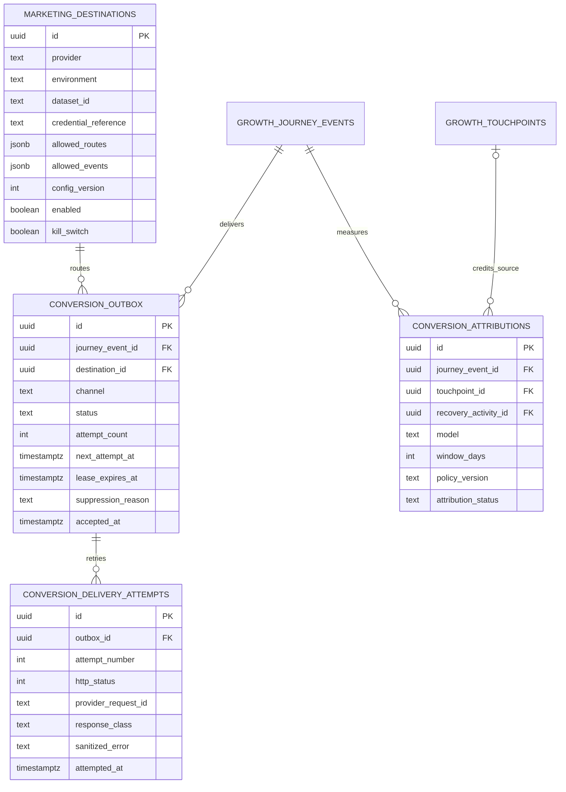
```mermaid
erDiagram
    direction TB
    MARKETING_DESTINATIONS ||--o{ CONVERSION_OUTBOX : routes
    GROWTH_JOURNEY_EVENTS ||--o{ CONVERSION_OUTBOX : delivers
    CONVERSION_OUTBOX ||--o{ CONVERSION_DELIVERY_ATTEMPTS : retries
    GROWTH_JOURNEY_EVENTS ||--o{ CONVERSION_ATTRIBUTIONS : measures
    GROWTH_TOUCHPOINTS o|--o{ CONVERSION_ATTRIBUTIONS : credits_source

    MARKETING_DESTINATIONS {
      uuid id PK
      text provider
      text environment
      text dataset_id
      text credential_reference
      jsonb allowed_routes
      jsonb allowed_events
      int config_version
      boolean enabled
      boolean kill_switch
    }
    CONVERSION_OUTBOX {
      uuid id PK
      uuid journey_event_id FK
      uuid destination_id FK
      text channel
      text status
      int attempt_count
      timestamptz next_attempt_at
      timestamptz lease_expires_at
      text suppression_reason
      timestamptz accepted_at
    }
    CONVERSION_DELIVERY_ATTEMPTS {
      uuid id PK
      uuid outbox_id FK
      int attempt_number
      int http_status
      text provider_request_id
      text response_class
      text sanitized_error
      timestamptz attempted_at
    }
    CONVERSION_ATTRIBUTIONS {
      uuid id PK
      uuid journey_event_id FK
      uuid touchpoint_id FK
      uuid recovery_activity_id FK
      text model
      int window_days
      text policy_version
      text attribution_status
    }
```

### Outbox reliability

- `UNIQUE(journey_event_id, destination_id, channel)`; ulang request tidak membuat antrean ganda. Retry memakai event ID dan occurred_at **yang sama**, bukan now()/ID baru.
- State `QUEUED/PROCESSING/ACCEPTED/RETRYABLE/DEAD_LETTER/SUPPRESSED`. ACCEPTED berarti API provider menerima, **bukan** iklan menghasilkan pelanggan atau pengguna menerima WhatsApp.
- Worker mengklaim row dengan transaksi/lease, membaca ulang enabled/kill switch/consent, lalu melakukan request di luar transaksi finansial. Setelah timeout yang hasilnya belum diketahui, retry idempoten mengikuti kontrak provider.
- `CONVERSION_DELIVERY_ATTEMPTS` hanya server deliveries. Pixel browser tidak mendapatkan status SENT/ACCEPTED palsu dari server; event browser dan CAPI berbagi ID berdasarkan canonical kejadian yang sama bila dual-delivery digunakan.
- Event/outbox dibuat tahan crash dari settlement transaction atau ledger durable plus reconciling job. Kegagalan menulis analytics harus mempunyai recovery path dan tidak menyebabkan pembayaran ulang. Jangan mengirim network request ke Meta di dalam RPC payment recovery.
- Destination menyimpan secret **reference**, bukan token plaintext. Tidak ada arbitrary JS/URL dari admin form. Production/test credentials dan dataset berbeda atau secara eksplisit diisolasi sesuai kemampuan provider.
- Consent saat capture dan dispatch diperiksa sesuai subject/purpose. Outbox withdrawn → SUPPRESSED; re-grant tidak otomatis mengirim ulang semua histori lama.

### Attribution constraints

- Model awal: `FIRST_TOUCH`, `LAST_ELIGIBLE_TOUCH`, `OBSERVED_RECOVERY`. Satu hasil per `(journey_event_id, model, policy_version)`, bukan penjumlahan ketiganya.
- First/last touch: touchpoint nullable bila `UNATTRIBUTED`; `recovery_activity_id` null. Observed recovery: activity yang benar-benar memenuhi syarat harus ada, terjadi sebelum settlement dalam jendela kebijakan; `touchpoint_id` null. LINK_OPENED tanpa kirim tidak memenuhi syarat.
- Join tidak boleh melintas org/env atau membuktikan identitas hanya dari IP. Touchpoint harus berada sebelum kejadian dan dalam window; policy/version snapshot disimpan.
- Purchase per invoice menjadi denominator conversion. Payment/refund ledger menjadi sumber observed net cash, bukan `conversion_value` dijumlah bersama cash. Refund tidak mengedit raw canonical event; view net cash mengurangi successful refunds dan final chargeback sesuai kebijakan finansial.
- No denominator → null/NOT_APPLICABLE. First purchase, renewal, test data dan mata uang terpisah. Ad-spend/ROAS belum ada sampai sumber biaya nyata diintegrasikan.

## 28. Support Ticket, Komplain, dan Lampiran

### 28.1. Percakapan dukungan privat

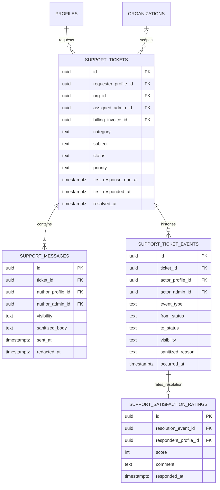
```mermaid
erDiagram
    direction TB
    PROFILES ||--o{ SUPPORT_TICKETS : requests
    ORGANIZATIONS o|--o{ SUPPORT_TICKETS : scopes
    SUPPORT_TICKETS ||--o{ SUPPORT_MESSAGES : contains
    SUPPORT_TICKETS ||--o{ SUPPORT_TICKET_EVENTS : histories
    SUPPORT_TICKET_EVENTS ||--o| SUPPORT_SATISFACTION_RATINGS : rates_resolution

    SUPPORT_TICKETS {
      uuid id PK
      uuid requester_profile_id FK
      uuid org_id FK
      uuid assigned_admin_id FK
      uuid billing_invoice_id FK
      text category
      text subject
      text status
      text priority
      timestamptz first_response_due_at
      timestamptz first_responded_at
      timestamptz resolved_at
    }
    SUPPORT_MESSAGES {
      uuid id PK
      uuid ticket_id FK
      uuid author_profile_id FK
      uuid author_admin_id FK
      text visibility
      text sanitized_body
      timestamptz sent_at
      timestamptz redacted_at
    }
    SUPPORT_TICKET_EVENTS {
      uuid id PK
      uuid ticket_id FK
      uuid actor_profile_id FK
      uuid actor_admin_id FK
      text event_type
      text from_status
      text to_status
      text visibility
      text sanitized_reason
      timestamptz occurred_at
    }
    SUPPORT_SATISFACTION_RATINGS {
      uuid id PK
      uuid resolution_event_id FK
      uuid respondent_profile_id FK
      int score
      text comment
      timestamptz responded_at
    }
```

Constraint:

- Requester adalah profile terautentikasi. `org_id` null diperbolehkan hanya untuk no-org account/billing help; jika populated, requester harus mempunyai membership yang relevan. Lead public form tidak diberi akses auth dengan menyebut email.
- Invoice reference opsional, harus milik org tiket dan requester berhak melihatnya. Payload tidak boleh menerima project invoice sebagai SaaS billing invoice. Tiket bukan jalur mutasi PAID/refund.
- Message author tepat satu profile/admin; customer tidak dapat menulis `author_admin_id` atau `visibility=INTERNAL`. Event otomatis boleh author null dengan actor_source SYSTEM yang ditetapkan server. Event human wajib actor valid.
- Visibility `CUSTOMER_VISIBLE/INTERNAL`. API, notifikasi, export dan search customer menyaring di server/database. Field hidden di UI saja tidak cukup.
- Status mengikuti PRD; duplicate request memakai idempotency pada create/reply untuk mencegah tiket/pesan ganda karena retry jaringan. Resolution event tidak dihapus saat reopen.
- Rating hanya requester tiket pada resolution event yang sah, skor 1–5; satu per `(resolution_event_id, respondent_profile_id)`. Agent tidak dapat menulis rating customer.
- READ_ONLY/SUSPENDED memblokir mutasi proyek tetapi tidak memblokir bantuan berizin. Scope support tidak otomatis mencakup data proyek; lampiran proyek dikirim customer secara sengaja atau melalui grant terpisah.

### 28.2. Lampiran feedback bersama dengan parent eksplisit

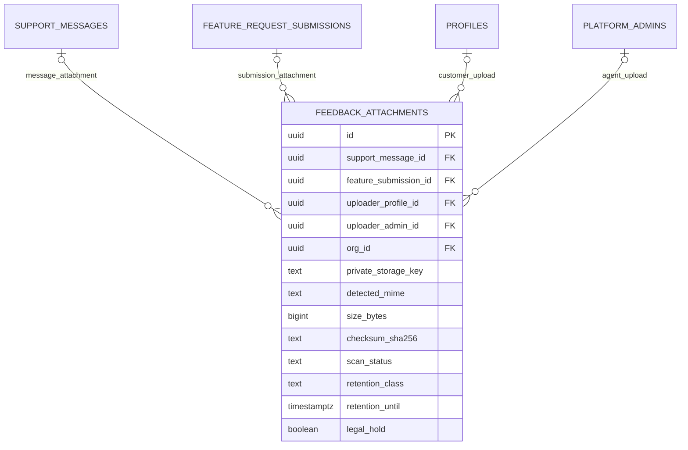
```mermaid
erDiagram
    direction TB
    SUPPORT_MESSAGES o|--o{ FEEDBACK_ATTACHMENTS : message_attachment
    FEATURE_REQUEST_SUBMISSIONS o|--o{ FEEDBACK_ATTACHMENTS : submission_attachment
    PROFILES o|--o{ FEEDBACK_ATTACHMENTS : customer_upload
    PLATFORM_ADMINS o|--o{ FEEDBACK_ATTACHMENTS : agent_upload

    FEEDBACK_ATTACHMENTS {
      uuid id PK
      uuid support_message_id FK
      uuid feature_submission_id FK
      uuid uploader_profile_id FK
      uuid uploader_admin_id FK
      uuid org_id FK
      text private_storage_key
      text detected_mime
      bigint size_bytes
      text checksum_sha256
      text scan_status
      text retention_class
      timestamptz retention_until
      boolean legal_hold
    }
```

Exactly-one parent: support message **atau** feature submission. Exactly-one uploader profile/admin. Org diturunkan dari parent (boleh null untuk no-org), tidak ditentukan bebas oleh browser. Akses file mengikuti visibility parent; attachment internal note tidak menjadi public hanya karena agent membagikan URL.

Status `QUARANTINED/SCANNING/CLEAN/REJECTED/DELETED`. Signed download hanya untuk CLEAN dan actor berizin, dengan TTL pendek. Limit awal 3 × 5 MB per submission, tipe PNG/JPEG/PDF sesuai isi file. Tidak menerima remote URL import. Metadata disanitasi; filename/object path tidak memuat email/token. Reuse object storage lama dimungkinkan, tetapi ACL dan prefix feedback harus teruji.

## 29. Feature Request, Canonical Backlog, dan Release

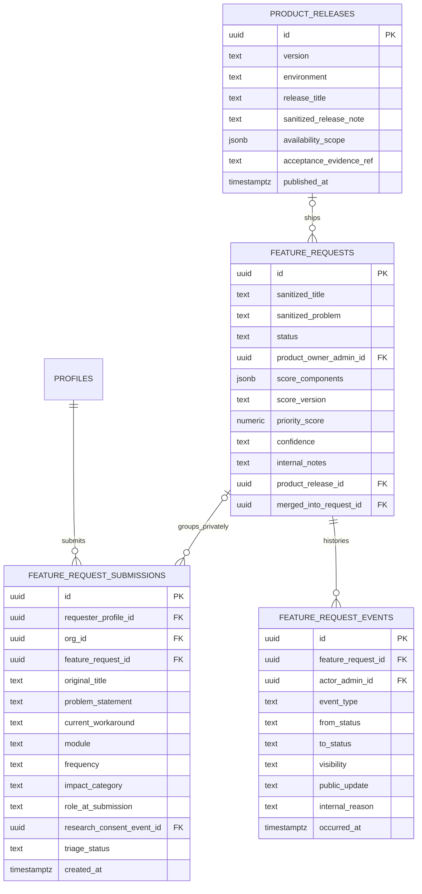
```mermaid
erDiagram
    direction TB
    PROFILES ||--o{ FEATURE_REQUEST_SUBMISSIONS : submits
    FEATURE_REQUESTS o|--o{ FEATURE_REQUEST_SUBMISSIONS : groups_privately
    FEATURE_REQUESTS ||--o{ FEATURE_REQUEST_EVENTS : histories
    PRODUCT_RELEASES o|--o{ FEATURE_REQUESTS : ships

    FEATURE_REQUEST_SUBMISSIONS {
      uuid id PK
      uuid requester_profile_id FK
      uuid org_id FK
      uuid feature_request_id FK
      text original_title
      text problem_statement
      text current_workaround
      text module
      text frequency
      text impact_category
      text role_at_submission
      uuid research_consent_event_id FK
      text triage_status
      timestamptz created_at
    }
    FEATURE_REQUESTS {
      uuid id PK
      text sanitized_title
      text sanitized_problem
      text status
      uuid product_owner_admin_id FK
      jsonb score_components
      text score_version
      numeric priority_score
      text confidence
      text internal_notes
      uuid product_release_id FK
      uuid merged_into_request_id FK
    }
    FEATURE_REQUEST_EVENTS {
      uuid id PK
      uuid feature_request_id FK
      uuid actor_admin_id FK
      text event_type
      text from_status
      text to_status
      text visibility
      text public_update
      text internal_reason
      timestamptz occurred_at
    }
    PRODUCT_RELEASES {
      uuid id PK
      text version
      text environment
      text release_title
      text sanitized_release_note
      jsonb availability_scope
      text acceptance_evidence_ref
      timestamptz published_at
    }
```

Constraint:

- Submission requester profile wajib; org opsional mengikuti membership nyata. Canonical `feature_request_id` boleh null sebelum triage. Usulan yang belum ditautkan menampilkan SUBMITTED/UNDER_REVIEW dari triage_status, bukan menghilang.
- Submission menyimpan uraian asli privat, canonical request menyimpan ringkasan tersanitasi. Customer tidak mendapat SELECT seluruh canonical/internal notes atau daftar pengusul tenant lain; gunakan projection berdasarkan submission miliknya.
- Research consent opsional dan purpose harus FEATURE_RESEARCH untuk contact yang terverifikasi terkait requester. Consent riset tidak membuka WHATSAPP_MARKETING atau ADS_MEASUREMENT. Tidak wajib membuat growth contact ketika user menolak riset.
- Merge menjaga submission dan audit event before/after linkage. `merged_into_request_id` tidak boleh menunjuk diri sendiri atau membentuk cycle. Salah merge dapat diperbaiki beralasan; scope akses masing-masing submission tidak berubah.
- Dukungan dihitung `COUNT(DISTINCT org_id)` untuk organisasi non-null yang sah pada canonical root; prospek tanpa org dihitung terpisah, bukan diasumsikan perusahaan baru. Jumlah dukungan adalah view, bukan counter yang dapat diisi admin.
- Priority komponen 1–5 dan effort >0, skor numeric dengan versi, confidence, serta override reason. Banyak vote dari satu org tidak otomatis menaikkan prioritas. Versi awal tidak menyediakan voting board publik.
- Released wajib `product_release_id`, environment production yang diverifikasi dan availability_scope yang relevan; build lokal/commit saja bukan bukti RELEASED. Planned tidak menyimpan tanggal janji wajib. Partial rollout harus dijelaskan; customer yang belum eligible mendapat keterangan yang benar.
- `FEATURE_REQUEST_EVENTS` internal_reason tidak pernah ikut notifikasi customer walaupun public_update tersedia; projection field-level wajib.

## 30. Notifikasi, Permission Platform, dan Data Access

### 30.1. Notifikasi berbasis event, bukan salinan data sensitif

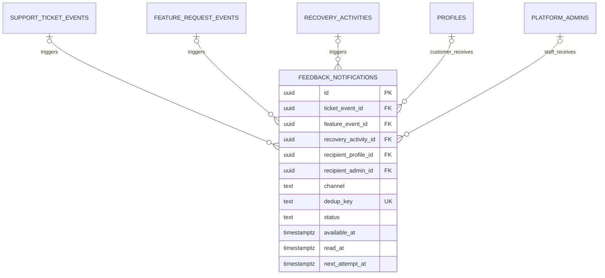
```mermaid
erDiagram
    direction TB
    SUPPORT_TICKET_EVENTS o|--o{ FEEDBACK_NOTIFICATIONS : triggers
    FEATURE_REQUEST_EVENTS o|--o{ FEEDBACK_NOTIFICATIONS : triggers
    RECOVERY_ACTIVITIES o|--o{ FEEDBACK_NOTIFICATIONS : triggers
    PROFILES o|--o{ FEEDBACK_NOTIFICATIONS : customer_receives
    PLATFORM_ADMINS o|--o{ FEEDBACK_NOTIFICATIONS : staff_receives

    FEEDBACK_NOTIFICATIONS {
      uuid id PK
      uuid ticket_event_id FK
      uuid feature_event_id FK
      uuid recovery_activity_id FK
      uuid recipient_profile_id FK
      uuid recipient_admin_id FK
      text channel
      text dedup_key UK
      text status
      timestamptz available_at
      timestamptz read_at
      timestamptz next_attempt_at
    }
```

Exactly-one trigger dan exactly-one recipient. In-app mandatory; email Later/opsional memakai notifier existing bila ada. Event creation/assignment/recovery due perlu activity/event yang immutable agar dedup dapat ditegakkan. Deduplikasi minimal trigger + recipient + channel, bukan satu notifikasi untuk seluruh org.

Saat fanout dan saat read, cek ulang izin resource, keanggotaan serta visibility. Internal event tidak bisa ditujukan ke customer profile. Notifikasi menyimpan referensi dan teks pendek tersanitasi, tidak menyalin seluruh tiket/PII/payment link. In-app memakai AVAILABLE/READ; email tidak diklaim DELIVERED sebelum receipt provider.

### 30.2. Grant internal yang sempit

Entitas logical `platform_permission_grants`: `id`, `platform_admin_id FK`, `permission_set`, `scope`, `granted_by FK`, `reason`, `expires_at`, `revoked_at`. Reuse tabel RBAC/grant existing bila tersedia, jangan membuat sistem identity kedua.

Permission set: `GROWTH_OPERATOR`, `SUPPORT_AGENT`, `PRODUCT_MANAGER`, `TRACKING_CONFIG_ADMIN`; billing financial permissions tetap terpisah. Grant aktif unik per admin/set/scope dengan waktu berlaku; scope null ditangani deterministik. Seluruh grant/revoke diaudit pada `admin_audit_logs`.

| Data/aksi | Customer | Operator internal |
|---|---|---|
| growth_contacts/recovery_* | submit/update preferensi sendiri melalui endpoint sempit, tidak SELECT list | Growth Operator sesuai tugas |
| marketing_destinations | tidak ada | config admin; credential value tetap tidak dibaca UI |
| consent/suppression | subject terverifikasi dapat withdraw; no contact enumeration | minimum read; tidak membuat opt-in palsu |
| support ticket/public messages | requester atau grant org-support eksplisit | assigned Support Agent/admin support |
| internal note/feature prioritization | tidak ada | staf dengan scope yang tepat |
| feature submission | pemilik/role berizin saja | Product Manager; tidak otomatis akses kontrak |
| product release summary | hanya ringkasan yang dipublikasikan | Product Manager dapat update melalui audit |
| billing mutasi finansial | role billing lama | permission finansial lama, bukan karena support/growth role |

Semua tabel tambahan dengan akses melalui API/Supabase wajib RLS aktif dan default deny. Service role melewati RLS: sebelum memakainya, server wajib memverifikasi actor/permission/resource dan menulis audit. Financial RPC tetap hanya service_role dengan server authorization; jangan memberi EXECUTE ke anon/authenticated agar dashboard growth bekerja.

Endpoint customer support/consent dikecualikan secara spesifik dari **project-mutation entitlement**, bukan dari autentikasi/ownership/rate-limit/CSRF. SUSPENDED security/legal karena penyalahgunaan berbeda dari suspended nonpayment; bila akun auth diblokir, arahkan ke kanal bantuan/verifikasi identitas eksternal, bukan membuka endpoint tanpa kontrol.

## 31. Constraints, View, Retention, Migration, dan Acceptance Tambahan

### 31.1. Unique keys dan ownership checks

| Entitas | Constraint minimum |
|---|---|
| growth_contact_links | null-safe unique contact/profile/membership; profile sama dengan anggota org |
| growth_sessions | session_token_hash unik per environment; token acak, bukan fingerprint |
| growth_consent_events | exactly-one subject; append-only; purpose/state tervalidasi |
| checkout_attempts | unique org/env/idempotency_key serta provider/env/provider_checkout_id bila tersedia |
| growth_journey_events | business_event_key unik; khusus Purchase satu event/invoice/env |
| recovery_cases | satu open invoice-case per org/invoice/type; nurture satu contact/type aktif; lease + row_version |
| recovery_activities | unique case/idempotency_key; evidence type enum tervalidasi |
| recovery_templates | unique template_key/version/channel |
| marketing_destinations | satu config aktif provider/dataset/environment yang relevan |
| conversion_outbox | unique event/destination/channel; state dan lease recoverable |
| conversion_delivery_attempts | unique outbox_id/attempt_number |
| conversion_attributions | unique event/model/policy_version; origin/occurrence/window validated |
| support_messages/events | author provenance dan resource authorization; create/reply idempotency pada service |
| support_satisfaction_ratings | unique resolution/requester, score 1–5 |
| feedback_attachments | exactly-one parent dan uploader; org/visibility sama dengan parent |
| feature_requests | merged-into acyclic; Released memerlukan release evidence |
| feature_request_submissions | immutable source identity; scope membership tervalidasi |
| feedback_notifications | unique dedup_key; exactly-one trigger dan recipient |
| platform_permission_grants | null-safe unique active admin/set/scope; expiry dan revocation checked |

Cross-table consistency seperti org invoice, parent attachment, ownership rating dan visibility tidak cukup ditangani FK tunggal. Pilih composite FK/constraint/trigger dan server checks sesuai schema nyata, lalu buktikan negative path melalui database dan API. Constraint berbasis “masih aktif” harus memperhitungkan waktu lewat tanpa update; jangan membuat partial index dengan `now()` sebagai solusi expiry otomatis.

### 31.2. View tambahan yang tidak membuat ledger kedua

- `v_growth_contact_eligibility`: permission, purpose, suppression dan data contact validity.
- `v_checkout_abandon_candidates`: waktu/status/uncertainty, dengan policy version.
- `v_recovery_queue`: owner, lease, due, consent dan billing current state.
- `v_growth_funnel`: sessions, contacts, orgs, checkout invoices dan paid invoices terpisah grain.
- `v_observed_recovered_cash`: join invoice unik ke payment allocation/refund sah; first/last attribution tidak dijumlah.
- `v_customer_support_threads`: authorized public messages/events saja.
- `v_support_backlog`: waiting, response time, resolution, reopen dan CSAT denominator.
- `v_customer_feature_status`: submission sendiri + sanitized public canonical status.
- `v_feature_request_demand`: distinct org count, no-org requesters, status dan score version.

Setiap view membawa environment, scope, waktu data, currency bila relevan, dan definition version. Kegagalan data quality tampil sebagai flag, bukan zero yang seolah tidak ada masalah.

### 31.3. Retention dan penghapusan aman

Jendela default mengikuti PRD A.13 dan harus disetujui sebelum produksi. Growth/contact/feedback body mempunyai `retention_review_at/retention_until/redacted_at` atau metadata lifecycle ekuivalen; legal hold dicatat dengan reason dan owner. Konten tiket/lampiran bisa dihapus setelah masa berlaku, sementara audit minimal mempertahankan ID/aksi/waktu tanpa menyalin PII. Consent dan suppression disimpan seminimal yang dibutuhkan untuk membuktikan preferensi serta mencegah reimport tak sengaja; bukan alasan menyimpan seluruh pesan tanpa batas.

Request access/delete menggunakan verifikasi identitas dan workflow privacy/support; tidak menghapus payment ledger, audit wajib, atau data proyek lewat cascade growth_contact. Default FK ke record finansial/identity `RESTRICT` atau explicit redaction mapping, bukan cascade delete. Contact removal memutus/menganonimkan context analytics yang layak dan menghentikan pending dispatch; archived database backups mengikuti siklus retention sendiri dan tidak diberi janji penghapusan seketika.

### 31.4. Inventaris dan urutan migration aditif

Ada **26 entitas logical tambahan** yang dijelaskan di §24–§30 termasuk `platform_permission_grants`. Ini bukan kewajiban membuat 26 tabel baru sekaligus. Pengelompokan deployment:

| Fase | Entitas/seam minimum | Gate |
|---|---|---|
| Audit awal | mapping existing→target, auth/consent/RBAC/billing seam | KEEP/ADAPT/NEW/CONFLICT, keputusan reuse terdokumentasi |
| 20A | session, consent/suppression, permission grant, marketing config, touchpoint dan event vocabulary | data boundary, consent deny dan kill switch |
| 20B | contacts, verified links, checkout projection | tidak menambah sistem auth/harga/payment kedua |
| 20C | cases, activities, templates, notifikasi staff | lease, frequency, paid/opt-out suppression |
| 20D | support, feedback attachments, feature submissions/backlog/releases, notifikasi customer | privacy/RLS, merge/audit dan no-org support |
| 20E | canonical conversion, outbox/attempts, attribution dan reporting views | crash/retry/dedup dan cash reconciled |
| 20F | extension provider WhatsApp berdasarkan provider terpilih | scope, biaya dan izin pesan nyata disetujui |

Jika 20A membutuhkan FK contact yang baru dipakai 20B, schema minimal parent boleh dibuat pada 20A tanpa membuka UI capture. Laporan phase membedakan schema dependency dan fitur aktif. Jangan mengganti nama migration yang sudah terpasang; pilih nomor berikutnya dari repository. Uji terhadap clone/test database terisolasi, bukan reset production. Backfill hanya data first-party dengan tujuan sah; tidak scraping kontak proyek atau mengekspor customer list ke Meta.

Keluaran audit Antigravity sebelum implementasi: requirement→existing service/entity→gap→migration→test→phase, termasuk permission ownership. Existing tabel yang sama dipakai ulang melalui adapter/view, bukan menyalin pembayaran ke tabel growth. Event/schema perubahan dijaga backward-compatible; feature flag default OFF sampai acceptance.

### 31.5. Acceptance extension

- [ ] Semua GFR-001–GFR-040 dan GSR-001–GSR-012 terpetakan; 20F berlabel Later.
- [ ] 97 requirement baseline dan 18 UAT produk tidak dihapus/diganti.
- [ ] UAT-G01–UAT-G30 pada PRD memiliki expected/actual, environment, timestamp dan evidence; belum dijalankan tidak diberi PASS.
- [ ] Consent subject/purpose, multi-org identity, grant expiry dan null-org boundaries teruji.
- [ ] Semua hubungan finansial menunjuk invoice SaaS yang benar dan tidak membuka ledger proyek.
- [ ] Race operator, webhook paid-after-open, withdrawal-before-send dan worker timeout tidak menimbulkan duplikasi/komunikasi lanjut.
- [ ] Manual LINK_OPENED bukan bukti SENT, delivery, atau revenue recovery.
- [ ] Customer tidak dapat membaca internal notes/tenant lain melalui API, attachment, notifikasi, search atau export.
- [ ] Feature merge tidak membocorkan submission dan distinct org count tidak berganda.
- [ ] Meta menerima hanya event allowlist dengan consent; CAPI bukan bypass consent atau transaksi finansial.
- [ ] Retention, deletion/redaction, backup dan legal hold mempunyai owner serta bukti.
- [ ] Provider external test yang blocked tetap NOT RUN/BLOCKED; no synthetic production acceptance.
- [ ] Tidak ada migration/deployment/kampanye/pembayaran nyata sebelum persetujuan user.

**Rujukan eksternal:** detail opt-in/template/provider mengikuti sumber dan batas verifikasi di PRD A.5, A.6, A.14. Nama tabel, default window, permission set dan diagram di dokumen ini adalah rancangan COVE, bukan skema resmi Meta/Mayar atau bukti schema repository.
