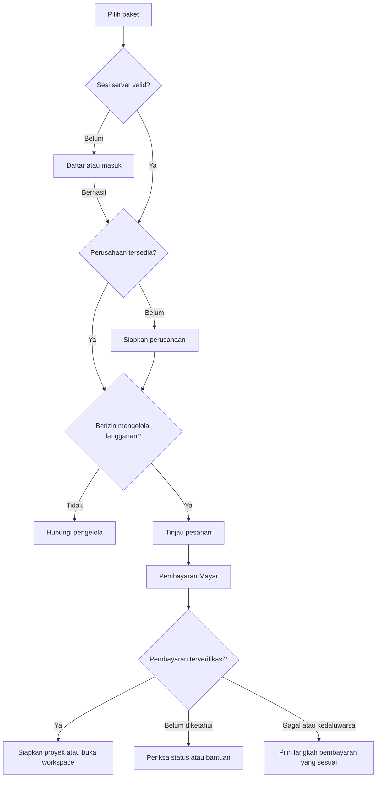
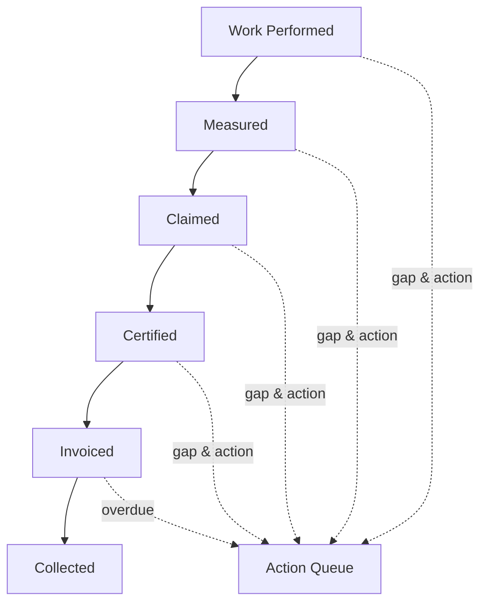
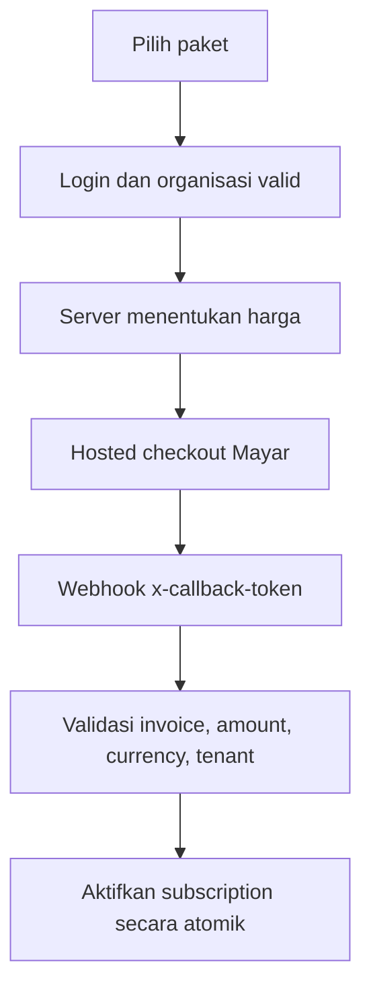

# COVE — Product Requirements Document v2.2

**Nama produk:** COVE — Construction Operations Value Engine  
**Kategori:** Construction Commercial Control & Progress-to-Cash SaaS  
**Versi:** 2.2 — Customer Journey, Information Architecture & Growth/Feedback  
**Tanggal:** 7 September 2026  
**Status dokumen:** Baseline produk untuk audit, implementasi bertahap, dan acceptance test  

> Dokumen ini menjelaskan bentuk akhir COVE dari sudut pandang pelanggan. Fitur lama tidak dihapus; fitur yang belum menjadi inti ditempatkan sebagai *Later*, *Add-on*, atau layanan implementasi agar produk tidak kehilangan fokus.

> **Pembaruan 7 September 2026:** versi isi sekarang **v2.2**. Bagian 10–11 dirancang ulang dari kebutuhan pengunjung hingga pengguna aktif; Bagian 33 menambahkan 16 skenario acceptance alur. Lima modul inti, 35 bagian utama, dan seluruh **149 requirement** tetap dipertahankan. Referensi UI/UX: `DESIGN.md` v1.0. Nama berkas v2.0 tetap untuk kompatibilitas tautan. ERD pasangan tetap `COVE_ERD_v2.0_Logical_Data_Model.md`, revisi isi v2.1; revisi navigasi ini tidak menyatakan perubahan database telah diimplementasikan. Seluruh perubahan baru berstatus **PLANNED** sampai dibuktikan melalui acceptance aktual.

---

## 1. Kendali Dokumen

| Atribut | Ketetapan |
|---|---|
| Product owner | Founder COVE |
| Pengguna utama | Commercial Manager/QS, Finance Manager, Project Manager |
| Pembeli ekonomi | Direktur/Owner/CFO kontraktor |
| Sumber kebenaran produk | PRD ini, migration terkontrol, test otomatis, dan bukti UAT |
| Perubahan requirement | Wajib memiliki ID, alasan, dampak, owner, dan release gate |
| Larangan | Tidak menganggap laporan implementasi sebagai bukti production tanpa UAT aktual |

### Riwayat perubahan

| Versi isi | Perubahan | Batas perubahan |
|---|---|---|
| 2.0 | Baseline produk, 35 bagian dan 97 requirement | Lima modul inti Progress-to-Cash |
| 2.1 | Growth, lead belum bayar, WhatsApp recovery manual, Meta Pixel/CAPI, support dan usulan fitur | Addendum A; tidak mengganti auth, payment ledger, harga paket, atau rumus G1–G5 |
| 2.2 | Arsitektur informasi berbasis perjalanan pengguna, navigasi ringkas, onboarding dua tahap dan handoff UI/UX | Memperjelas halaman/aksi/status; 149 ID requirement dipertahankan, menambah acceptance alur |

### Klasifikasi bukti

- **LIVE-VERIFIED:** terbukti pada production melalui request atau UAT aktual.
- **IMPLEMENTED-REPORTED:** dinyatakan telah dibangun dan lulus test lokal, tetapi masih perlu audit repository/production.
- **PLANNED:** target desain yang belum boleh diklaim tersedia.

---

## 2. Ringkasan Eksekutif

COVE membantu kontraktor mengendalikan nilai pekerjaan yang sudah dikerjakan tetapi belum berubah menjadi penerimaan kas. Produk menyatukan data proyek, pengukuran progres, klaim, sertifikasi, invoice, piutang, dokumen penghambat, pemilik tindakan, dan tenggat dalam satu ledger komersial yang dapat diaudit.

COVE tidak menjamin owner membayar. COVE memastikan perusahaan dapat menjawab setiap minggu:

1. Berapa Rupiah pekerjaan yang sudah dilakukan tetapi belum menjadi invoice?
2. Nilai tersebut tertahan pada tahap apa?
3. Apa penyebabnya?
4. Siapa yang harus bertindak dan kapan?
5. Berapa kas yang realistis masuk berdasarkan bukti dan status aktual?

---

## 3. Gambaran Hasil Akhir Produk

Setelah selesai, COVE terdiri atas tiga lapisan yang tidak boleh tercampur:

| Lapisan | Fungsi | Contoh |
|---|---|---|
| Produk pelanggan | Mengendalikan Progress-to-Cash proyek | progres, klaim, sertifikasi, invoice proyek, collection |
| Billing SaaS | Mengelola langganan pelanggan COVE | paket, checkout Mayar, subscription, dunning |
| Platform admin | Mengendalikan operasi COVE sebagai bisnis SaaS | reconciliation, refund, webhook, MRR, audit admin |

Perluasan v2.1 tetap berada dalam tiga lapisan ini: Growth & Recovery adalah alat internal COVE; Bantuan, Komplain, dan Usulan Fitur adalah permukaan pelanggan dengan inbox internal terpisah. Ini bukan modul CRM untuk mengumpulkan kontak owner/MK milik kontraktor.

### Pengalaman pelanggan

Pengunjung memahami manfaat melalui halaman utama dan contoh alur, kemudian memilih paket. Pendaftaran dan identitas perusahaan diselesaikan **sebelum checkout**. Setelah pembayaran terverifikasi, pelanggan menyiapkan proyek pertama dan mulai mengendalikan progres serta tindakan. Kunjungan berikutnya langsung menuju pekerjaan yang relevan tanpa mengulangi pembelian atau onboarding yang sudah selesai.

Onboarding dipisahkan menjadi **identitas perusahaan sebelum pembayaran** dan **setup proyek setelah entitlement aktif**. Staf undangan bergabung ke perusahaan yang mengundang, tidak diwajibkan membeli paket pribadi. Detail routing pada Bagian 10–11 menjadi acuan agar alur tidak kembali berputar ke login.

---

## 4. Masalah Prioritas

Masalah prioritas adalah **nilai pekerjaan yang tertahan sebelum menjadi kas karena status, dokumen, tanggung jawab, dan tindakan berikutnya tidak terlihat secara konsisten lintas proyek**.

Masalah ini muncul dalam bentuk:

- pekerjaan sudah dilakukan tetapi belum diukur;
- hasil pengukuran belum diajukan sebagai klaim;
- klaim belum lengkap atau belum disertifikasi;
- nilai bersertifikat belum dibuatkan invoice;
- invoice belum jatuh tempo tetapi forecast tidak jelas;
- invoice sudah jatuh tempo tetapi penagihan tidak terstruktur;
- VO, retensi, atau dokumen pendukung tidak ditindaklanjuti.

---

## 5. Target Pasar dan ICP

### ICP utama

Kontraktor menengah atau spesialis bernilai tinggi dengan karakteristik:

- 3–20 proyek aktif;
- nilai proyek tipikal Rp5 miliar–Rp250 miliar;
- mempunyai QS/Commercial dan Finance yang terpisah;
- menggunakan Excel, WhatsApp, email, dan folder dokumen;
- mengalami jeda opname-ke-invoice atau invoice-ke-cash yang berulang;
- belum memiliki control tower komersial lintas proyek;
- buyer dapat mengambil keputusan tanpa tender enterprise panjang.

### ICP sekunder

Subkontraktor besar MEP, struktur, baja, atau pekerjaan spesialis yang membiayai material dan tenaga kerja lebih dahulu serta bergantung pada approval main contractor/owner.

### Bukan beachhead

- kontraktor mikro satu proyek tanpa fungsi QS/Finance;
- BUMN konstruksi besar sebagai pelanggan pertama;
- owner yang hanya membutuhkan project scheduling;
- perusahaan yang belum bersedia menyediakan data kontrak dan klaim minimum.

---

## 6. Persona dan Buying Committee

| Peran | Kebutuhan | Peran pembelian |
|---|---|---|
| QS/Commercial | Menyiapkan klaim lengkap dan mengejar approval | Pengguna harian, champion |
| Finance Manager | Mengetahui invoice, jatuh tempo, collection | Pengguna rutin, co-champion |
| Project Manager | Menghapus hambatan lapangan/dokumen | Approver operasional |
| Direktur/Owner/CFO | Mengendalikan exposure dan penerimaan | Economic buyer |
| Admin kontrak | Menjaga dokumen dan status | Data steward |
| IT/Security | Integrasi, akses, keamanan | Blocker/approver |
| Auditor | Melihat histori tanpa mengubah data | Reviewer |

---

## 7. Jobs to Be Done

### Functional job

Ketika progres terjadi, pengguna ingin mengetahui nilai, bukti, status, hambatan, pemilik tindakan, dan tenggat sampai pembayaran diterima.

### Financial job

Mengurangi nilai yang mengendap antar-stage dan memperpendek waktu dari pekerjaan selesai hingga invoice serta kas.

### Emotional job

Mengurangi ketergantungan pada ingatan, chat pribadi, dan pengejaran manual yang tidak pasti.

### Social job

Membuat Commercial, Project, Finance, dan Direksi bekerja dari angka dan histori yang sama.

### Switching trigger

Klaim tertahan, forecast meleset, invoice terlambat terbit, audit menemukan dokumen tidak lengkap, atau direksi tidak dapat menjelaskan cash exposure lintas proyek.

---

## 8. Sasaran dan Non-Sasaran

### Sasaran 12 bulan

- pelanggan melihat value gap pertama dalam satu hari onboarding;
- median opname-ke-invoice turun pada cohort pilot;
- setiap gap material memiliki PIC dan tenggat;
- laporan mingguan dipakai Commercial dan Finance;
- ROI dapat dibuktikan dalam 45–90 hari.

### Non-sasaran MVP

- bukan ERP akuntansi penuh;
- bukan pengganti software penjadwalan konstruksi;
- bukan sistem payroll/subkon penuh;
- bukan pemberi nasihat hukum atau pajak otomatis;
- bukan penyimpanan seluruh foto proyek tanpa batas;
- bukan jaminan pembayaran owner.

---

## 9. Prinsip Produk

1. Setiap angka harus mempunyai sumber dan tanggal.
2. Setiap risiko harus menghasilkan tindakan.
3. Satu nilai hanya boleh berada pada satu gap utama pada waktu yang sama.
4. Data proyek pelanggan tidak boleh tercampur dengan billing SaaS COVE.
5. Server adalah sumber kebenaran untuk harga, akses, dan perubahan finansial.
6. Excel diterima sebagai jalur masuk, bukan dipaksa hilang pada hari pertama.
7. Forecast harus menampilkan keyakinan dan asumsi.
8. Dokumen otomatis adalah template operasional, bukan nasihat hukum.

---

## 10. Arsitektur Informasi dan Halaman

### 10.1. Prinsip: dari pertanyaan pengguna menuju tindakan

Halaman utama harus menjawab **COVE untuk siapa, masalah apa yang diselesaikan, bagaimana cara kerjanya, dan langkah berikutnya**. Pengunjung tidak perlu memahami istilah entitlement, rekonsiliasi webhook atau struktur modul sebelum memilih produk.

Tiga area navigasi yang berbeda: **situs publik**, **workspace perusahaan**, dan **konsol internal COVE**. Header/sidebar mengikuti area, tidak dicampur. Maksimal lima menu utama workspace; fitur rinci tetap tersedia di konteks proyek atau pengaturan. Satu primary action per konten halaman; tautan sekunder membantu pengguna yang belum siap melanjutkan.

Nama route berikut adalah **target navigasi**, bukan bukti route sudah ada. Audit repository wajib memetakan URL aktual ke target, mempertahankan bookmark/deep link melalui redirect atau alias yang aman. Jangan menghapus fitur/service karena menu disusun ulang.

### 10.2. Situs publik: orientasi sebelum pendaftaran

Header desktop: logo **COVE** ke `/`, **Cara kerja**, **Harga**, **Bantuan**, tautan **Masuk**. Tautan harga di header tidak bersaing secara visual dengan CTA utama hero. Pengguna dengan sesi valid melihat **Buka workspace**, bukan ajakan daftar berulang. Mobile: logo, tombol Masuk/Buka workspace, dan menu tiga tautan; tanpa megamenu.

| Halaman / target route | Pertanyaan yang dijawab | Isi utama | CTA utama → tujuan |
|---|---|---|---|
| Beranda `/` | “Ini untuk saya dan berguna untuk apa?” | masalah, outcome, cuplikan alur, target pengguna, bukti yang tersedia | **Lihat cara kerja** → `/cara-kerja`; sekunder **Lihat paket** → `/pricing` |
| Cara kerja `/cara-kerja` | “Apa yang saya lakukan dan hasilnya apa?” | satu ilustrasi proyek, progres→klaim→invoice→kas, hambatan/PIC/tenggat | **Lihat paket** → `/pricing` |
| Harga `/pricing` | “Paket mana sesuai kebutuhan perusahaan?” | harga/periode, proyek aktif, dukungan, perbandingan dan FAQ pembayaran | **Pilih paket** → resolver signup/login/onboarding/checkout |
| Bantuan `/bantuan` | “Bagaimana mendapat bantuan?” | FAQ akses, pembayaran dan cara mulai; kanal kontak resmi yang dikonfigurasi | **Masuk untuk melihat tiket** → login; bantuan akses akun tetap dapat dijangkau |
| Daftar `/signup` | “Bagaimana membuat akun?” | nama, email, password; ringkasan paket jika sudah dipilih | **Buat akun** → konfirmasi email atau pemeriksaan identitas perusahaan |
| Masuk `/login` | “Bagaimana melanjutkan akun saya?” | email/password nyata, pemulihan password, tautan daftar | **Masuk** → tujuan yang sah sesuai status |
| Menunggu konfirmasi `/verify-email` | “Mengapa belum bisa lanjut?” | alamat email tersamar, instruksi konfirmasi, kirim ulang dengan cooldown | **Kirim ulang email** bila layak; keberhasilan konfirmasi melanjutkan intent |
| Pemulihan akses `/forgot-password`, `/reset-password` | “Saya tidak bisa masuk” | alur Supabase resmi, pesan tanpa account enumeration | **Kirim tautan pemulihan** / **Simpan password** |
| Privasi `/privasi`, ketentuan `/ketentuan` | “Bagaimana layanan dan data saya dikelola?” | teks kebijakan yang telah disetujui; bukan placeholder | tautan kembali dan preferensi yang relevan |

Halaman Cara kerja adalah **penjelasan dengan data ilustrasi**, bukan free trial, demo login palsu, atau akses ke proyek produksi. Tampilan sample diberi label “Ilustrasi • Data fiktif”. Konten produk tersedia tanpa menyerahkan email. Form minat opsional muncul setelah penjelasan bagi yang ingin konsultasi; consent WhatsApp tidak diwajibkan.

### 10.3. Urutan isi halaman utama

| Urutan | Isi yang dilihat | Keputusan pengguna |
|---|---|---|
| 1. Hero | “Pekerjaan sudah berjalan. Tagihannya sampai mana?”; COVE untuk kontraktor dengan beberapa proyek | memahami masalah; buka Cara kerja atau Harga |
| 2. Tiga pertanyaan nyata | pekerjaan belum ditagih; klaim tertahan; siapa perlu bertindak | mengenali situasinya |
| 3. Satu contoh proyek | nilai pada enam tahap, satu hambatan dan satu tindakan; contoh terlabel | melihat hubungan angka dan keputusan |
| 4. Cara mulai | pilih paket → buat akun & perusahaan → bayar → siapkan proyek | mengetahui komitmen dan urutan |
| 5. Untuk tim siapa | QS/Commercial, Finance, PM dan Direktur; pekerjaan masing-masing | memahami pengguna dan pembeli |
| 6. Bukti yang tersedia | cuplikan produk terverifikasi atau ilustrasi jelas; studi kasus hanya jika sah | menilai kepercayaan tanpa angka/testimoni buatan |
| 7. Paket & FAQ ringkas | tautan harga aktual, onboarding, keamanan akses dan mekanisme pembayaran | menilai kesesuaian; CTA **Lihat paket** |
| 8. Footer | Bantuan, Privasi, Ketentuan, kontak resmi | menemukan informasi pendukung |

Tidak membuka checkout modal, meminta nomor WhatsApp, atau memaksa signup saat pertama kali halaman dibuka. Tidak menggunakan klaim “nomor 1”, “kas pasti cair”, “pertama”, tombol trial, badge integrasi, atau social login tanpa dasar/implementasi nyata. Fitur Later tidak ditampilkan sebagai sudah tersedia.

### 10.4. Pemilihan paket sampai aktivasi

Peta berikut khusus **pembelian awal**. Staf undangan mengikuti jalur bergabung; pelanggan aktif yang mengubah paket memakai Langganan COVE sesuai resolver Bagian 10.5.

| Layar | Kondisi masuk | Isi dan tindakan | Langkah berikutnya |
|---|---|---|---|
| Harga | publik atau sesi valid | pilih paket dengan nominal/periode dari server | simpan pilihan sebagai intent, lalu resolver akses |
| Akun | belum terautentikasi | default daftar; tautan **Sudah punya akun? Masuk** membawa intent yang sama | konfirmasi email jika diperlukan |
| Identitas perusahaan `/onboarding` | akun valid, belum ada membership perusahaan | nama perusahaan dan data minimum; jelaskan bahwa akun berlangganan untuk perusahaan | pilih paket jika belum ada, atau tinjau checkout |
| Tinjau pesanan `/checkout` | sesi server, perusahaan, role billing dan paket valid | perusahaan, paket, periode, subtotal/potongan/pajak jika relevan, total dan cara renewal | **Lanjutkan ke Mayar** |
| Hosted checkout | session server berhasil dibuat | pembayaran pada provider sesuai konfigurasi lingkungan | kembali ke status; browser kembali tidak menjadi bukti lunas |
| Status `/billing/status` | referensi checkout milik pengguna/perusahaan | memeriksa pembayaran; paid/pending/failed/expired dengan next action yang sesuai | confirmed→setup proyek atau workspace; pending→lihat status/bantuan |
| Setup proyek `/onboarding/project` | entitlement aktif, belum ada proyek, pengguna berizin membuat proyek | nama proyek dan baseline minimum; input atau impor Excel, preview dan validasi | proyek tersimpan→Ringkasan proyek; staf tanpa izin mendapat petunjuk hubungi pengelola |

**Onboarding perusahaan terjadi sebelum checkout; setup proyek terjadi setelah aktivasi.** Nama perusahaan tidak diwajibkan memuat kontrak lengkap. Membuat perusahaan belum dianggap membuat proyek berbayar. Onboarding minimal memerlukan jalur bootstrap yang sah dan idempoten; tidak membuka bypass umum untuk mutasi proyek.

Halaman review dedicated menjadi pola utama agar pengguna memahami pesanan. CheckoutModal lama boleh dipakai ulang sebagai komponen ringkasan dalam konteks terautentikasi; tidak lagi menjadi pintu bayar dari landing page tanpa pemeriksaan sesi. Tidak ada nominal hardcoded baru dari DESIGN.md; daftar harga/billing server tetap sumber kebenaran.

### 10.5. Resolver tujuan: satu aturan server yang konsisten

Resolver bekerja **sesuai tugas yang dituju**. Pemeriksaan identitas dan membership dipisahkan dari permission billing; pengguna QS yang sah tidak boleh ditolak masuk workspace hanya karena tidak dapat membeli paket. Tabel berikut bukan satu urutan global yang mengalihkan setiap request. Halaman publik tetap publik; bantuan akun dan preferensi consent milik pengguna tetap dapat diakses tanpa organisasi sesuai Addendum A. Undangan yang valid diproses sebelum meminta pembuatan perusahaan baru.

| Kondisi aktual | Arah yang benar | Pesan/aksi yang tersedia |
|---|---|---|
| Tidak ada sesi valid | login/signup dengan intent aman | kembali ke pilihan paket; bukan pesan teknis Unauthorized |
| Email belum terkonfirmasi, bila wajib | konfirmasi email | kirim ulang/pemulihan; tidak membuat auth mock |
| Sesi valid, perusahaan belum ada | identitas perusahaan | lanjut setup, bukan logout/login ulang |
| Ada undangan staf valid | penerimaan undangan dan workspace pengundang | jangan memaksa membuat perusahaan atau membeli paket pribadi |
| Mengakses tindakan billing, role tidak berizin | halaman informasi/hubungi pengelola perusahaan | workspace berizin tetap dapat dibuka; tidak redirect ke login atau menaikkan role |
| Paket belum dipilih, akun belum berlangganan | Harga | pilihan jelas, tanpa halaman kosong |
| Perusahaan sudah aktif pada paket tersebut | Langganan COVE atau Buka workspace | tidak membuat checkout pembelian awal ganda |
| Perusahaan aktif memilih paket berbeda | review perubahan paket pada Langganan COVE | gunakan workflow upgrade/downgrade yang ada; jangan membuat subscription awal kedua |
| Checkout pending yang masih valid | Status pembayaran / Lanjutkan pembayaran | idempotency; jangan membuat invoice baru setiap refresh |
| Pembayaran sah, setup proyek belum lengkap | lanjut langkah onboarding tersimpan | tidak menagih ulang atau menampilkan dashboard angka palsu |
| Aktif dan sudah mempunyai proyek | tujuan deep link sah atau Ringkasan | lanjut pekerjaan tanpa lewat landing/pricing |
| Restricted karena nonpayment | workspace read-only dengan banner dan tindakan sesuai role | Owner/Admin→Kelola langganan; staf→hubungi pengelola; bantuan/export tetap ada |
| Langganan cancelled/expired, pengelola ingin melanjutkan | Langganan COVE→review langganan kembali sesuai kebijakan | organisasi dan data lama dipertahankan; akses pulih hanya setelah validasi server |
| Status server tidak dapat diperiksa | error yang bisa dicoba ulang | tidak dianggap logout/pembayaran gagal tanpa bukti |

Parameter `plan` dan `returnTo` hanya intent navigasi: validate allowlist dan kepemilikan resource di server, bukan bukti harga/akses. Pertahankan intent selama signup→email callback→onboarding tanpa menyimpan password/token pada URL. Setelah callback atau login, baca ulang session authoritative dan membership sebelum redirect. Maksimal satu pengalihan pemulihan otomatis; jika gagal lagi, tampilkan penjelasan + retry/bantuan, bukan redirect loop atau auto-signout berulang.

### 10.6. Workspace pelanggan: lima menu utama

Header workspace: nama perusahaan aktif, konteks proyek bila ada, notifikasi, profil. Sidebar memiliki lima menu berikut. Bantuan di bawah sidebar; Langganan COVE dan pengaturan di menu akun/perusahaan. Semua label customer memakai Bahasa Indonesia yang konsisten.

| Menu utama | Target route | Fungsi | Primary action yang mengikuti peran |
|---|---|---|---|
| **Ringkasan** | `/dashboard` | pekerjaan prioritas, nilai tertahan, data terbaru dan drill-down | owner baru→**Siapkan proyek pertama**; pengguna aktif→tindakan prioritas |
| **Proyek** | `/projects` | daftar proyek, pencarian, filter, status dan masuk detail | **Tambah proyek** bila berizin atau **Buka proyek** |
| **Tindakan** | `/actions` | daftar pekerjaan saya/tim, hambatan, PIC, tenggat dan bukti | **Tindak lanjuti** item yang dipilih |
| **Tagihan Proyek** | `/invoices` | invoice proyek, jatuh tempo, piutang dan penerimaan | Finance→**Catat penerimaan** atau **Buat tagihan** sesuai konteks |
| **Laporan** | `/reports` | portfolio, cycle time, ROI dan ekspor | **Buka laporan** / **Ekspor** sesuai izin |

Label **Tagihan Proyek** dipakai untuk AR konstruksi. Label **Langganan COVE** dipakai untuk SaaS billing di `/billing`. Keduanya tidak sama-sama bernama “Billing/Tagihan” tanpa konteks.

### 10.7. Detail proyek: informasi muncul saat dibutuhkan

Target base `/projects/[projectId]`. Nama proyek, pihak terkait, waktu pembaruan, project switcher, dan breadcrumb selalu terlihat. Lima tab utama:

| Tab | Isi | Fitur lama yang tetap terjangkau |
|---|---|---|
| **Ringkasan proyek** | status komersial, hambatan material, PIC, tenggat, tindakan | executive project overview, action links |
| **Progres & Klaim** | enam stage, rincian record, checklist, revisi, sertifikasi dan histori | Progress-to-Cash Ledger, Claims & Readiness |
| **Tagihan & Penerimaan** | invoice, jatuh tempo, receipt allocation, promise dan collection | Project Invoices, Receivables, Collections |
| **Dokumen** | pencarian, kategori, dokumen terkait, versi, preview, unduh berizin | Documents, viewer, foto/bukti bila sudah tersedia |
| **Kontrak** | baseline, nilai/terms, revisi, potongan, retensi, uang muka dan VO | Project Setup, Contract, Addendum/VO/CCO, Retention |

Impor Excel adalah aksi kontekstual pada Proyek/Progres & Klaim/Kontrak dengan jenis import yang sesuai; histori impor tetap bisa dibuka. Tindakan per proyek membuka halaman Tindakan dengan filter proyek. Fitur besar yang Later tetap mengikuti release flag, tidak diganti tombol palsu.

### 10.8. Bantuan, feedback, dan pengaturan

| Akses pendukung | Struktur | Batas |
|---|---|---|
| Bantuan & Feedback `/support` | **Tiket saya**, **Buat tiket**, **Usulkan fitur** | tersedia bagi akun valid unpaid/restricted; tidak membuka data lintas tenant |
| Usulan fitur `/support/feature-requests` | form “Fitur apa yang Anda harapkan?” + daftar usulan sendiri/status | tidak menampilkan backlog internal atau submission customer lain |
| Langganan COVE `/billing` | paket, kuota, invoice SaaS, pembayaran, perubahan/pembatalan | role billing; staf diarahkan menghubungi pengelola |
| Tim & Peran `/settings/team` | undang, role, status anggota | hanya role berwenang; bukan platform admin |
| Pengaturan perusahaan `/settings` | identitas, preferensi, format dan integrasi yang tersedia | scoped ke perusahaan aktif |
| Preferensi pribadi | profil, zona waktu bila ada, komunikasi dan privasi | pilihan marketing terpisah, dapat dicabut |

Tidak menampilkan menu konfigurasi Meta/Mayar kepada pelanggan kontraktor. Tidak meminta pelanggan memahami platform admin untuk melakukan pembayaran atau mengajukan komplain.

### 10.9. Konsol internal COVE: area terpisah

Target prefix `/admin`, label shell **COVE Admin**, dan penanda **Internal** yang selalu terlihat. Akses hanya dari grant platform; menjadi tenant OWNER tidak memenuhi syarat. Bila operator juga customer, perpindahan workspace harus disengaja melalui switcher berizin, bukan automatic redirect.

| Menu internal | Subhalaman yang dikelompokkan |
|---|---|
| Ringkasan SaaS | MRR/ARR, churn, recovery, backlog dan health; definisi metrik jelas |
| Langganan & Pembayaran | Subscription Control, invoice SaaS, Webhook Events, Reconciliation, Refunds/Disputes, Dunning |
| Prospek & Recovery | lead belum bayar, kandidat abandon, case, template, follow-up history, funnel/attribution |
| Dukungan Pelanggan | Support Inbox, assignment, prioritas, public reply dan internal notes |
| Usulan Fitur | canonical backlog, duplicate merge, prioritas dan release/status updates |
| Pengaturan Platform | provider configuration, Meta Pixel/CAPI, permission, immutable admin audit log |

Permission menyaring menu dan data pada server. Tabs/links internal muncul sesuai kapabilitas; admin growth tidak otomatis mengakses refund/secret. View financial mutation tetap memakai workflow aman yang sudah ada.

### 10.10. Empty, error, loading dan jalur kembali

- Data kosong bukan nol finansial. Beri alasan, contoh apa yang dibutuhkan, dan satu CTA yang sesuai izin.
- Setiap halaman mempunyai judul yang menjelaskan objek, breadcrumb/back yang stabil dan status konteks perusahaan/proyek.
- Loading mempertahankan shell dan filter; skeleton mengikuti bentuk komponen. Jangan spinner tanpa batas atau angka 0 menggantikan data belum tersedia.
- Access denied menjelaskan peran yang dibutuhkan tanpa mengekspos resource tenant lain. Network error berbeda dari unauthorized.
- Form memiliki label terlihat, error di field, ringkasan error bila banyak, serta nilai isian yang tetap ada setelah gagal.
- Kembali dari provider/refresh tidak membuat invoice, proyek atau pembayaran baru. Browser Back tidak menghilangkan pilihan paket yang aman.
- Bantuan bisa dijangkau dari error checkout, halaman konfirmasi, empty onboarding, dan restricted workspace.

### 10.11. Pemetaan dan larangan regresi

Arsitektur baru adalah penyusunan ulang presentasi. `Executive Command Center→Ringkasan`, `Progress-to-Cash/Claims→Proyek: Progres & Klaim`, `Collection→Tagihan & Penerimaan`, `SaaS Billing→Langganan COVE`, `Growth/Feedback→area terkait` tetap merujuk service dan entitas lama sesuai ERD. Preserve filter, bookmark, audit, permission, ekspor dan history. Pindah menu tidak menghapus kapabilitas dan tidak mengubah perhitungan nilai.

`DESIGN.md` mengatur tampilan, tipografi, komponen, responsive behavior, dan acceptance visual. Saat terjadi konflik: keamanan/perhitungan/hak akses mengikuti PRD; relasi data mengikuti ERD; UI diselaraskan tanpa melonggarkan kontrol.

---

## 11. Perjalanan Pengguna Utama

### 11.1. Calon pelanggan baru

| Langkah | Apa yang dilihat/dilakukan | Sistem dianggap berhasil jika |
|---|---|---|
| 1. Memahami | Beranda menjelaskan progres belum menjadi tagihan/kas | pengguna bisa menjelaskan manfaat dan target COVE |
| 2. Melihat cara kerja | satu ilustrasi proyek beserta hambatan dan tindakan | pengguna memahami input dan hasil tanpa login |
| 3. Memilih | membandingkan paket yang benar-benar dijual | harga, periode, cakupan dan dukungan jelas |
| 4. Membuat akun | daftar atau masuk, konfirmasi email bila perlu | sesi server valid; pilihan paket tidak hilang |
| 5. Membuat perusahaan | isi data minimum atau terima undangan yang sah | organisasi dan membership terbentuk benar; tanpa login loop |
| 6. Meninjau | pesanan menampilkan perusahaan, paket, periode dan total | keputusan membeli sadar; nominal berasal dari server |
| 7. Membayar | hosted checkout dan halaman status | hanya settlement terverifikasi mengaktifkan subscription |
| 8. Menyiapkan proyek | buat/input atau impor baseline minimum | proyek valid tersimpan dengan tenant dan kontrak benar |
| 9. Mendapat nilai pertama | melihat nilai tertahan, sumber, satu hambatan/PIC/tenggat | bukan dashboard kosong atau data demo tak berlabel |

Bila pengguna mendaftar langsung tanpa memilih paket, ia menyelesaikan perusahaan lalu memilih paket. Bila ia staf undangan, langkah memilih/membayar digantikan penerimaan undangan dan akses sesuai perusahaan. Bila verifikasi membutuhkan waktu, status harus tetap jujur dan menyediakan langkah berikutnya.

### 11.2. Pengguna yang kembali

| Situasi | Tujuan utama | Kegiatan |
|---|---|---|
| Owner/Direktur | Ringkasan | pilih exposure atau tindakan material lalu drill-down |
| QS/Commercial | Tindakan saya atau proyek terakhir yang sah | lanjut measurement, readiness, claim dan certification |
| Finance | Tagihan Proyek | cek jatuh tempo, janji bayar, catat receipt dan alokasi |
| PM | Tindakan proyek | selesaikan hambatan dan unggah bukti |
| Akun berbayar belum selesai setup | Lanjutkan setup proyek | lanjut draft/step tersimpan, tidak mulai bayar ulang |
| Subscription perlu perhatian | workspace dengan banner kontekstual | Owner/Admin mengelola langganan; staf tetap memahami status |
| Pengguna butuh bantuan | Tiket saya | melihat respons, mengirim detail, membuka kembali masalah |

Tujuan default adalah Ringkasan yang menampilkan blok relevan per peran. Last valid deep link boleh dipertahankan setelah pemeriksaan akses; jangan mengganti navigasi utama secara mengejutkan setiap login. Tidak ada pengalihan otomatis ke pricing untuk perusahaan yang masih aktif atau user yang hanya tidak punya izin billing.

### 11.3. Sasaran validasi kegunaan

Target desain, bukan hasil yang telah tercapai: uji sedikitnya lima calon pengguna dengan kombinasi owner/QS/finance. Minimal empat dapat (a) menjelaskan manfaat COVE, (b) menemukan harga, (c) memilih jalur daftar/masuk yang benar, (d) membedakan Tagihan Proyek dari Langganan COVE, dan (e) menemukan bantuan tanpa diarahkan moderator. Catat salah klik, backtrack, label yang membingungkan, dan alasan kegagalan. Target auth-to-checkout: **nol loop login**, pilihan paket terjaga, tidak ada pembayaran/invoice ganda.

Perbaiki label/alur yang gagal sebelum menambahkan animasi atau halaman baru. Keindahan visual bukan bukti usability atau conversion rate meningkat; keduanya perlu observasi pengguna dan pengukuran terpisah.

---

## 12. Core Workflow

Update dapat berasal dari input terstruktur, impor Excel, atau integrasi. Setiap perpindahan stage menyimpan aktor, waktu, nilai, bukti, dan alasan.

---

## 13. Model Stage

| Stage | Definisi | Bukti minimum | Pemilik utama |
|---|---|---|---|
| Work Performed | Nilai pekerjaan telah dilaksanakan | progress record dan sumber volume | Project/QS |
| Measured | Volume/nilai telah diukur sesuai proses proyek | opname/measurement record | QS |
| Claimed | Klaim resmi telah diajukan | submission dan checklist | Commercial |
| Certified | Nilai telah disetujui/certified | certificate/BAP/approval | Commercial |
| Invoiced | Invoice proyek telah diterbitkan | project invoice dan tanggal jatuh tempo | Finance |
| Collected | Penerimaan dialokasikan ke invoice | receipt/bank reference | Finance |

Stage tidak boleh maju hanya karena pengguna mengubah dropdown. Setiap transisi harus melewati validasi bukti minimum atau override beralasan dan diaudit.

---

## 14. Leakage Model dan Pain Economics

Gunakan basis nilai komersial yang sama, tidak termasuk PPN sebagai pass-through dan tidak menggandakan potongan pajak, retensi, atau amortisasi uang muka.

Misalkan:

- `W` = cumulative Work Performed
- `M` = cumulative Measured
- `C` = cumulative Claimed
- `S` = cumulative Certified
- `I` = cumulative Invoiced principal
- `P` = cumulative Collected allocated to principal

Dengan invarian normal `W ≥ M ≥ C ≥ S ≥ I ≥ P`, maka:

| Gap | Rumus | Makna |
|---|---|---|
| G1 | `max(W − M, 0)` | Earned but not measured |
| G2 | `max(M − C, 0)` | Measured but not claimed |
| G3 | `max(C − S, 0)` | Claimed but not certified |
| G4 | `max(S − I, 0)` | Certified but not invoiced |
| G5 | `max(I − P, 0)` | Invoiced but uncollected |

`G5` dibagi sebagai atribut, bukan gap tambahan:

- belum jatuh tempo;
- jatuh tempo hari ini;
- overdue 1–30, 31–60, 61–90, atau >90 hari.

Identitas kontrol:

`G1 + G2 + G3 + G4 + G5 = W − P`

---

## 15. Pencegahan Double-Count

1. Stage disimpan sebagai nilai kumulatif pada basis yang sama.
2. Gap dihitung sebagai selisih stage berurutan, bukan penjumlahan tag manual.
3. Satu receipt dapat dialokasikan ke banyak invoice melalui `receipt_allocations`; jumlah alokasi tidak boleh melebihi receipt.
4. Satu invoice dapat menerima banyak receipt; collected adalah jumlah alokasi settled.
5. Retensi disimpan pada ledger terpisah dan baru masuk receivable saat hak tagih muncul.
6. PPN, PPh dipotong, uang muka, dan potongan lain tidak ditambahkan ke leakage principal.
7. Approved VO yang sudah masuk revised contract/progress tidak ditambahkan kembali sebagai exposure.
8. Unapproved VO ditampilkan sebagai overlay exposure, bukan bagian dari contracted leakage.
9. Snapshot mingguan immutable; koreksi dibuat sebagai versi baru.
10. Nilai negatif atau urutan stage tidak konsisten masuk exception queue, bukan disembunyikan dengan `max()` saja.

---

## 16. Modul Inti MVP 1 — Executive Command Center

### Outcome

Direksi melihat dalam 30 detik nilai tertahan, overdue, forecast, dan tindakan prioritas.

### Must have

- total W, I, P, G1–G5;
- top project exposure;
- aging piutang;
- action overdue;
- expected collection 30 hari dengan confidence;
- drill-down sampai transaksi sumber;
- filter organisasi, proyek, periode, dan mata uang.

### Tidak cukup

Dashboard tanpa pemilik tindakan atau drill-down tidak dianggap selesai.

---

## 17. Modul Inti MVP 2 — Project & Contract Setup

### Outcome

Proyek mempunyai baseline komersial yang konsisten sebelum perhitungan leakage dimulai.

### Must have

- identitas proyek dan para pihak;
- nilai, mata uang, tanggal, dan payment terms;
- metode progress/termin;
- aturan retensi dan uang muka sebagai konfigurasi kontrak;
- cut-off dan SLA yang dapat diubah per proyek;
- daftar pengguna dan peran proyek;
- impor baseline Excel dengan preview, mapping, validasi, dan rollback.

---

## 18. Modul Inti MVP 3 — Progress-to-Cash Ledger

### Outcome

Commercial dan Finance mempunyai ledger stage yang sama.

### Must have

- record progres per periode;
- measurement/opname;
- claim submission;
- certification;
- project invoice;
- cash receipt dan allocation;
- stage history dan snapshot;
- gap calculation otomatis;
- exception untuk urutan/nilai yang tidak valid.

---

## 19. Modul Inti MVP 4 — Claim Readiness & Action Queue

### Outcome

Nilai tertahan berubah menjadi daftar pekerjaan yang dapat diselesaikan.

### Must have

- checklist kesiapan klaim;
- blocker taxonomy;
- PIC, due date, severity, dan nilai terkait;
- reminder dan escalation;
- bukti penyelesaian;
- komentar dan event history;
- link WhatsApp sebagai kanal bantu, bukan sumber kebenaran;
- weekly review queue.

---

## 20. Modul Inti MVP 5 — Invoice, Receivable & Collection

### Outcome

Finance mengetahui apa yang dapat ditagih, jatuh tempo, overdue, dan tindakan collection berikutnya.

### Must have

- readiness dari certified ke invoice;
- register invoice proyek;
- due-date calculation berdasarkan kontrak;
- aging;
- receipt allocation;
- collection promise dan follow-up;
- surat penagihan sebagai template editable;
- export dan reconciliation dengan Excel/accounting.

---

## 21. Fitur Lama yang Dipertahankan

| Fitur | Keputusan | Fase/Model |
|---|---|---|
| VO/CCO/Addendum | Pertahankan | Should have setelah core ledger stabil |
| Pajak konstruksi | Ubah menjadi konfigurasi berversi | Add-on/compliance service |
| Retensi & uang muka | Pertahankan dalam contract ledger | Should have |
| Surat penagihan | Sederhanakan menjadi template | MVP terbatas |
| Somasi | Tunda; wajib legal review | Add-on/template, bukan nasihat hukum |
| Cash-flow 12 minggu | Pertahankan dengan confidence | Later |
| Kontrol mandor/subkon | Tunda sebagai AP commitment | Expansion module |
| C-Score | Ubah menjadi benchmark berbasis data | Later, setelah dataset cukup |
| Foto geotag | Jadikan bukti opsional | Add-on storage |
| WhatsApp | Pertahankan sebagai notification channel | Should have |
| Document viewer | Pertahankan sebagai utilitas | Later |
| Executive dashboard | Pertahankan tetapi action-oriented | MVP |

---

## 22. Hak Akses

| Peran | Baca | Mutasi utama | Larangan penting |
|---|---|---|---|
| OWNER | Seluruh tenant | billing, user, override terbatas | tidak dapat menembus tenant lain |
| ADMIN | Seluruh tenant operasional | setup, user, workflow | tidak dapat menjadi platform admin |
| COMMERCIAL_MANAGER | proyek yang ditugaskan | claim, certificate, action | tidak mencatat cash receipt tanpa izin |
| QS | proyek yang ditugaskan | progress, measurement, claim draft | tidak menyetujui klaim sendiri bila SoD aktif |
| PROJECT_MANAGER | proyek yang ditugaskan | review progress, resolve blocker | tidak mengubah billing SaaS |
| FINANCE_MANAGER | invoice/collection | invoice, receipt, allocation | tidak mengubah progress sumber |
| EXECUTIVE_VIEWER | portfolio read-only | komentar terbatas | tanpa mutasi finansial |
| AUDITOR | histori read-only | tidak ada | tanpa export sensitif jika tidak diberi izin |
| COVE_IMPLEMENTATION | akses sementara | impor/onboarding sesuai scope | time-bound dan diaudit |
| PLATFORM_ADMIN | billing SaaS COVE | reconciliation/refund terkontrol | tidak mengubah data proyek tenant tanpa grant |

Perluasan internal `GROWTH_OPERATOR`, `SUPPORT_AGENT`, dan `PRODUCT_MANAGER` adalah permission set pada identitas platform, bukan role organisasi pelanggan. Grant harus eksplisit dan dapat dicabut. Tidak satu pun otomatis memperoleh izin refund, konfigurasi secret, atau membaca kontrak pelanggan.

---

## 23. Audit Trail dan Separation of Duties

Audit event wajib memuat organisasi, aktor, role, aksi, resource, nilai sebelum/sesudah, waktu server, correlation ID, alasan, dan sumber request. Audit finansial dan admin bersifat append-only. Koreksi menggunakan reversal atau event baru, bukan mengedit histori.

Persetujuan opsional per tenant:

- pembuat progress ≠ approver measurement;
- pembuat invoice ≠ recorder receipt;
- requester refund ≠ approver refund;
- manual entitlement override wajib alasan dan kedaluwarsa.

---

## 24. Data, Impor, dan Integrasi

### Input minimum

- proyek dan kontrak;
- nilai kumulatif stage atau transaksi sumber;
- invoice, due date, dan receipt;
- blocker, PIC, dan tenggat.

### Impor Excel

- template per domain;
- mapping kolom;
- preview dan validasi;
- hash file untuk pencegahan duplikat;
- delta import/versioning;
- error report per baris;
- rollback batch.

### Integrasi minimum

- CSV/XLSX import-export;
- email/notifikasi;
- hosted checkout Mayar untuk billing COVE;
- API/integrasi ERP setelah pola data pelanggan terbukti.

---

## 25. Notifikasi dan Komunikasi

Notifikasi dipicu oleh tindakan, bukan sekadar perubahan angka:

- claim approaching cut-off;
- dokumen belum lengkap;
- action melewati SLA;
- certified belum diinvoiced;
- invoice mendekati/menyeberangi due date;
- subscription renewal/dunning.

Status harus jujur: `GENERATED`, `QUEUED`, `SENT`, `DELIVERED`, `FAILED`. Sistem tidak boleh mengklaim terkirim tanpa bukti provider.

Khusus recovery manual v2.1, klik `wa.me` hanya dicatat sebagai `LINK_OPENED`; catatan operator memakai `MANUAL_REPORTED_SENT`, bukan `SENT/DELIVERED` terverifikasi. Notifikasi project collection, subscription dunning, dan marketing recovery mempunyai tujuan, antrean, serta permission terpisah.

---

## 26. Packaging dan Pricing

Paket lifetime Rp799.000 dan harga Rp129.000–Rp499.000 tidak sesuai biaya keamanan, onboarding, support, dan nilai B2B COVE. Paket legacy boleh dipertahankan hanya sebagai kontrak lama yang terisolasi, bukan penawaran publik.

| Paket | Cakupan | Harga indikatif | Batas |
|---|---|---:|---|
| Paid Pilot 45 Hari | 1 proyek, concierge onboarding, ROI baseline | Rp7,5–15 juta sekali bayar | data dan success criteria wajib |
| Core | hingga 3 proyek aktif, core modules | Rp3–6 juta/bulan | annual commitment disarankan |
| Scale | hingga 10 proyek, portfolio, advanced controls | Rp8–15 juta/bulan | onboarding terpisah |
| Enterprise | multi-entity, SSO/integration/custom SLA | custom | annual contract |

Harga final adalah hipotesis WTP yang harus diuji. Metrik penagihan utama: perusahaan + jumlah proyek aktif; user seat menjadi batas sekunder, bukan penggerak utama.

---

## 27. Billing SaaS dan Mayar

Alur billing COVE:

Ketetapan:

- `MAYAR_API_URL=https://api.mayar.id/hl/v2` adalah production;
- autentikasi callback yang teramati menggunakan `x-callback-token`;
- redirect sukses tidak pernah mengaktifkan subscription;
- event `testing` menghasilkan HTTP 200 tanpa mutasi finansial;
- COVE memiliki scheduler renewal/dunning;
- Mayar diposisikan sebagai payment-link processor, bukan recurring debit headless sampai ada bukti kemampuan resmi;
- invoice proyek pelanggan dan billing invoice SaaS wajib memakai tabel serta service terpisah.

---

## 28. Lifecycle Subscription dan Entitlement

| Status | Mutasi data proyek | Export | Trigger keluar |
|---|---:|---:|---|
| DRAFT | Tidak | Ya | checkout dibuat |
| PENDING_PAYMENT | Tidak | Ya | payment success/expiry |
| PILOT_ACTIVE | Ya | Ya | pilot berakhir/upgrade |
| ACTIVE | Ya | Ya | cancel/failure |
| CANCEL_AT_PERIOD_END | Ya sampai akhir periode | Ya | reactivate/period end |
| PAST_DUE | Ya selama grace 7 hari | Ya | recovery/grace end |
| READ_ONLY | Tidak | Ya | recovery/suspension |
| SUSPENDED | Tidak | Ya | recovery/cancellation |
| CANCELLED | Tidak | Ya | repurchase |
| EXPIRED | Tidak | Ya | repurchase |
| MANUAL_GRANT | Sesuai override | Ya | expiry/revoke |

Entitlement diperiksa server-side pada seluruh mutasi material, bukan hanya pembuatan proyek.

---

## 29. Keamanan, Privasi, dan Kepatuhan

- Supabase Auth berbasis cookie SSR; mock login dilarang di production.
- RLS aktif untuk seluruh tabel tenant.
- `org_id` tidak dipercaya dari body/query tanpa verifikasi membership.
- service-role key hanya di server.
- webhook secret diverifikasi constant-time.
- idempotency persistent untuk webhook dan admin financial action.
- financial RPC hanya dapat dieksekusi service role.
- audit log admin immutable.
- CSRF memakai canonical origin yang dikonfigurasi server.
- dokumen dan foto memakai signed URL, retention policy, dan quota.
- export data tetap tersedia pada status restricted sesuai Open Data Guarantee.
- kebijakan pajak dan legal diberi versi, tanggal berlaku, disclaimer, dan reviewer.

Tambahan v2.1: pembatasan READ_ONLY/SUSPENDED tetap berlaku pada mutasi **data proyek**. Endpoint bantuan, preferensi privasi, dan recovery billing mendapat pengecualian sempit agar pelanggan beridentitas valid tetap bisa meminta bantuan/mencabut consent; pengecualian tidak pernah membuka mutasi finansial atau proyek. Detail GSR-004 dan GSR-008.

---

## 30. Non-Functional Requirements

| Area | Target awal |
|---|---|
| Availability | 99,5% bulanan, di luar maintenance terjadwal |
| Performance | p95 halaman utama <3 detik; p95 API umum <1,5 detik |
| Webhook | ack p95 <2 detik; proses berat melalui queue bila perlu |
| Recovery | RPO target ≤24 jam sebelum production maturity; RTO ≤4 jam |
| Audit retention | minimum 7 tahun atau sesuai kontrak/kebijakan pelanggan |
| Security | zero known critical/high pada release gate |
| Accessibility | navigasi keyboard, label form, kontras AA untuk workflow inti |
| Localization | IDR dan Asia/Jakarta default; currency/timezone disimpan eksplisit |
| Scale awal | 100 tenant, 2.000 proyek aktif, 1 juta event/tahun tanpa redesign fundamental |

---

## 31. Requirement Fungsional dan Keamanan — 97 Item

### A. Tenant, Auth, dan Onboarding

| ID | Requirement |
|---|---|
| FR-001 | Pengguna dapat signup dengan email dan password melalui Supabase Auth nyata. |
| FR-002 | Login production wajib menghasilkan cookie SSR yang dapat divalidasi server. |
| FR-003 | Konfirmasi email harus kembali melalui callback yang tervalidasi. |
| FR-004 | Pengguna dapat membuat atau bergabung ke satu organisasi. |
| FR-005 | Onboarding mengumpulkan identitas perusahaan dan konfigurasi dasar. |
| FR-006 | Undangan user memiliki role, organisasi, expiry, dan status. |
| FR-007 | Pengguna dapat logout dan seluruh sesi lokal/cookie dibersihkan. |
| FR-008 | Sesi kedaluwarsa diarahkan ke login tanpa loop. |
| FR-009 | Akun tanpa organisasi diarahkan ke onboarding. |
| FR-010 | Tenant dapat mengatur timezone, currency, dan format nomor. |

### B. Project & Contract

| ID | Requirement |
|---|---|
| FR-011 | User berizin dapat membuat, mengubah, mengarsipkan proyek. |
| FR-012 | Setiap proyek memiliki satu baseline contract aktif dan histori revisi. |
| FR-013 | Contract menyimpan nilai, mata uang, tanggal, pihak, dan payment terms. |
| FR-014 | Retensi, uang muka, potongan, dan pajak dikonfigurasi per kontrak. |
| FR-015 | Project role dapat dibatasi per proyek. |
| FR-016 | Addendum mengubah baseline melalui versi, bukan overwrite histori. |
| FR-017 | VO/CCO memiliki status, nilai, bukti, dan relasi contract revision. |
| FR-018 | Proyek yang diarsipkan tetap dapat dibaca dan diekspor. |
| FR-019 | Kuota proyek aktif ditegakkan server-side. |
| FR-020 | Import baseline mempunyai preview dan validasi sebelum commit. |

### C. Progress-to-Cash

| ID | Requirement |
|---|---|
| FR-021 | Sistem mencatat Work Performed per periode dan sumber. |
| FR-022 | Sistem mencatat measurement/opname dan bukti. |
| FR-023 | Sistem membuat claim draft dan submission. |
| FR-024 | Claim mempunyai checklist readiness berversi. |
| FR-025 | Sistem mencatat certified value dan dokumen approval. |
| FR-026 | Sistem mencatat project invoice terpisah dari SaaS invoice. |
| FR-027 | Sistem mencatat cash receipt dan status settlement. |
| FR-028 | Receipt dapat dialokasikan ke satu atau lebih project invoice. |
| FR-029 | Stage transition menyimpan actor, timestamp, reason, dan evidence. |
| FR-030 | Override stage membutuhkan role khusus dan alasan. |
| FR-031 | Sistem menghitung G1–G5 dari nilai kumulatif. |
| FR-032 | Sistem memeriksa identitas `ΣG = W − P`. |
| FR-033 | Pelanggaran urutan stage masuk exception queue. |
| FR-034 | G5 diklasifikasikan berdasarkan due date dan aging. |
| FR-035 | Retention receivable dilacak tanpa menggandakan principal leakage. |
| FR-036 | Unapproved VO exposure dipisahkan dari contracted leakage. |
| FR-037 | Snapshot stage mingguan bersifat immutable. |
| FR-038 | Koreksi historis menghasilkan versi/snapshot baru. |
| FR-039 | Dashboard dapat drill-down dari agregat ke sumber. |
| FR-040 | Semua perhitungan menyimpan currency dan calculation version. |

### D. Action, Document, dan Notification

| ID | Requirement |
|---|---|
| FR-041 | Setiap gap material dapat membuat action item. |
| FR-042 | Action mempunyai PIC, due date, severity, value, dan status. |
| FR-043 | Action resolution membutuhkan bukti atau catatan. |
| FR-044 | SLA dan escalation dapat dikonfigurasi per proyek. |
| FR-045 | Sistem membentuk weekly review queue. |
| FR-046 | Dokumen dapat ditautkan ke project, claim, certificate, invoice, VO, dan action. |
| FR-047 | Dokumen mempunyai versi, checksum, uploader, dan timestamp. |
| FR-048 | Template surat dapat diedit sebelum diterbitkan. |
| FR-049 | Template legal/pajak menampilkan disclaimer dan versi referensi. |
| FR-050 | WhatsApp hanya menjadi kanal kirim; hasil tindakan tetap dicatat di COVE. |
| FR-051 | Status notifikasi tidak boleh `SENT/DELIVERED` tanpa bukti provider. |
| FR-052 | Foto/geotag menyimpan consent, metadata, dan retention class. |

### E. Reporting, Import, dan Forecast

| ID | Requirement |
|---|---|
| FR-053 | Dashboard menampilkan exposure dan aging lintas proyek. |
| FR-054 | Pengguna dapat memfilter organisasi, proyek, periode, stage, dan PIC. |
| FR-055 | Sistem menampilkan tren cycle time antar-stage. |
| FR-056 | Forecast menampilkan expected value, date, confidence, dan assumption. |
| FR-057 | Sistem tidak mengklaim forecast sebagai kepastian pembayaran. |
| FR-058 | Import mendukung CSV/XLSX dengan column mapping. |
| FR-059 | File import diberi hash untuk mendeteksi duplikat. |
| FR-060 | Import error dilaporkan per baris tanpa partial silent failure. |
| FR-061 | Import batch dapat di-rollback secara auditabel. |
| FR-062 | Export tersedia dalam format terbuka pada seluruh status subscription. |
| FR-063 | ROI report memisahkan verified acceleration dari observed correlation. |
| FR-064 | Weekly snapshot dapat dikunci untuk review manajemen. |

### F. Subscription dan Billing SaaS

| ID | Requirement |
|---|---|
| FR-065 | Pricing publik mengarahkan user tanpa sesi ke login/signup. |
| FR-066 | Server menentukan plan, currency, dan amount checkout. |
| FR-067 | Hosted checkout dibuat hanya untuk user dan organisasi valid. |
| FR-068 | Redirect checkout tidak mengaktifkan entitlement. |
| FR-069 | Webhook Mayar diverifikasi melalui `x-callback-token`. |
| FR-070 | Event testing di-acknowledge tanpa mutasi finansial. |
| FR-071 | Webhook replay diproses idempoten. |
| FR-072 | Payment success memvalidasi tenant, invoice, amount, currency, dan settlement. |
| FR-073 | Aktivasi subscription dan invoice payment bersifat atomik. |
| FR-074 | Upgrade menghitung proration server-side. |
| FR-075 | Downgrade tidak menghapus data proyek. |
| FR-076 | Cancel-at-period-end dapat dibatalkan sebelum period end. |
| FR-077 | Dunning menerapkan milestone dan grace period deterministik. |
| FR-078 | Late recovery mengaktifkan kembali entitlement secara atomik. |
| FR-079 | Refund current-period dan historical-period dibedakan. |
| FR-080 | Platform admin dapat merekonsiliasi exception dengan audit dan idempotency. |

### G. Security Requirements

| ID | Requirement |
|---|---|
| SR-001 | RLS wajib aktif pada seluruh tabel tenant. |
| SR-002 | Setiap query/mutasi tenant memverifikasi membership server-side. |
| SR-003 | `org_id` dari client tidak boleh menjadi bukti otorisasi. |
| SR-004 | Service-role key tidak boleh masuk client bundle atau log. |
| SR-005 | Secret webhook dibandingkan secara constant-time. |
| SR-006 | Financial webhook dan admin action memakai persistent idempotency. |
| SR-007 | Financial RPC direvoke dari PUBLIC, anon, dan authenticated. |
| SR-008 | Audit log finansial/admin append-only dan immutable. |
| SR-009 | Mutasi admin memvalidasi CSRF/origin terhadap canonical URL. |
| SR-010 | Password, JWT, cookie, API key, dan token tidak boleh dicatat. |
| SR-011 | Sensitive download memakai signed URL berumur terbatas. |
| SR-012 | Role dan permission diuji untuk positive dan negative path. |
| SR-013 | Entitlement guard diterapkan pada seluruh mutasi material. |
| SR-014 | READ_ONLY/SUSPENDED tidak dapat menulis tetapi tetap dapat export. |
| SR-015 | Backup terenkripsi dan restore diuji berkala. |
| SR-016 | Dependency dan secret scan menjadi release gate. |
| SR-017 | Production tidak boleh menggunakan demo/mock authentication. |

Total baseline: **80 functional requirements + 17 security requirements = 97 requirements**. Seluruh ID tersebut tetap berlaku; 52 requirement tambahan dicatat terpisah pada Addendum A.10. Total revisi v2.2 tetap **149 requirement**; rincian navigasi dan acceptance baru memperjelas requirement tersebut.

---

## 32. Edge Cases dan Error Handling

| Kondisi | Perilaku wajib |
|---|---|
| Stage downstream > upstream | Blok/exception; minta rekonsiliasi |
| Nilai negatif | Tolak kecuali adjustment/reversal bertipe jelas |
| Claim revisi turun | Buat revision dan delta, jangan overwrite |
| Receipt parsial | Alokasikan sebagian; invoice tetap partially paid |
| Overpayment | Masuk reconciliation/credit ledger, bukan bonus periode |
| Currency berbeda | Tolak atau wajib FX policy eksplisit |
| Duplicate import | No-op dengan referensi batch lama |
| File rusak/terlalu besar | Tolak dengan alasan dan limit |
| Missing document | Claim tetap draft/not-ready |
| Due date tidak tersedia | Tandai `DATE_REQUIRED`, jangan menebak |
| Forecast tanpa bukti | Confidence rendah dan disclaimer |
| Login client tanpa cookie server | One-time session migration; tanpa loop |
| Webhook invalid signature | HTTP 401, zero mutation |
| Unknown webhook | HTTP 200 ignored setelah auth, zero mutation |
| Webhook out-of-order | Terapkan state machine/idempotency, jangan mundurkan settled state |
| Subscription past due | Grace sesuai kebijakan, lalu read-only |
| Downgrade melebihi kuota | Minta pilih proyek aktif; arsip non-destruktif |
| Concurrent update | Optimistic lock/version conflict |
| Timezone boundary | Hitung dengan timestamp UTC dan tampilkan Asia/Jakarta |
| Provider outage | Queue/retry terkontrol; status tidak dipalsukan |

---

## 33. User Acceptance Test — 18 Skenario Inti Produk

| ID | Skenario | Hasil minimum |
|---|---|---|
| UAT-01 | Buat organisasi dan undang user | tenant/role benar |
| UAT-02 | Impor kontrak | preview, commit, audit |
| UAT-03 | Duplicate import | tidak ada data ganda |
| UAT-04 | Catat progres dan measurement | G1 turun sesuai delta |
| UAT-05 | Submit claim lengkap | G2 berpindah ke G3 |
| UAT-06 | Claim tidak lengkap | submission diblokir/override audit |
| UAT-07 | Certified parsial | G3 dan G4 benar |
| UAT-08 | Buat project invoice | G4 turun, G5 naik sama besar |
| UAT-09 | Receipt parsial | allocation dan outstanding benar |
| UAT-10 | Overdue invoice | aging/action terbentuk |
| UAT-11 | VO belum disetujui | exposure terpisah, tidak double-count |
| UAT-12 | Retention release | receivable baru tanpa double-count |
| UAT-13 | Cross-tenant access | ditolak oleh server/RLS |
| UAT-14 | READ_ONLY mutation | ditolak, export tetap tersedia |
| UAT-15 | Dashboard drill-down | total sama dengan transaksi sumber |
| UAT-16 | Weekly snapshot correction | histori lama immutable |
| UAT-17 | Subscription webhook | valid aktif; replay no-op |
| UAT-18 | Login-to-checkout | cookie server valid, tidak loop, harga server |

Subscription-specific financial integrity tests tetap menjadi suite terpisah dan tidak menggantikan 18 UAT inti produk.

### Acceptance arsitektur informasi v2.2 — 16 skenario

Ini tambahan spesifikasi uji, bukan hasil pengujian atau penomoran ulang 149 requirement. Semua skenario berstatus NOT RUN sampai ada bukti; terkait khususnya FR-001–FR-010, FR-039, FR-054, FR-065–FR-080 dan GFR-027–GFR-038.

| ID | Skenario | Hasil minimum |
|---|---|---|
| UAT-IA01 | Pengunjung pertama membuka `/` | target, masalah, manfaat dan CTA dipahami; checkout tidak terbuka otomatis |
| UAT-IA02 | Pengunjung memilih Cara kerja lalu Harga | contoh berlabel, tidak dipaksa login/menyerahkan kontak untuk membaca |
| UAT-IA03 | Paket dipilih sebelum signup | plan intent tetap benar sesudah signup dan email confirmation |
| UAT-IA04 | User punya akun memilih Masuk dari signup | konteks paket/tujuan tetap ada; sesi server dipakai |
| UAT-IA05 | Sesi valid tetapi belum ada organisasi | lanjut identitas perusahaan, bukan login kembali |
| UAT-IA06 | Staf menerima undangan | masuk perusahaan pengundang sesuai peran, tanpa pembelian pribadi |
| UAT-IA07 | Pengguna tanpa role billing memilih paket | informasi hubungi pengelola; tidak diminta login ulang atau mendapat elevasi role |
| UAT-IA08 | Klik bayar berulang, refresh, kembali dari Mayar | checkout/pembayaran/invoice tidak ganda; paid hanya dari validasi server |
| UAT-IA09 | Checkout pending atau status tidak diketahui | status jujur + lanjut/status/bantuan; tidak mengaktifkan akun atau menagih ulang diam-diam |
| UAT-IA10 | Pembayaran terverifikasi, proyek belum ada | menuju setup proyek pertama, bukan dashboard angka nol yang menyesatkan |
| UAT-IA11 | Pengguna aktif login lagi | deep link sah/Ringkasan, tidak melewati pricing/onboarding selesai |
| UAT-IA12 | User membedakan dua jenis tagihan | Tagihan Proyek untuk klien konstruksi; Langganan COVE untuk biaya SaaS |
| UAT-IA13 | Feature berpindah dari sidebar ke detail proyek | link lama/filter/audit/izin tetap berfungsi, tidak ada fitur terhapus |
| UAT-IA14 | User restricted mencari bantuan/export | dapat mengakses sesuai izin; project mutation tetap ditolak |
| UAT-IA15 | Tenant mencoba menu admin; staf mencoba internal notes | UI dan server menolak akses; tidak ada data platform/tenant lain bocor |
| UAT-IA16 | Mobile, keyboard, refresh dan error jaringan | menu dapat dipakai, CTA terbaca, Back stabil, tidak ada loop atau spinner tanpa jalan keluar |

---

## 34. Onboarding, Pilot 45 Hari, dan Release Gates

### Pilot 45 hari

| Waktu | Aktivitas | Bukti |
|---|---|---|
| Hari 0–3 | kontrak, stakeholder, baseline | data completeness ≥90% |
| Hari 4–7 | import posisi stage dan blocker | aha moment/value gap |
| Minggu 2 | weekly review pertama | action ownership |
| Minggu 3–4 | claim/invoice movement | cycle-time evidence |
| Minggu 5 | collection/forecast review | forecast vs actual |
| Hari 45 | ROI review dan keputusan | convert/iterate/stop |

### Release gates

- **Gate A — Problem:** pelanggan mengakui gap material dan menyediakan data.
- **Gate B — Data:** ≥90% record minimum dapat dimasukkan tanpa kerja manual berlebihan.
- **Gate C — Workflow:** ≥70% action material mempunyai PIC dan update mingguan.
- **Gate D — ROI:** ada percepatan invoice, penyelesaian exposure, atau penghematan waktu terverifikasi.
- **Gate E — Quality:** zero critical/high, tests/build/backup lulus.
- **Gate F — Commercial:** minimal 3 pilot berbayar dan minimal 2 bersedia melanjutkan.

---

## 35. Metrics, Roadmap, Risiko, dan Definition of Done

### North-star metric

**Rupiah certified value yang berhasil berubah menjadi project invoice dalam SLA target.**

Leading indicators: data freshness, claim readiness, action closure, stage cycle time. Lagging indicators: invoice acceleration, overdue reduction, forecast accuracy, renewal, expansion.

### Urutan build/release

1. Selesaikan auth-cookie dan production checkout tanpa login loop.
2. Buktikan satu pembayaran terkendali end-to-end.
3. Bekukan billing foundation dan pisahkan dari project finance.
4. Fokuskan tenant product pada lima modul MVP.
5. Jalankan tiga pilot 45 hari.
6. Bangun VO, retention, forecast, dan integrasi berdasarkan bukti penggunaan.
7. Tambahkan benchmark/C-Score hanya setelah dataset cukup.

### Risiko terbesar

- input manual dan data proyek tidak konsisten;
- dashboard pasif tanpa action ownership;
- invoice proyek tercampur billing SaaS;
- forecast memberi rasa aman palsu;
- harga tidak menutup onboarding/support;
- fitur legal/pajak dianggap nasihat;
- integrasi ERP datang lebih cepat dari kemampuan tim;
- siklus sales lebih panjang dari runway.

### Definition of Done produk

Sebuah fitur dianggap selesai hanya jika:

1. requirement dan owner jelas;
2. role dan tenant boundary diuji;
3. happy path dan negative path lulus;
4. nilai Rupiah dapat ditelusuri ke sumber;
5. audit event tersedia;
6. loading, empty, error, dan retry state tersedia;
7. dokumentasi dan migration tersedia;
8. tidak ada critical/high security finding;
9. production UAT aktual lulus;
10. fitur menghasilkan keputusan atau tindakan yang dapat diukur.

### Keputusan akhir

Produk pertama yang benar-benar harus dijual bukan “semua fitur COVE”, melainkan:

> **Progress-to-Cash Control untuk kontraktor menengah: menemukan nilai yang tertahan, menetapkan tindakan, mempercepat certified value menjadi invoice, dan mengendalikan collection—dengan bukti Rupiah yang dapat diaudit.**

---

# Addendum A — Growth, Feedback & Recovery Center

**Status:** PLANNED — persetujuan scope dokumen, belum persetujuan menjalankan kampanye, transaksi, migration, atau deployment. Semua angka SLA, frekuensi, masa simpan, dan jendela atribusi di addendum ini adalah **default desain yang harus divalidasi**, bukan fakta pasar atau ketentuan hukum universal.

## A.1. Tujuan dan Daftar Fitur

Tiga outcome tambahan: mengetahui calon pelanggan yang teridentifikasi dan belum membayar, membantu mereka menyelesaikan pembelian secara etis, dan menutup lingkaran feedback pelanggan menjadi perbaikan produk. North-star Progress-to-Cash pada Bagian 35 tidak diganti dengan jumlah lead atau event iklan.

| No | Fitur | Pengguna | Hasil/tindakan | Prioritas |
|---|---|---|---|---|
| 1 | Lead Capture | calon pelanggan, Growth Operator | menyimpan kontak yang sengaja diberikan serta minat paket | 20B |
| 2 | Checkout Tracking & Abandoned Checkout | Growth Operator | membedakan belum checkout, pending, gagal, kedaluwarsa, dan sukses | 20B |
| 3 | Recovery Dashboard | Growth Operator | menentukan siapa layak dihubungi berikutnya | 20C |
| 4 | Follow-up WhatsApp manual | Growth Operator | membuka percakapan melalui `wa.me` setelah pemeriksaan kelayakan | 20C |
| 5 | Template follow-up | Growth Operator | pesan konsisten dengan harga dan status terkini | 20C |
| 6 | Riwayat follow-up & opt-out | Growth Operator | mencegah penghubungan ganda dan menghormati penolakan | 20C |
| 7 | Meta Pixel Configuration | internal admin berizin | pemasangan Pixel ID terkontrol pada halaman akuisisi | 20A |
| 8 | Meta Conversions API | internal admin, Growth Operator | mengirim konversi yang terbukti tanpa double-count | 20E |
| 9 | UTM & click identifier tracking | Growth Operator | mengetahui sumber akuisisi dengan batas consent | 20A |
| 10 | Revenue Funnel & Attribution | founder, Growth Operator | menemukan tahapan konversi yang gagal dan hasil follow-up | 20E |
| 11 | Feedback, Complaint & Support Center | pelanggan, Support Agent | melaporkan masalah dan mengikuti penyelesaiannya | 20D |
| 12 | Feature Request Center | pelanggan | menjawab “Fitur apa yang Anda harapkan untuk aplikasi ini?” | 20D |
| 13 | Product Feedback Dashboard | Product Manager | menggabungkan kebutuhan serupa dan memutuskan prioritas | 20D |
| 14 | Admin & customer notifications | staf terkait, pengirim feedback | mengetahui tiket baru, penugasan dan pembaruan status | 20C/20D |

**Later — 20F:** integrasi WhatsApp Business Platform resmi, chatbot recovery terbatas, handoff manusia, pesan otomatis dan bukti delivery. Provider belum dipilih. Penambahan ini tidak mengharuskan pembelian layanan pihak ketiga sekarang dan tidak menjanjikan chatbot produksi gratis.

## A.2. Batas Produk dan Hak Akses

| Area | Audiens/customer | Tim internal COVE |
|---|---|---|
| Kontak dan preferensi | mengisi, memperbarui dan mencabut preferensinya sendiri | akses seperlunya untuk tujuan yang diizinkan |
| Lead/Recovery Dashboard | tidak boleh melihat daftar prospek | Growth Operator berizin |
| Pixel ID/CAPI credential reference | tidak boleh mengubah | admin konfigurasi khusus; operator hanya status kesehatan |
| Tiket | pengirim melihat tiketnya; org admin hanya jika permission eksplisit | Support Agent menangani tiket yang ditugaskan |
| Internal notes | tidak dikirim ke pelanggan | hanya staf berizin |
| Usulan fitur | mengirim, melihat usulan sendiri dan status publik yang relevan | Product Manager mengelola canonical request dan prioritas |
| Refund/rekonsiliasi | tidak diberikan melalui fitur support | tetap mengikuti permission dan workflow finansial lama |

Kontak owner/MK/subkon, nilai kontrak, foto, invoice proyek, dan nomor rekening dalam workspace konstruksi **tidak menjadi prospek marketing COVE**. Lead platform tidak memberi akses ke organisasi; pencocokan email/telepon tidak boleh menjadi bukti membership.

Prospek tanpa organisasi disimpan sebagai data platform dengan deny-by-default. `org_id = null` tidak berarti publik. Form submit tidak boleh menjadi endpoint pencarian data kontak atau pembaca tiket berdasarkan email saja.

## A.3. Lead Capture, Identitas, dan Consent

### Form minimum

- Nama atau nama perusahaan; email atau WhatsApp sesuai kebutuhan formulir, tanpa memaksa semua kolom.
- Minat paket dan sumber form; peran/perusahaan opsional untuk segmentasi.
- Penjelasan penggunaan data dan tautan kebijakan privasi.
- Checkbox marketing WhatsApp **opsional, tidak tercentang otomatis**, terpisah dari kebutuhan transaksi dan persetujuan analytics/iklan.
- Pilihan “boleh dihubungi untuk klarifikasi usulan” pada feedback adalah izin riset atas usulan itu, bukan izin promosi.

Kontak disimpan setelah pengguna menekan submit; jangan merekam ketikan, password, atau data form yang belum dikirim. Data identitas browser/anonymous session tidak boleh dipresentasikan sebagai nomor WhatsApp orang yang diketahui. Pengunjung anonim hanya mempunyai data agregat/analitik sesuai preferensinya, bukan daftar individu siap dihubungi.

Pisahkan consent purpose `ANALYTICS`, `ADS_MEASUREMENT`, `WHATSAPP_MARKETING`, dan `FEATURE_RESEARCH`. Simpan status `GRANTED`, `DENIED`, `WITHDRAWN`, versi pemberitahuan, kanal, waktu server, serta bukti sumber. Izin marketing tidak menjadi syarat membayar atau memakai dukungan.

Catat UTM melalui parameter allowlist, panjang terbatas, dan normalisasi. FBCLID/FBP/FBC hanya bila tersedia dan consent sesuai; jangan mengarang identifier yang hilang. URL yang disimpan harus dibersihkan dari token callback, email, nomor telepon dan query sensitif. Gunakan identifier opaque, bukan email, untuk event atau correlation ID.

## A.4. Funnel dan Definisi Belum Bayar

Satu status tidak boleh mewakili sekaligus identitas, pembayaran, izin komunikasi, dan penugasan. Gunakan dimensi terpisah:

| Dimensi | Nilai contoh | Sumber kebenaran |
|---|---|---|
| Identitas | anonymous, contact submitted, verified account | form yang disubmit atau Supabase Auth |
| Checkout | created, pending, failed, expired, cancelled, succeeded, superseded | checkout service dan billing ledger |
| Recovery case | open, assigned, waiting customer, closed converted, closed declined, suppressed | aktivitas operator + status pembayaran |
| Izin kontak | eligible, missing consent, opted out, invalid contact | consent dan suppression ledger |
| Relationship | prospect, existing paying org, renewal overdue | billing organisasi; tidak ditebak dari satu tab browser |

**Abandoned checkout adalah sinyal kandidat**, bukan status gagal bayar dari Mayar. Default kandidat: percobaan pembelian awal tidak memiliki aktivitas selama ≥60 menit, belum ada settlement terkait, dan bukan test. Sebelum follow-up, wajib baca ulang invoice dan masa berlaku link. Jika status provider ambigu, beri `PAYMENT_STATUS_UNCERTAIN` dan tunda pesan sampai rekonsiliasi selesai. Pending transfer dalam masa berlaku tidak diberi pesan “pembayaran gagal”.

`CHECKOUT_CREATED` hanya ketika server berhasil membuat checkout. `PAYMENT_FAILED` hanya dari hasil otoritatif; modal ditutup, refresh, atau browser offline tidak cukup. Jika pembayaran sukses walaupun browser tidak kembali, billing tetap menutup recovery case. Pembayaran renewal overdue masuk dunning yang sudah ada, bukan dibuat sebagai calon pelanggan baru.

Satu invoice dapat memiliki beberapa upaya checkout. Dashboard menghitung checkout attempt terpisah dari pelanggan dan invoice unik. Lead dengan beberapa perusahaan hanya ditautkan ke org yang terbukti; payment suatu org tidak mengaktifkan org lain.

## A.5. WhatsApp Recovery — Manual Lebih Dulu

Workflow 20C: operator mengambil case → server memeriksa consent/suppression/status pembayaran → menampilkan template preview → operator membuka `wa.me` → mengirim sendiri → mencatat hasil dan next action. Jangan menyebut ini chatbot atau pengiriman otomatis.

Default pengendalian: maksimal dua tindak lanjut dalam tujuh hari untuk satu kontak, jarak minimal 24 jam, jam kontak 09.00–17.00 zona penerima yang diketahui, tanpa retry terus-menerus. Nilai tersebut adalah kebijakan produk awal yang bisa diperketat. Saat timezone tidak diketahui, minta operator memastikan waktu yang layak; jangan mengaku mengetahui lokasi penerima.

| Event | Bukti yang boleh diklaim |
|---|---|
| `TEMPLATE_PREPARED` | teks disusun, belum dikirim |
| `LINK_OPENED` | tautan WhatsApp dibuka, pengiriman tidak diketahui |
| `MANUAL_REPORTED_SENT` | operator menyatakan telah mengirim; bukan receipt provider |
| `CUSTOMER_REPLIED` | dicatat operator atau event provider, dengan evidence source |
| `OPTED_OUT` | suppression langsung berlaku dan case ditutup |
| `PROVIDER_SENT/DELIVERED` | hanya 20F setelah receipt resmi; tidak disimpulkan dari klik |

Pesan menggunakan identitas COVE, konteks permintaan, bantuan yang relevan, dan cara berhenti dihubungi. Tidak menggunakan tekanan palsu, scarcity palsu, atau diskon yang tidak ada dalam katalog. Link pembayaran hanya berasal dari checkout resmi yang valid dan ditampilkan setelah pemeriksaan server; regenerasi mengikuti billing/auth lama, bukan dibuat dari nominal dalam template.

WhatsApp Business mensyaratkan nomor yang diberikan penerima dan opt-in, serta penghormatan opt-out. Untuk Platform API, pesan inisiasi memakai template yang disetujui, respons bebas dibatasi jendela layanan yang berlaku, dan otomasi membutuhkan jalur eskalasi manusia. [WhatsApp Business Messaging Policy](https://business.whatsapp.com/policy), diperiksa 7 September 2026.

Pada mode manual, STOP tidak bisa dibaca otomatis dari WhatsApp pribadi: operator wajib segera mencatatnya di COVE. Sediakan juga tautan preferensi opaque dan aman supaya pencabutan dapat dilakukan langsung; GET tidak boleh mengubah consent, perubahan memerlukan aksi konfirmasi POST yang tervalidasi. Uji invalid/expired token, tanpa mengekspos daftar kontak.

Pembayaran terverifikasi, opt-out, kontak tidak valid, atau komplain marketing memblokir tindak lanjut berikutnya. Token/claim operator diberi lease agar dua staf tidak menghubungi kontak yang sama bersamaan. Saat case sudah converted setelah halaman dibuka, tombol kirim/link harus menolak atau meminta refresh; jangan membuka jalur mutasi entitlement dari modul growth.

## A.6. Meta Pixel, CAPI, dan Analitik Aplikasi

### Pembagian yang tegas

**Meta Pixel/CAPI mengukur akuisisi dan pembelian SaaS COVE.** Pergerakan di dalam workspace proyek, billing detail, support, dan platform admin menggunakan analitik internal berdata minimal jika diperlukan—bukan memasang Pixel global pada seluruh aplikasi. Jangan mengirim nilai proyek, rekening, invoice konstruksi, isi tiket, dokumen, atau data pelanggan kontraktor ke Meta.

Pengaturan menerima **Pixel/Dataset ID tervalidasi**, bukan kotak untuk menempelkan JavaScript/HTML bebas. CAPI access token tetap server-only melalui secret reference. Pisahkan test dan production, allowlist hostname/path, tampilkan status disabled/configured/verified, serta kill switch. SDK marketing tidak dimuat sebelum izin iklan; kegagalan tracker tidak boleh menggagalkan login, checkout, atau pembayaran.

| Event | Kapan dianggap terjadi | Kanal awal | Batas |
|---|---|---|---|
| `PageView` | halaman publik yang diizinkan terlihat | Pixel | consent iklan aktif; bukan semua route |
| `ViewContent` | rincian paket benar-benar dilihat | Pixel | plan ID publik, tanpa data tenant |
| `Lead` | form kontak berhasil diterima server | server/CAPI pada 20E | bukan setiap tombol diklik |
| `CompleteRegistration` | akun valid selesai pada auth flow yang ditetapkan | server/CAPI pada 20E | bukan setelah pembayaran; tidak dari mock login |
| `InitiateCheckout` | session checkout dibuat server | CAPI; Pixel opsional dengan ID sama | bukan hanya modal terbuka |
| `Purchase` | billing invoice SaaS pertama kali mencapai settlement yang sah | CAPI | per invoice unik; bukan per webhook atau partial payment |
| `Subscribe` | tidak diaktifkan pada rilis awal addendum | Later | hindari konversi ganda atau klaim auto-debit; pilot sekali bayar bukan recurring debit |
| `AddPaymentInfo` | tidak diaktifkan jika COVE tidak mengobservasi langkah tersebut | Later | jangan menyimpulkan dari redirect ke Mayar |

Gunakan event ID opaque yang stabil; pasangan browser/server untuk kejadian yang sama menggunakan `event_name` dan `event_id` yang sama. Retry mempertahankan ID dan `occurred_at` asli. Mekanisme deduplikasi didukung dokumentasi [Meta Conversions API — Using the API](https://developers.facebook.com/documentation/ads-commerce/conversions-api/using-the-api) dan [Server Event Parameters](https://developers.facebook.com/documentation/ads-commerce/conversions-api/parameters/server-event), indeks resmi diperiksa 7 September 2026; akses penuh halaman terkena pembatasan saat penyusunan, sehingga detail API/version wajib diverifikasi lagi pada 20E.

### Integritas transaksi dan consent

Settlement dan pembuatan event kanonik/outbox harus tahan crash: gunakan transaksi bersama bila layak, atau event ledger durable dengan job backfill idempoten dari invoice settled. Pemanggilan Meta/WhatsApp **tidak dilakukan di dalam transaksi finansial**. Gangguan provider analytics tidak boleh memundurkan invoice PAID, mengubah entitlement, atau memicu pembayaran ulang.

Partial payment belum menghasilkan Purchase sampai threshold invoice terpenuhi; overpayment tidak menambah conversion value. Nilai `Purchase` mengambil total invoice SaaS tervalidasi secara konsisten, currency eksplisit; definisi inklusi pajak ditampilkan. Ini metrik pembelian bruto, bukan recognized revenue. Refund/dispute memakai ledger finansial untuk koreksi metrik internal; jangan mengirim Purchase baru atau nilai negatif tanpa skema yang didukung.

Dispatcher memeriksa consent saat kejadian dan saat hendak mengirim. Jika dicabut sebelum retry, item menjadi `SUPPRESSED`; CAPI tidak boleh dipakai untuk melewati penolakan consent atau menciptakan profil anonim. Contact matching opsional hanya dengan izin dan aturan provider; hashing tidak berarti data menjadi anonim. Tidak ada auto-upload customer list/custom audience pada rilis ini.

## A.7. Feedback, Komplain, dan Support Center

Menu pelanggan: **Bantuan & Feedback → Buat Tiket / Tiket Saya / Usulkan Fitur**. Tautan kontekstual tersedia di billing, onboarding, dan import. Form support memakai kategori masalah aplikasi, billing, data proyek, onboarding, layanan, atau lainnya; pengguna mengisi ringkasan, uraian, dan lampiran opsional. Error code/build ID yang aman boleh dilampirkan otomatis; isi kontrak dan seluruh log browser tidak diambil diam-diam.

Status tiket: `OPEN → TRIAGED → IN_PROGRESS → WAITING_CUSTOMER → RESOLVED → CLOSED`, dengan `REOPENED` saat pengirim masih mengalami masalah. Priority triage: P1 insiden keamanan/layanan luas, P2 blocker penting, P3 masalah biasa, P4 saran; penetapan akhir oleh petugas. Default target acknowledgment adalah satu hari kerja, bukan SLA kontrak atau janji layanan 24/7. Jam layanan harus terlihat.

Setiap tiket memiliki requester, org opsional, kategori, assigned agent, prioritas, waktu respons, public thread, dan event history. **Internal notes disimpan dan disaring server-side**, bukan disembunyikan hanya lewat CSS. Customer tidak dapat memilih actor/admin/org sewenang-wenang. Akun yang belum membayar atau tidak memiliki org tetap dapat melaporkan masalah akun/billing; rate limit berlaku.

Lampiran awal maksimal 3 file × 5 MB per submission, hanya PNG/JPEG/PDF yang lolos validasi tipe aktual dan pemindaian. Storage privat; file dalam quarantine tidak dapat diunduh customer/agent sebelum lolos. No executable, HTML/SVG aktif, public bucket, atau mengambil file dari URL arbitrer. Batas ini hipotesis operasional dan dapat direvisi setelah data biaya tersedia.

Setelah resolved, pengguna bisa memberi rating 1–5 dan komentar opsional; satu rating aktif per penyelesaian. Komplain pembayaran tidak otomatis membuat refund. Petugas meneruskan ke workflow billing yang berotorisasi dan mencatat referensinya.

## A.8. Feature Request Center — “Fitur Apa yang Anda Harapkan?”

### Form customer

| Field | Ketetapan |
|---|---|
| Judul fitur | wajib, ringkas |
| Masalah yang ingin diselesaikan | wajib; tanyakan kejadian terbaru, bukan sekadar nama teknologi |
| Cara mengatasinya sekarang | opsional; membantu menilai switching cost |
| Modul terkait | proyek, klaim, finance, billing, laporan, lainnya |
| Frekuensi kebutuhan | harian, mingguan, bulanan, sesekali |
| Dampak | waktu, hambatan kerja, risiko pendapatan, kemudahan; contoh Rupiah opsional |
| Peran dan organisasi | dari sesi server; tanpa memilih tenant lain |
| Lampiran | mengikuti kontrol support |
| Boleh dihubungi untuk klarifikasi? | opsional; consent riset terpisah |

Status: `SUBMITTED`, `UNDER_REVIEW`, `PLANNED`, `IN_PROGRESS`, `RELEASED`, `NOT_PLANNED`. Pelanggan melihat status, penjelasan publik, dan tanggal pembaruan. Status PLANNED bukan janji tanggal rilis; alasan penolakan disampaikan secara operasional. RELEASED memerlukan referensi release dan bukti availability pada lingkungan/paket terkait, bukan karena kode baru selesai ditulis.

Usulan asli tetap privat. Product Manager bisa menautkan beberapa submission ke canonical request dengan judul dan uraian tersanitasi. Penggabungan mencatat sumber, aktor, alasan, dan dapat dikoreksi tanpa menghapus submission. **Tidak ada papan publik lintas tenant atau vote publik pada versi awal.** Jumlah organisasi pendukung dihitung distinct org, bukan jumlah akun/klik; prospek tanpa org dilaporkan terpisah.

Prioritas bukan voting otomatis. Gunakan skor internal 1–5 untuk severity, frequency, strategic fit dan estimated economic impact, dibagi estimated effort 1–5. Tampilkan jumlah org pendukung sebagai bukti terpisah. Skor, confidence, rumus versi, dan catatan disimpan; Product Manager dapat override dengan alasan. Jangan menganggap klaim dampak customer atau banyak usulan dari satu akun sebagai bukti nilai pasar.

## A.9. Metrik Bisnis, Atribusi, dan Biaya

| Metrik | Definisi yang wajib ditampilkan |
|---|---|
| Eligible unpaid contacts | kontak teridentifikasi yang belum converted, memiliki consent sesuai, tidak suppressed; bukan semua visitor |
| Checkout conversion | invoice pembelian awal unik yang settled ÷ invoice checkout valid pada cohort yang sama |
| Observed recovery | invoice unik yang settled setelah aktivitas recovery yang memenuhi syarat dalam 7 hari; bukan bukti kausal |
| Observed recovered cash | payment settled yang teralokasi ke invoice cohort − refund sukses − chargeback final, tanpa menggandakan overpayment |
| Incremental recovery | hanya setelah eksperimen/holdout yang disetujui; tidak disimpulkan dari korelasi |
| Funnel by source | session/contact/checkout/invoice masing-masing punya grain dan denominator terpisah |
| Support health | unresolved backlog, median first-response/resolution, reopen rate dan CSAT beserta jumlah respons |
| Feedback closed loop | usulan yang mendapat respons/status update; jumlah distinct org dan release yang ditautkan |

Default attribution: first touch dan last eligible touch dipisahkan, jendela 30 hari sebelum checkout, versi kebijakan dicatat. Tidak mencocokkan lintas perangkat tanpa identitas dan izin yang sesuai. Conversion yang tidak mempunyai sumber diberi `UNATTRIBUTED`, bukan ditebak sebagai Meta. Renewal dikecualikan dari akuisisi baru.

Jangan menjumlahkan gross purchase, payment cash, MRR, dan project collection menjadi satu “revenue”. Nol denominator → `null/NOT_APPLICABLE`. COVE dashboard tidak diklaim identik dengan Ads Manager karena sumber observasi, consent, dan attribution window dapat berbeda. ROAS/CAC kampanye **belum ditampilkan** sebelum data biaya iklan tersedia; integrasi spend bukan bagian rilis awal.

Fitur internal growth tidak menambah harga atau modul wajib pada paket pelanggan. Support dasar dan usulan fitur tersedia juga saat unpaid/restricted; bukan paywall untuk mengajukan keluhan. Pantau menit penanganan per case, biaya storage feedback, volume event/retry, dan biaya pesan provider jika 20F diaktifkan. Tidak ada unlimited messages/storage atau biaya provider yang diasumsikan nol.

## A.10. Requirement Tambahan — 52 Item

ID baseline FR-001–FR-080 dan SR-001–SR-017 tidak diubah atau dinomori ulang. ID berikut adalah tambahan normatif. Kolom fase adalah fase paling awal; detail acceptance tetap mengikuti addendum dan ERD pasangannya.

### Fungsional — 40 requirement

| ID | Requirement tambahan | Fase |
|---|---|---|
| GFR-001 | Simpan lead hanya setelah submit eksplisit, dengan sumber, minat, timestamp dan kontak minimum. | 20B |
| GFR-002 | Bedakan anonymous visitor, kontak teridentifikasi, verified account dan organisasi tanpa mengklaim identitas yang tidak tersedia. | 20A/20B |
| GFR-003 | Pisahkan menu/permission growth, support, product dan finansial platform dari role tenant. | 20A |
| GFR-004 | Catat consent per tujuan dan versi notice beserta grant, denial dan withdrawal. | 20A |
| GFR-005 | Sediakan preferensi dan suppression yang menghentikan follow-up saat opt-out tanpa memblokir layanan inti. | 20A/20C |
| GFR-006 | Simpan UTM dan click identifier yang tersedia melalui allowlist dan consent yang sesuai. | 20A |
| GFR-007 | Deduplikasi kontak secara terkontrol dan tautkan akun/org hanya dengan identitas server yang terbukti; simpan histori. | 20B |
| GFR-008 | Tautkan checkout attempt ke org, profil, plan/price, environment dan billing invoice melalui referensi server. | 20B |
| GFR-009 | Turunkan status pembayaran dari billing otoritatif, bukan clickstream, modal atau redirect. | 20B |
| GFR-010 | Hitung kandidat abandon dengan ambang berversi serta bedakan status pending, uncertain dan expired. | 20B |
| GFR-011 | Recovery Dashboard memuat alasan tertahan, owner, due date, paket, sumber dan kelayakan komunikasi. | 20C |
| GFR-012 | Sebelum follow-up, evaluasi consent, suppression, pembayaran, validitas link, frekuensi dan jam kontak. | 20C |
| GFR-013 | Klaim case operator bersifat atomik dengan lease untuk mencegah penanganan bersamaan. | 20C |
| GFR-014 | Template follow-up memiliki versi, placeholder allowlist, preview dan larangan harga/diskon palsu. | 20C |
| GFR-015 | Tombol manual `wa.me` tidak mengirim pesan otomatis dan tidak membuat invoice/entitlement baru. | 20C |
| GFR-016 | Pisahkan link dibuka, pengiriman yang dilaporkan operator, dan receipt provider pada status aktivitas. | 20C |
| GFR-017 | Simpan hasil follow-up, evidence source, alasan tutup, PIC dan jadwal berikutnya. | 20C |
| GFR-018 | Pembayaran sah atau opt-out menutup/suppress seluruh recovery case relevan; renewal tetap di dunning lama. | 20C |
| GFR-019 | Admin berizin dapat mengatur Pixel/Dataset ID tervalidasi, environment dan secret reference tanpa script bebas. | 20A |
| GFR-020 | Consent gate, allowlist halaman, kill switch dan fail-open terhadap layanan inti berlaku untuk tracker. | 20A |
| GFR-021 | Terapkan event dictionary dengan trigger aktual; jangan mengirim AddPaymentInfo/Subscribe tanpa bukti sesuai. | 20A/20E |
| GFR-022 | Buat Purchase dari invoice SaaS yang pertama kali settled, bukan project invoice, partial, testing atau redirect. | 20E |
| GFR-023 | Event/outbox durable mendukung retry, dead-letter, backfill dan pembatalan dispatch saat consent dicabut. | 20E |
| GFR-024 | Jaga event ID stabil dan deduplikasi lintas kanal; refund/overpayment tidak menggandakan nilai atau transaksi. | 20E |
| GFR-025 | Funnel memakai grain eksplisit, environment/cohort/currency terpisah dan denominator nol berstatus N/A. | 20E |
| GFR-026 | Atribusi menyimpan first/last touch, jendela dan versi; observed recovery tidak disebut incremental revenue. | 20E |
| GFR-027 | Pengguna terautentikasi dapat membuat tiket dan membaca tiketnya, termasuk unpaid/no-org untuk bantuan akun. | 20D |
| GFR-028 | Public support thread dan internal note dipisahkan pada penyimpanan, API, export dan notifikasi. | 20D |
| GFR-029 | Tiket mendukung kategori, assignment, prioritas, target respons, resolution dan reopen dengan event history. | 20D |
| GFR-030 | Lampiran feedback mematuhi limit, MIME validation, quarantine, private storage dan authorized download. | 20D |
| GFR-031 | Notifikasi in-app diberikan ke penerima berizin dan dideduplikasi; email/provider channel menjadi konfigurasi terpisah. | 20C/20D |
| GFR-032 | Customer dapat memberi CSAT setelah penyelesaian tiket dengan pembatasan satu respons aktif per resolution. | 20D |
| GFR-033 | Form usulan memuat judul, masalah, modul, frekuensi, dampak, cara saat ini, lampiran dan izin riset opsional. | 20D |
| GFR-034 | Customer melihat usulan sendiri beserta status dan alasan publik tanpa membuka submission tenant lain. | 20D |
| GFR-035 | Admin dapat menghubungkan/merge duplikat ke canonical request tanpa menghapus submission atau mencampur private notes. | 20D |
| GFR-036 | Prioritas internal menyimpan skor, versi, confidence, effort dan override reason; distinct org dihitung terpisah. | 20D |
| GFR-037 | Status Released membutuhkan referensi release dan bukti availability; Planned bukan janji tanggal. | 20D |
| GFR-038 | Product Feedback Dashboard menampilkan tren, distinct org, status, waktu respons dan fitur yang telah dirilis. | 20D |
| GFR-039 | Retention job, export/redaction dan monitoring volume/biaya mencakup data growth dan feedback. | 20A–20E |
| GFR-040 | Integrasi chatbot hanya pada 20F dengan provider resmi, consent, template, handoff manusia, spending cap dan delivery evidence. | 20F — Later |

### Keamanan dan privasi — 12 requirement

| ID | Requirement tambahan |
|---|---|
| GSR-001 | Data lead platform deny-by-default; tidak ada akses lintas tenant atau hak platform dari `org_id` client. |
| GSR-002 | Consent purpose-bound dan revocation diperiksa saat capture/dispatch; support/signup bukan izin marketing implisit. |
| GSR-003 | Meta tidak menerima data proyek, isi feedback, password, rekening atau raw PII; schema outbound memakai allowlist. |
| GSR-004 | Support/consent tetap dapat diakses requester valid pada unpaid/restricted, tanpa melemahkan entitlement guard proyek. |
| GSR-005 | Secret provider server-only, konfigurasi tanpa arbitrary code, egress/URL tervalidasi dan test/production terisolasi. |
| GSR-006 | Form/API mempunyai rate limit, payload limit, sanitasi, proteksi CSRF yang sesuai auth, serta no account enumeration. |
| GSR-007 | Lampiran privat, tidak executable, lolos scan dan diunduh hanya dengan otorisasi resource serta URL singkat. |
| GSR-008 | Support agent tidak dapat menandai invoice PAID, memberi akses proyek, atau mengeksekusi refund tanpa grant terpisah. |
| GSR-009 | Deduplikasi, assignment lease dan outbox persistent aman terhadap race, retry, restart dan replay. |
| GSR-010 | Audit perubahan consent, akses data/export, merge dan status memuat aktor/reason tanpa menyalin secret atau body PII. |
| GSR-011 | Opt-out menghentikan future tasks dan retry; hilangnya bukti consent membuat pengiriman ditolak. |
| GSR-012 | Data minimization, akses/hapus yang tervalidasi, retention berakhir dan legal hold tidak menghapus ledger wajib atau bukti audit minimal. |

## A.11. Fase Implementasi — Satu per Satu

Penomoran berikut bersifat proposal dan wajib dicocokkan dengan roadmap repository. Phase 20 yang sudah ada tidak boleh ditimpa. Semua fase dimulai setelah audit gap dan perintah user; selesainya dokumen ini tidak mengizinkan Antigravity mengeksekusi sekaligus.

| Fase | Deliverable | Gate sebelum lanjut | Belum boleh dikerjakan |
|---|---|---|---|
| 20A — Tracking & Privacy Foundation | audit schema/auth, permission platform, consent/suppression, Pixel config off-by-default, UTM, event dictionary | tidak ada request marketing sebelum consent; no sensitive payload; core regression lulus | live ads, CAPI Purchase, bot, kampanye |
| 20B — Lead & Checkout Visibility | capture kontak, verified identity link, checkout projection dan kandidat abandon | login/onboarding/checkout tidak berubah; tagihan cocok ke org; lead bukan akses tenant | follow-up otomatis, menebak payment failure |
| 20C — Recovery Manual | daftar prioritas, assignment, template, `wa.me`, riwayat, stop rules dan notifikasi admin | consent/opt-out/race/paid suppression terbukti; manual status jujur | WhatsApp API dan spam broadcast |
| 20D — Support & Feature Requests | tiket, inbox, attachment, CSAT, form usulan, private canonical request, status/release notification | isolation customer/internal note, restricted-access support dan merge audit lulus | public board lintas tenant, janji semua usulan dibangun |
| 20E — Revenue Funnel & CAPI | conversion outbox, dedup, atribusi, observed recovery, internal aggregate analytics | fixture settlement/replay/refund cocok ledger; test events provider punya bukti; produksi menunggu izin | Ads spend sync, auto audience upload, klaim kausal tanpa eksperimen |
| 20F — WhatsApp Automation | provider resmi dipilih, template approval, inbound webhooks, chatbot terbatas, handoff dan budget | WTP/volume membenarkan biaya, opt-in & provider tests nyata, kill switch | debit otomatis, refund/discount decision otonom, perubahan entitlement oleh bot |

Persetujuan customer tidak berarti persetujuan founder untuk mengirim kampanye. Preview, analitik test, pemanggilan provider, pengiriman pesan nyata, dan pembayaran live punya gerbang berbeda. Tidak menjalankan `supabase db reset` remote, menonaktifkan auth/RLS, membuat synthetic payment seolah nyata, atau mengganti gateway untuk meluluskan fase.

### Pemetaan requirement ke ERD tambahan

| Kelompok requirement | Domain ERD v2.1 |
|---|---|
| GFR-001–GFR-007 | §24 Identity, session dan consent; §25 attribution |
| GFR-008–GFR-010 | §25 checkout projection dan business events |
| GFR-011–GFR-018 | §26 recovery case, template dan activity |
| GFR-019–GFR-026 | §25 events dan §27 destination/outbox/attribution |
| GFR-027–GFR-032 | §28 support dan §30 notification/access |
| GFR-033–GFR-038 | §29 feature feedback dan §30 notifications |
| GFR-039–GFR-040 | §31 storage/migration/constraints; provider extension tetap Later |
| GSR-001–GSR-012 | §30–§31 + constraint setiap domain |

## A.12. UAT Tambahan — 30 Skenario

Skenario berikut **belum dijalankan**; ini acceptance specification, bukan laporan PASS. Fixture test dan provider test diberi environment terpisah. Semua 18 UAT inti produk tetap berlaku.

| ID | Skenario | Hasil yang harus dibuktikan |
|---|---|---|
| UAT-G01 | Visitor menolak tracking | tidak ada SDK/request Pixel/CAPI/click ID tracking; layanan inti tetap berfungsi |
| UAT-G02 | User submit lead tanpa izin WhatsApp | kontak tersimpan sesuai tujuan form, tombol recovery promosi diblokir |
| UAT-G03 | Pengunjung belum mengirim form | tidak ada nama/email/nomor hasil rekaman ketikan |
| UAT-G04 | UTM/URL berisi token dan script | data tersanitasi, script ditolak, secret tidak tersimpan/dikirim |
| UAT-G05 | Kontak sama dipakai untuk dua org | tidak muncul membership/akses otomatis; relasi diverifikasi server |
| UAT-G06 | Login lalu klik paket | cookie SSR valid, no-org→onboarding, valid org→checkout; harga server tetap berlaku |
| UAT-G07 | Checkout pending lalu lewat ambang abandon | label kandidat, bukan failed; uncertain payment menunda pesan |
| UAT-G08 | Dua operator mengklaim case bersamaan | hanya satu lease aktif, yang lain conflict/busy |
| UAT-G09 | Operator membuka `wa.me` tanpa mengirim | hanya LINK_OPENED, bukan SENT/DELIVERED atau recovered |
| UAT-G10 | Lewat batas frekuensi/jam komunikasi | aktivitas baru diblokir dengan alasan dan next eligible time |
| UAT-G11 | STOP saat aktivitas/retry masih antre | suppression langsung; no future message; callback preference invalid ditolak |
| UAT-G12 | Webhook paid tiba saat case sedang dibuka | case ditutup; pengiriman baru ditolak; entitlement hanya dari billing |
| UAT-G13 | Coba template dengan harga/link manipulatif | placeholder tervalidasi; bukan invoice baru atau nominal dari browser |
| UAT-G14 | Role tenant mencoba growth/admin API | ditolak server/RLS tanpa daftar kontak bocor |
| UAT-G15 | Testing webhook, redirect sukses dan replay | testing/redirect tidak membuat Purchase; replay tidak menggandakan event |
| UAT-G16 | Partial payment lalu lunas dan overpay | satu Purchase per invoice; value tanpa overpay; cash cocok ledger |
| UAT-G17 | Meta timeout/crash worker setelah menerima event | billing tetap committed; retry memakai ID/timestamp sama dan tidak double-count |
| UAT-G18 | Browser + server kirim event sama | event_name/ID sama; test provider membuktikan dedup, bukan sekadar HTTP 200 |
| UAT-G19 | Consent dicabut sebelum dispatch | outbox suppressed; tidak melewati consent melalui CAPI |
| UAT-G20 | Pixel diuji pada dashboard proyek/support/admin | tidak dimuat; outbound tidak mengandung data tenant/feedback |
| UAT-G21 | Refund, renewal, test, currency berbeda | funnel/cohort dan cash net benar; tidak menjumlahkan currencies atau acquisition+renewal |
| UAT-G22 | Unpaid/no-org/READ_ONLY membuat tiket | support yang berizin berhasil; project mutation tetap ditolak |
| UAT-G23 | Tenant lain/internal-note ditebak melalui API/export | data ditolak; tidak ada leak dalam notifikasi, search, atau attachment URL |
| UAT-G24 | Lampiran besar/spoof MIME/berbahaya | ditolak/quarantine; tidak pernah menjadi public object |
| UAT-G25 | Resolve, reopen dan CSAT ganda | histori utuh, priority/assignment benar, rating unik per resolution |
| UAT-G26 | Beberapa user satu org mengusulkan hal sama | canonical merge terkontrol; distinct org dihitung satu; submission privat tetap ada |
| UAT-G27 | Perubahan status usulan dan release | customer hanya menerima uraian publik; Released perlu bukti availability |
| UAT-G28 | Job notifikasi diulang atau consumer restart | satu notifikasi logis per penerima/event; notes internal tidak ikut |
| UAT-G29 | Permintaan export/delete dan retention job | identitas diverifikasi; data yang layak dihapus/redaksi, ledger/legal hold terlindungi |
| UAT-G30 | Layanan growth mati/kill switch dan regresi | login, payment, webhook, G1–G5, ekspor dan lima modul inti tetap berfungsi |

## A.13. Risiko, Retensi, dan Definition of Done Tambahan

| Risiko | Warning | Mitigasi | Owner |
|---|---|---|---|
| Data audiens dianggap izin promosi | banyak lead tanpa bukti opt-in | purpose-bound consent dan fail-closed dispatch | Growth + Privacy owner |
| Pixel membocorkan kontrak/feedback | event URL/body berisi data tenant | route allowlist, payload allowlist, outbound test | Engineering/Security |
| Manual WA dilaporkan otomatis | LINK_OPENED dihitung SENT | pisahkan evidence source dan UI label | Growth |
| Case paid masih dihubungi | follow-up sesudah settlement | refresh status, suppression, event consumer idempoten | Billing + Growth |
| Support dipakai menembus paywall/tenant | support role dapat mutasi finance | endpoint exception sempit dan negative UAT | Security |
| Feedback menjadi janji roadmap | semua permintaan diberi Planned | product review, confidence dan alasan publik | Product Manager |
| Biaya menyebar sebelum core dipakai | storage/log/messages naik tanpa recovery | quota, event budget, manual dulu, gate 20F | Founder |
| Revenue atribusi dibesar-besarkan | tiap pesan diakui sebagai penjualan baru | invoice unik, cash net, observed vs incremental | Finance/Growth |

Default retensi baru: prospek tidak converted ditinjau setelah 90 hari tidak aktif; raw attribution/event 90 hari; isi tiket/lampiran 12 bulan setelah closed; data usulan ditinjau tiap 12 bulan. Ini proposal minimisasi data, bukan masa simpan wajib menurut hukum. Legal/contractual retention dan legal hold dinilai terpisah. Consent/suppression menyimpan bukti minimal untuk menjalankan preferensi dan mencegah reimport; pseudonym/HMAC tetap diperlakukan sebagai data terbatas. Audit tidak menyalin isi pesan/PII sehingga penghapusan konten tidak merusak audit operasi.

Definition of Done tambahan:

1. Baseline dan tambahan memiliki traceability ke schema/service/test; tidak ada perubahan diam-diam pada 97 ID lama.
2. Permission, consent, event schema, retention dan state transition terdokumentasi.
3. UAT relevan fase dijalankan terhadap service dan database nyata; static assertion/mock-only diberi label, bukan bukti produksi.
4. Negative tests, concurrency, retry, duplicate event dan tenant isolation lulus.
5. Outbound payload disanitasi dan tidak membawa data finansial konstruksi.
6. Cost/queue monitoring, kill switch dan rollback non-destruktif tersedia.
7. Tidak ada temuan security critical/high yang belum ditutup; baseline warning tidak dinaikkan diam-diam.
8. External test yang belum memiliki izin/kredensial berstatus NOT RUN/BLOCKED, bukan PASS.
9. Founder menyetujui audit hasil fase sebelum fase berikutnya; production release dan pesan/pembayaran nyata butuh persetujuan eksplisit.
10. Laporan membedakan PLANNED, local verified dan production verified; semua 97 baseline requirement dan perhitungan Rupiah tetap diuji.

## A.14. Sumber dan Batas Verifikasi

Rancangan workflow, tabel, batas penggunaan, SLA, skor dan roadmap di atas adalah keputusan desain COVE. Bukan klaim seluruh kemampuan tersedia pada provider atau kode saat ini.

| Sumber primer | Digunakan untuk | Status pemeriksaan 7 September 2026 |
|---|---|---|
| [WhatsApp Business Messaging Policy](https://business.whatsapp.com/policy) | opt-in/opt-out, template Platform dan jalur eskalasi | teks kebijakan berhasil dibaca; verifikasi ulang sebelum 20F |
| [Meta CAPI — Using the API](https://developers.facebook.com/documentation/ads-commerce/conversions-api/using-the-api) | stabilitas event ID dan dedup | indeks resmi terambil; halaman penuh dibatasi 429 |
| [Meta CAPI — Server Event Parameters](https://developers.facebook.com/documentation/ads-commerce/conversions-api/parameters/server-event) | event_name/event_id | indeks resmi terambil; detail implementasi wajib recheck 20E |
| [Meta Pixel — Consent](https://developers.facebook.com/documentation/meta-pixel/implementation/gdpr) | referensi kontrol consent SDK | indeks resmi terambil; bukan pendapat hukum tentang yurisdiksi Indonesia |

Kebijakan privasi final, transfer data dan retensi harus diperiksa sesuai operasi COVE dan aturan yang berlaku. Dokumen ini tidak memberi nasihat hukum dan tidak mengesahkan penggunaan data tanpa persetujuan atau dasar pemrosesan yang sesuai.
