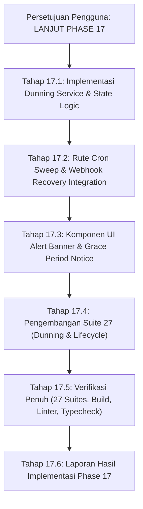

# COVE — Phase 17 Implementation Plan
## Dunning Management & Automated Subscription Lifecycle

**Document Version:** 1.0.0  
**Planning Date:** 4 September 2026  
**Author:** Antigravity  
**Governance Standard:** Section 14 Remediation Directives — *Plan only, zero implementation in Phase 16R.*  
**Status:** **DRAFT PLAN — MENUNGGU PERSETUJUAN PENGGUNA SEBELUM DIEKSEKUSI PADA PHASE 17**  

---

## 1. Latar Belakang & Tujuan Phase 17

Berdasarkan `COVE_SUBSCRIPTION_BILLING_BLUEPRINT_v1.0.md` (Bagian 6 & 7), sistem langganan B2B COVE memerlukan otomasi penanganan tagihan jatuh tempo (*dunning management*) dan transisi siklus hidup (*lifecycle automation*) yang transparan dan tidak merugikan kontraktor:

1. **Jadwal Dunning Humanis & Terjadwal:**
   - Memberikan pengingat bertahap sebelum jatuh tempo (H-7, H-1).
   - Memberikan masa tenggang (*grace period*) selama 7 hari kalender saat pembayaran gagal di Hari H tanpa memutus operasional proyek seketika.
   - Mengalihkan akun ke status `READ_ONLY` pada H+7 (melarang mutasi baru sambil menjaga ketersediaan data dan ekspor).
   - Mengalihkan akun ke status `SUSPENDED` pada H+21 jika tidak ada pembayaran setelah 3 minggu.
2. **Pemulihan Otomatis (*Self-Healing Recovery*):**
   - Pembayaran yang berhasil diselesaikan via webhook pada masa `PAST_DUE`, `READ_ONLY`, atau `SUSPENDED` secara otomatis memulihkan status tenant menjadi `ACTIVE` dan membuka kembali seluruh kuota mutasi.
3. **Komunikasi Multi-Channel & Transparansi Antarmuka:**
   - Banner peringatan in-app di dashboard dan modul billing.
   - Perekaman riwayat notifikasi dunning pada tabel log penagihan.
   - Penegakan Open Data Guarantee (PRD 28.1) bahkan saat akun berstatus `SUSPENDED`.

---

## 2. Rincian Komponen Arsitektur Phase 17

### 2.1 Modul Dunning Engine (`domains/subscription/dunning-service.ts`)
Modul logika inti yang bertugas mengevaluasi seluruh langganan aktif/menunggak:
1. `evaluateDunningStatus(subscription, currentDate)`:
   - Menghitung delta hari antara `currentDate` dan `current_period_end` atau `grace_period_end`.
   - Menentukan aksi dunning yang relevan:
     - `RENEWAL_REMINDER_H7` (H-7)
     - `RENEWAL_REMINDER_H1` (H-1)
     - `PAYMENT_DUE_TODAY` (Hari H)
     - `DUNNING_NOTICE_H1` (H+1)
     - `DUNNING_NOTICE_H3` (H+3)
     - `TRANSITION_TO_READ_ONLY` (H+7)
     - `TRANSITION_TO_SUSPENDED` (H+21)
2. `processDunningSweep(orgId?, targetDate?)`:
   - Melakukan iterasi terhadap seluruh langganan yang memerlukan tindakan.
   - Mengeksekusi transisi status via `executeSubscriptionTransition`.
   - Merekam log dunning ke `billing_audit_logs`.

### 2.2 Worker / Rute Eksekusi Dunning (`app/api/billing/dunning/sweep/route.ts`)
Endpoint server-side yang dapat dipicu oleh cron runner (seperti Vercel Cron atau internal scheduler):
- Dilindungi dengan secret token `CRON_SECRET` atau otorisasi `SUPER_ADMIN`.
- Menghasilkan ringkasan laporan eksekusi dunning: jumlah langganan yang diperiksa, pengingat yang dikirim, dan transisi status yang dieksekusi.

### 2.3 Handler Pemulihan Langganan Terpadu (`domains/billing/webhook-service.ts`)
Memperluas penanganan webhook pembayaran lunas:
- Jika langganan saat ini berstatus `PAST_DUE`, `READ_ONLY`, atau `SUSPENDED`, status otomatis beralih kembali ke `ACTIVE`.
- Memperpanjang `current_period_end` sesuai interval paket (bulanan/tahunan).
- Membersihkan `grace_period_end`.
- Mencatat event pemulihan pada `subscription_status_events`.

### 2.4 Banner Status Penagihan di Frontend (`components/billing/SubscriptionAlertBanner.tsx`)
Komponen visual yang terpasang pada layout utama aplikasi:
- Tampil dengan warna kuning/peringatan saat status `PAST_DUE` (menampilkan hitung mundur sisa hari grace period).
- Tampil dengan warna oranye/peringatan keras saat status `READ_ONLY` (memberitahukan bahwa mutasi data dinonaktifkan, namun ekspor data tetap tersedia).
- Tampil dengan modal penguncian saat status `SUSPENDED` dengan opsi cepat bayar atau unduh data lengkap.

---

## 3. Rencana Pengujian Suite 27 (`tests/unit/dunning_lifecycle.test.js`)

Test suite baru (Suite 27) akan mencakup 6 skenario komprehensif:

1. **Test 1: Jadwal Notifikasi Pengingat Perpanjangan (H-7 dan H-1):**
   - Memastikan pengingat terbentuk pada jendela waktu yang tepat tanpa mengubah status `ACTIVE`.
2. **Test 2: Pembayaran Gagal & Transisi ke `PAST_DUE` di Hari H:**
   - Memastikan kegagalan invoice menginisiasi masa tenggang 7 hari kalender (`grace_period_end = current_period_end + 7 hari`).
3. **Test 3: Kedaluwarsa Grace Period & Transisi Otomatis ke `READ_ONLY` di H+7:**
   - Memastikan lewatnya masa tenggang mengubah status ke `READ_ONLY` dan membekukan wewenang `canMutate`.
4. **Test 4: Transisi Otomatis ke `SUSPENDED` di H+21:**
   - Memastikan setelah 21 hari kalender tanpa pembayaran, status beralih ke `SUSPENDED`.
5. **Test 5: Pemulihan Otomatis Akun Menunggak ke `ACTIVE` via Webhook:**
   - Mensimulasikan pembayaran berhasil saat akun berada di `PAST_DUE`, `READ_ONLY`, atau `SUSPENDED`, membuktikan pemulihan instan ke `ACTIVE`.
6. **Test 6: Preservasi Hak Ekspor Data pada Seluruh Tahapan Dunning:**
   - Membuktikan Open Data Guarantee tetap aktif 100% pada status `PAST_DUE`, `READ_ONLY`, dan `SUSPENDED`.

---

## 4. Jadwal & Tahapan Kerja Phase 17

---

## 5. Batasan Disiplin Tata Kelola

- **Zero Premature Code:** Dokumen ini merupakan rencana arsitektur murni. Tidak ada kode aplikasi Phase 17 yang dibuat sebelum instruksi resmi pengguna.
- **Strict Backward Compatibility:** Tidak ada perubahan skema yang merusak data atau alur bisnis yang sudah stabil pada Phase 1–16R.
