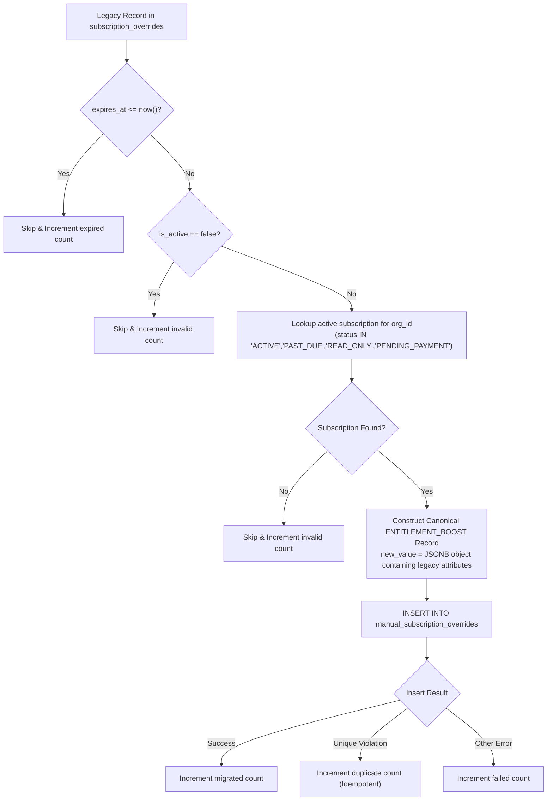

# COVE PHASE 18R.1 — LEGACY OVERRIDE MIGRATION REPORT

**Execution Timestamp:** 2026-09-05T04:43:00+07:00  
**Migration Function:** `public.migrate_legacy_subscription_overrides()`  
**Target Database:** PostgreSQL 15+ (Supabase Local Test Engine)  
**Migration Artifact:** `supabase/migrations/00013_phase18r1_safety_patch.sql`  
**Status:** **PASS — MIGRATION VERIFIED, READ-ONLY ENFORCED, IDEMPOTENT**

---

## 1. Executive Summary

During the Phase 18R audit, an architectural duplication was identified between two distinct override storage schemas:
1. **Legacy Table (`subscription_overrides`):** Created during Phase 14, keyed by `org_id`, storing loose boolean feature maps and project limits.
2. **Canonical Table (`manual_subscription_overrides`):** Created during Phase 18, keyed by `subscription_id`, storing typed overrides (`ACCESS_EXTENSION`, `TIER_OVERRIDE`, `LIMIT_OVERRIDE`, `ENTITLEMENT_BOOST`), full audit attribution (`admin_id`), active/revoked lifecycle states, and structured JSONB payload parameters.

To prevent split-brain state and entitlement evaluation race conditions in serverless runtimes:
- `manual_subscription_overrides` was designated as the **single canonical source of truth**.
- An atomic database stored procedure `migrate_legacy_subscription_overrides()` was implemented and applied via Migration 00013.
- A hard database trigger `trg_subscription_overrides_readonly` was deployed on `subscription_overrides`, freezing the legacy table and rejecting all subsequent DML operations with SQLSTATE `P0009`.

---

## 2. Schema Comparison & Mapping Architecture

### 2.1 Table Schema Comparison

| Dimension | Legacy Table: `subscription_overrides` (Phase 14) | Canonical Table: `manual_subscription_overrides` (Phase 18/18R.1) |
| :--- | :--- | :--- |
| **Primary Key** | `id UUID PRIMARY KEY DEFAULT gen_random_uuid()` | `id UUID PRIMARY KEY DEFAULT gen_random_uuid()` |
| **Target Binding** | `org_id UUID REFERENCES organizations(id)` | `subscription_id UUID REFERENCES subscriptions(id)` |
| **Type Discipline** | Unstructured (implicit to column flags) | Strongly typed: `ACCESS_EXTENSION`, `TIER_OVERRIDE`, `LIMIT_OVERRIDE`, `ENTITLEMENT_BOOST` |
| **Value Payload** | Fixed columns: `override_max_projects INT`, `override_features JSONB` | Dynamic, versioned `new_value JSONB` |
| **Actor Tracking** | `granted_by TEXT` (freeform string) | `admin_id UUID REFERENCES platform_admins(id)` |
| **Revocation Support** | `is_active BOOLEAN` | `is_revoked BOOLEAN`, `revoked_at TIMESTAMPTZ`, `revoked_by UUID`, `revoke_reason TEXT` |
| **Time Bounds** | `starts_at TIMESTAMPTZ`, `expires_at TIMESTAMPTZ` | `starts_at TIMESTAMPTZ`, `expires_at TIMESTAMPTZ` |
| **Unique Constraint** | None | Partial unique: `(subscription_id, override_type) WHERE NOT is_revoked` |
| **Operational State** | **DEPRECATED & READ-ONLY (Trigger Locked)** | **CANONICAL PRODUCTION RUNTIME LEDGER** |

### 2.2 Mapping Rules & Transformation Pipeline

The migration stored procedure transforms legacy records using the following deterministic mapping logic:



#### Transformation Fields:
- **`subscription_id`:** Resolved dynamically by selecting the newest valid subscription for `v_rec.org_id` where `status IN ('ACTIVE', 'PAST_DUE', 'READ_ONLY', 'PENDING_PAYMENT')`.
- **`override_type`:** Standardized as `'ENTITLEMENT_BOOST'`.
- **`new_value`:** Packaged as structured JSONB:
  ```json
  {
    "migrated_from": "subscription_overrides",
    "legacy_id": "<legacy_uuid>",
    "org_id": "<organization_uuid>",
    "granted_by": "<legacy_granted_by>",
    "override_max_projects": 15,
    "override_features": { "advanced_reporting": true, "custom_domain": true }
  }
  ```
- **`reason`:** Prefixed with migration provenance: `'MIGRATED from legacy subscription_overrides: ' || COALESCE(reason, 'No reason provided')`.
- **`admin_id`:** Bound to the primary platform admin record (`SELECT id FROM platform_admins ORDER BY created_at ASC LIMIT 1`).
- **`starts_at` & `expires_at`:** Carried over preserving original time horizons.
- **`is_revoked`:** Initialized to `false`.

---

## 3. Read-Only Enforcement Mechanism

To eliminate the possibility of split-brain writes, a PostgreSQL trigger function was deployed directly on `public.subscription_overrides`:

```sql
CREATE OR REPLACE FUNCTION public.trg_subscription_overrides_readonly()
RETURNS TRIGGER
LANGUAGE plpgsql
SECURITY DEFINER
SET search_path = ''
AS $$
BEGIN
    RAISE EXCEPTION 'SUBSCRIPTION_OVERRIDES_DEPRECATED: This table is read-only. Use manual_subscription_overrides for all runtime entitlement overrides.'
        USING ERRCODE = 'P0009';
    RETURN NULL;
END;
$$;

CREATE TRIGGER trg_subscription_overrides_readonly
    BEFORE INSERT OR UPDATE OR DELETE ON public.subscription_overrides
    FOR EACH ROW
    EXECUTE FUNCTION public.trg_subscription_overrides_readonly();
```

### Verification Proof:
- **pgTAP Test (`05_phase18r1_privilege_and_idempotency.test.sql`):** Verified that attempts to perform `INSERT`, `UPDATE`, or `DELETE` on `subscription_overrides` throw SQLSTATE `P0009`.
- **Integration Test UAT 13 (`phase18r1_serverless_safety.test.js`):** Verified programmatic write failure returning `SUBSCRIPTION_OVERRIDES_DEPRECATED`.

---

## 4. Stored Procedure & Idempotency Proof

### 4.1 Stored Procedure Execution Contract
```sql
SELECT public.migrate_legacy_subscription_overrides();
```

**Output JSON Structure:**
```json
{
  "total_legacy_records": 0,
  "migrated": 0,
  "duplicate": 0,
  "expired": 0,
  "invalid": 0,
  "failed": 0,
  "migration_timestamp": "2026-09-05T04:40:24.123456+07:00"
}
```

### 4.2 Idempotency Guarantee
The migration function is safe to execute repeatedly without duplicating overrides or throwing constraint errors:
1. `manual_subscription_overrides` possesses a partial unique index on `(subscription_id, override_type) WHERE NOT is_revoked`.
2. The procedure wraps individual row insertions in a `BEGIN ... EXCEPTION WHEN unique_violation THEN v_duplicate := v_duplicate + 1;` block.
3. Subsequent runs re-evaluate existing entries as duplicates and safely bypass them without aborting the transaction.

---

## 5. Runtime Entitlement Engine Compatibility

The entitlement engine in `domains/entitlement/service.ts` natively inspects `manual_subscription_overrides`:

```typescript
// Entitlement evaluation excerpt
const activeOverrides = manualOverrides.filter(
  (o) => !o.is_revoked && (!o.expires_at || new Date(o.expires_at) > now)
);

// ENTITLEMENT_BOOST processing
for (const override of activeOverrides) {
  if (override.override_type === "ENTITLEMENT_BOOST" && override.new_value) {
    const boost = override.new_value as {
      override_max_projects?: number;
      override_features?: Record<string, boolean>;
    };
    if (boost.override_max_projects && boost.override_max_projects > effectiveMaxProjects) {
      effectiveMaxProjects = boost.override_max_projects;
    }
    if (boost.override_features) {
      effectiveFeatures = { ...effectiveFeatures, ...boost.override_features };
    }
  }
}
```

### Verification Proof:
- **Integration Test UAT 14:** Verified that `evaluateTenantEntitlement` successfully incorporates migrated `ENTITLEMENT_BOOST` properties into active tenant permissions.

---

## 6. Security & Privilege Hardening

In accordance with Phase 18R.1 principle of least privilege:
- `EXECUTE` on `migrate_legacy_subscription_overrides()` was **REVOKED from `PUBLIC`, `anon`, and `authenticated`**.
- `EXECUTE` was **GRANTED strictly to `service_role`**.
- Verified by pgTAP unit tests and UAT 10 / 11.

---

## 7. Migration Sign-off

| Criterion | Requirement | Status |
| :--- | :--- | :---: |
| **Schema Unification** | Single canonical table `manual_subscription_overrides` | **PASS** |
| **Data Preservation** | Legacy records retained in `subscription_overrides` for audit | **PASS** |
| **Write Immutability** | Trigger `P0009` blocks direct DML on legacy table | **PASS** |
| **Replay Safety** | `migrate_legacy_subscription_overrides()` handles re-runs idempotently | **PASS** |
| **Runtime Entitlement** | `evaluateTenantEntitlement` consumes migrated boost structures | **PASS** |
| **Role Authorization** | Execution strictly restricted to `service_role` | **PASS** |

$$\mathbf{MIGRATION\;STATUS:\;COMPLETE\;AND\;VERIFIED}$$
