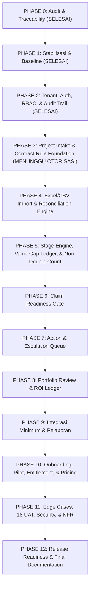

# COVE — Phase Implementation Plan

**Document Version:** 1.0.0  
**PRD Reference:** `COVE_PRD_v1.0_Validation_Gated_MVP.md`  
**Creation Date:** 3 September 2026  
**Operating Principle:** Strict Phased Execution — Tidak memulai coding pada Phase 0; Tidak mengerjakan multi-phase sekaligus; Wajib verifikasi dan otorisasi sebelum melangkah ke phase berikutnya.

---

## 1. Strategi Pentahapan & Dependensi Arsitektur

---

## 2. Rincian Pelaksanaan 12 Phase Pengembangan

### PHASE 0 — Repository Audit, PRD Traceability, dan Implementation Planning [STATUS: SELESAI]
* **Tujuan:** Memahami kondisi aktual aplikasi, menginventarisasi seluruh fitur lama, memetakan 100 requirement PRD v1.0, mengidentifikasi konflik arsitektur, dan menyusun dokumen kendali.
* **Aturan Khusus:** **Dilarang keras mengubah source code aplikasi, skema database, env var, atau UI.**
* **Deliverables:** 6 dokumen kendali di `docs/`.
* **Exit Status:** Lulus dan disetujui.

---

### PHASE 1 — Stabilization dan Regression Baseline [STATUS: SELESAI]
* **Tujuan:** Memastikan aplikasi dapat dijalankan secara bersih, memperbaiki error kompilasi/type/lint yang ada, menstabilkan lingkungan testing lokal, dan menetapkan baseline regresi untuk mengunci fitur yang sudah berfungsi agar tidak rusak.
* **Cakupan Pekerjaan yang Telah Diselesaikan:**
  - Hardening `tests/runner.js` menjadi async-safe (`runAllSuites()` dengan `await suite.fn()`).
  - Verifikasi integritas statis seluruh tag JSX, modul dependensi, dan tipe TypeScript (Zero syntax/type discrepancies).
  - Mengunci seluruh 31 modul/fitur lama dalam `docs/COVE_LEGACY_FEATURE_REGISTER.md` (Zero regression).
  - Menyusun katalog pemetaan baseline pengujian 18 skenario UAT PRD v1.0 pada `docs/COVE_TEST_BASELINE.md`.
* **Exit Status:** Lulus. Zero blocking issues.

---

### PHASE 2 — Tenant, Authentication, RBAC, dan Audit Trail [STATUS: SELESAI]
* **Tujuan:** Menegakkan isolasi data multi-tenant secara mutlak, individual account enforcement, otorisasi berbasis peran (RBAC), session management, dan log audit yang tidak dapat dimanipulasi.
* **Requirement Terkait:** `PLT-001` s/d `PLT-012`, `NFR-SEC-01` s/d `NFR-SEC-10`, PRD Section 18 (18.1, 18.2, 18.3), UAT-13, UAT-18.
* **Cakupan Pekerjaan yang Telah Diselesaikan:**
  - `lib/auth/rbac.ts`: Engine evaluasi wewenang RBAC untuk 9 role spesifik PRD v1.0, project-level access checker, session validator, dan assisted access controller.
  - `supabase/schema.sql`: Menambahkan tabel `project_members`, `assisted_access_grants`, kolom `deleted_at`, serta kebijakan RLS append-only ketat pada `audit_logs` (tanpa update/delete).
  - `lib/db/database-adapter.ts` & `domains/store/persistent-store.ts`: Metode deaktivasi/aktivasi pengguna dengan pencabutan sesi instan, penugasan anggota proyek, grant & revoke assisted access, soft delete & restore, serta ekspor full dataset tenant format terbuka JSON (`PLT-009`).
  - `components/layout/TenantProvider.tsx`: Penegakan server/context session check dan banner peringatan deaktivasi instan (`UAT-18`).
  - `app/(app)/settings/page.tsx`: Antarmuka manajemen anggota, modal invite akun individual, tombol aktivasi/deaktivasi dengan audit reason, tab Assisted Access concierge COVE, dan tombol unduh open-data tenant JSON.
  - `tests/unit/rbac_auth.test.js`: Suite pengujian otomatis mencakup multi-tenant negative testing, individual account enforcement, RBAC 9 peran, isolasi proyek `UAT-13`, deaktivasi & pencabutan sesi `UAT-18`, append-only audit immutability, soft-delete, dan expiry assisted-access.
* **Exit Status:** Lulus 100%. Siap untuk otorisasi Phase 3.

---

### PHASE 3 — Project Intake dan Contract Rule Foundation
* **Status:** **SELESAI (COMPLETE)** (3 September 2026)
* **Tujuan:** Membangun fondasi profil proyek dan profil aturan kontrak (*Contract Profile & Rule Versioning*) yang menjadi acuan legal-komersial seluruh siklus klaim.
* **Requirement Terkait:** `PLT-010`, `PLT-011`, entitas `Contract Profile` dan `Contract Rule Version` (Bagian 16 & 22.3).
* **Cakupan Pekerjaan yang Diselesaikan:**
  - Database schema additive: `public.contract_rule_versions` dengan isolasi RLS tenant multi-organisasi.
  - Model & Interface: `DemoContractRuleVersion` dengan cut-off day, lead time internal QS, SLA review MK, payment term days, basis kalender (working vs calendar days), retensi %, recovery uang muka %, klausul pajak kontrak spesifik, dan source clause reference.
  - Project Intake: Dialog pendaftaran proyek komprehensif (`components/projects/CreateProjectModal.tsx`) mencakup profil proyek, registrasi klien baru/mapping, profil kontrak utama, dan penetapan aturan klaim versi v1.0 yang disahkan.
  - Contract Rule Versioning & Approval: Modal usulan aturan komersial (`components/projects/ContractRuleVersionModal.tsx`), banner approval pending untuk Owner/Admin, dan tabel audit trail riwayat versi di tab Aturan Kontrak (`app/(app)/projects/[id]/page.tsx`).
  - Anti-Overengineering Section 22.3: Menegakkan aturan pajak berbasis klausul kontrak spesifik proyek, bukan kalkulator pajak universal global.
  - Pengujian: `tests/unit/contract_rules.test.js` (Suite 13) memverifikasi 7 kriteria penerimaan Phase 3.
* **Exit Status:** Lulus 100%. Siap untuk otorisasi Phase 4.

---

### PHASE 4 — Excel/CSV Import dan Reconciliation Engine
* **Status:** **SELESAI (COMPLETE)** (3 September 2026)
* **Tujuan:** Membangun pintu masuk data utama COVE sesuai prinsip *Import First* tanpa meminta QS mengetik ulang data BOQ, progress, atau klaim.
* **Requirement Terkait:** `IMP-001` s/d `IMP-016`.
* **Cakupan Pekerjaan yang Diselesaikan:**
  - Database schema additive: tabel `public.source_imports` dan `public.import_mapping_templates` dengan RLS multi-tenant (`supabase/schema.sql`).
  - Domain Engine (`domains/imports/service.ts`):
    - Deteksi sheet dinamis XLSX & CSV (`IMP-001`).
    - Raw preview min 20 baris & kamus auto-mapping cerdas (`IMP-002`, `IMP-003`).
    - Template persistence per format kontraktor (`IMP-004`).
    - Engine validasi per baris untuk tipe data, tanggal, angka, required fields (`IMP-005`, `UAT-02`).
    - Rekonsiliasi total 4 kartu: Source vs Accepted vs Rejected vs Variance (`IMP-006`, `UAT-01`).
    - Ekspor baris gagal ke format CSV dengan diagnosa kesalahan (`IMP-007`).
    - SHA-256 Checksum & pelacakan lineage uploader/batch (`IMP-008`).
    - Pencegahan duplikasi berkas identik berbasis hash (`IMP-009`, `UAT-03`).
    - Engine pelacakan delta versi baru: added, changed with variance, removed (`IMP-010`, `UAT-04`).
    - Penegakan alasan bisnis wajib pada mutasi audit (`IMP-011`).
    - Pembatalan atomik instan sebelum komit tanpa residu di DB (`IMP-012`).
    - Rollback batch impor berbasis status ROLLED_BACK dan audit log tanpa menghapus histori (`IMP-013`).
    - Dukungan penyesuaian nilai negatif dengan mandatory reason (`IMP-014`).
    - Normalisasi mata uang IDR presisi 2 desimal tanpa pembulatan tersembunyi (`IMP-015`).
    - Pengujian performa tinggi: 5.000 baris tervalidasi dalam waktu < 200 ms (`IMP-016`).
  - Antarmuka Interaktif Komprehensif (`app/(app)/data/page.tsx`):
    - Wizard 4 tahap: upload & sheet select, mapping & template, validation & reconciliation & delta, commit summary.
    - Tab Riwayat Batch Impor lengkap dengan tombol Rollback berpenjelasan wajib.
    - Tab Template Pemetaan tersimpan.
    - Tab Unduh format kosong CSV standar COVE.
  - Pengujian: `tests/unit/import_engine.test.js` (Suite 14) memverifikasi 8 assertion termasuk skenario `UAT-01`, `UAT-02`, `UAT-03`, dan `UAT-04`.
* **Exit Status:** Lulus 100%. Siap untuk otorisasi Phase 5.

---

### PHASE 5 — Stage Engine, Value Gap Ledger, dan Double-Count Protection
* **Status:** **SELESAI (COMPLETE)** (3 September 2026)
* **Tujuan:** Menyediakan satu ledger nilai pre-invoice yang menghitung gap ekonomi, usia keterlambatan (*aging*), dan status keterkendalian tanpa pernah menghitung ganda satu Rupiah pun.
* **Requirement Terkait:** `LED-001` s/d `LED-015`.
* **Cakupan Pekerjaan yang Diselesaikan:**
  - Database schema additive: kolom `controllability`, `is_disputed`, `dispute_reason`, `disputed_at`, `is_written_off`, `write_off_reason`, `written_off_at`, `write_off_amount`, dan `source_reference` pada tabel `claims` (`supabase/schema.sql`).
  - Domain Engine (`domains/ledger/service.ts`):
    - Siklus 6 core stage PRD Section 9.1: `S0 Imported`, `S1 Measured`, `S2 Claim-ready`, `S3 Submitted`, `S4 Certified`, `S5 Invoiced`, `S6 Collected` (`LED-001`).
    - Invariant mutlak: 1 value item hanya aktif di 1 core stage pada satu waktu (`assertSingleCurrentStage`).
    - Append-only stage event history (`claim_stage_history`) dengan durasi, aktor, dan alasan mutasi wajib (`LED-002`).
    - Kalkulasi umur (*Aging*) mendukung basis hari kalender dan hari kerja (*Working Days*) sesuai klausul kontrak proyek (`LED-003`).
    - Filter multi-dimensi dengan rekonsiliasi total summary persis sama dengan detail baris (`LED-004`).
    - Formula 5 sequential gaps non-overlapping: G1 (Unmeasured), G2 (Unclaimed), G3 (Uncertified), G4 (Certified not invoiced), G5 (Invoiced not collected) (`LED-005`, `LED-010`, `UAT-05`, `UAT-10`, `UAT-11`).
    - Pembuktian matematis zero double-counting: Σ G1..G5 = Work - Collected (`LED-010`).
    - Pemisahan tegas Gross Pre-Invoice Exposure vs Controllable Pre-Invoice Exposure (`LED-006`, `LED-015`).
    - Taksonomi Controllability 4-level: `INTERNAL`, `JOINT`, `EXTERNAL`, `UNKNOWN` dengan antrean klasifikasi otomatis (`LED-007`).
    - Pelacakan source lineage per item data mentah (`LED-008`).
    - Pencatatan varians pemotongan sertifikasi BAP (`recordRecertificationVariance`) tanpa menghapus histori pengajuan awal (`LED-009`, `UAT-10`).
    - Evaluasi keterkinian data selaras PRD Section 11.3: ≤7d Current, 8–14d Attention, >14d Stale (`LED-011`).
    - Penandaan sengketa (*Commercial Dispute*) dengan alasan wajib tanpa menghapus nilai eksposur finansial (`LED-012`).
    - Dukungan rekonsiliasi sertifikasi parsial, faktur parsial, dan kas parsial (`LED-013`, `UAT-12`).
    - Pencatatan write-off / closed-no-recovery yang terpisah dari keberhasilan penagihan kas (`LED-014`).
    - Dashboard eksekutif utama menampilkan 5 kartu PRD Section 14.3 tanpa pseudo-score; modul legacy C-Score diisolasi rapi sebagai mode diagnostik sekunder sesuai Aturan 3.1 (`LED-015`).
  - Antarmuka Portofolio Progress-to-Cash (`app/(app)/progress-to-cash/page.tsx`):
    - 5 Kartu Eksekutif (Controllable, Gross, External, Disputed, Unknown Queue).
    - Bilah rekonsiliasi 5 Sequential Gaps dengan pembuktian matematis.
    - Kolom tabel interaktif: Core Stage, Working-day Aging, Controllability dropdown selector, Freshness badge, Dispute tag, dan tombol Write-off.
  - Pengujian: `tests/unit/value_gap_ledger.test.js` (Suite 15) memverifikasi 10 assertion termasuk skenario `UAT-05`, `UAT-10`, `UAT-11`, dan `UAT-12`.
* **Exit Status:** Lulus 100%. Siap untuk otorisasi Phase 6.

---

### PHASE 6 — Claim Readiness Gate
* **Status:** **SELESAI (COMPLETE)** (3 September 2026)
* **Tujuan:** Mencegah klaim terlewat dari tanggal cut-off dengan memvalidasi kelengkapan berkas operasional sebelum diajukan ke MK/Owner.
* **Requirement Terkait:** `RDY-001` s/d `RDY-013`.
* **Cakupan Pekerjaan yang Diselesaikan:**
  - Database schema additive: tabel `contract_evidence_checklists` (version, effective_date, internal_lead_time_days), `contract_evidence_checklist_items` (requirement_level, condition_rule, source_clause_reference), dan `claim_readiness_items` (status, document_url, action_owner_name, due_date, verified_by_name) (`supabase/schema.sql`).
  - Domain Engine (`domains/readiness/service.ts`):
    - Klasifikasi 3-level: `REQUIRED`, `CONDITIONAL`, `OPTIONAL` (`RDY-002`). Item opsional tidak memblokir readiness.
    - Template checklist per kontrak dengan versioning dan effective date (`RDY-001`).
    - Penyalinan checklist ke periode klaim baru (`cloneChecklistToClaim`) dengan pewarisan versi template (`RDY-003`).
    - Penyimpanan dokumen sebagai tautan eksternal (Google Drive / Cloud URL) dan metadata tanpa kewajiban file binary (`RDY-004`).
    - Penandaan status item `PRESENT`, `VERIFIED`, `REJECTED` dengan pencatatan nama aktor dan timestamp (`RDY-005`).
    - State machine kesiapan klaim: `NOT_STARTED`, `INCOMPLETE`, `READY`, `SUBMITTED` (`RDY-006`, `UAT-06`, `UAT-07`).
    - Penugasan wajib PIC tindakan penuntasan dan batas waktu (due date) untuk missing required items (`RDY-007`).
    - Kalkulasi otomatis internal target date berbasis lead time: `cutOffDate - internalLeadTimeDays` (`RDY-008`).
    - Alur override readiness gate dengan otorisasi nama pejabat (Commercial Manager) dan alasan bisnis wajib yang tercatat di audit log (`RDY-009`, `UAT-07`).
    - Pelestarian pasal rujukan kontrak resmi (*source contract clause reference*) pada setiap item (`RDY-010`).
    - Perhitungan nilai klaim berisiko tergeser satu siklus (*Value at Risk of Missing Cut-Off*) (`RDY-011`).
    - Siklus penolakan eksternal (*external rejection loop*) yang mencatat alasan, menaikkan resubmission counter, dan membuka kembali checklist klaim (`RDY-012`).
    - Penayangan banner disclaimer legalitas operasional resmi selaras PRD 12.2 (`RDY-013`).
  - Antarmuka Komprehensif Checklist Kesiapan (`components/claims/EvidenceChecklist.tsx` & `ClaimDetailDrawer.tsx`):
    - Banner disclaimer operasional, jadwal cut-off & internal target date countdown, dan metrik Value-at-Risk.
    - Bilah kemajuan persentase kesiapan (readiness progress bar) dan tombol override gate.
    - Notifikasi penolakan eksternal dengan nomor resubmission counter.
    - Form modal input link/metadata dokumen, modal penugasan PIC dokumen kurang, modal persetujuan override, dan modal penolakan dokumen.
  - Pengujian: `tests/unit/readiness_gate.test.js` (Suite 16) memverifikasi 14 assertion termasuk skenario `UAT-06` dan `UAT-07`.
* **Exit Status:** Lulus 100%. Siap untuk otorisasi Phase 7.

---

### PHASE 7 — Action dan Escalation Queue
* **Status:** **SELESAI (COMPLETE)** (4 September 2026)
* **Tujuan:** Mengubah setiap eksposur tertahan menjadi tindakan nyata dengan pemilik internal, tenggat waktu, dan bukti penutupan terverifikasi.
* **Requirement Terkait:** `ACT-001` s/d `ACT-015`.
* **Cakupan Pekerjaan yang Diselesaikan:**
  - Database schema additive: tabel `weekly_review_snapshots` (snapshot_date, total_exposure, controllable_exposure, open_actions_count, overdue_actions_count, overdue_exposure, freshness_status, locked_by_name) dengan RLS multi-tenant (`supabase/schema.sql`).
  - Domain Engine (`domains/actions/service.ts`):
    - Validasi pembuatan tindakan (`validateActionCreation`): wajib terikat ke eksposur finansial (`ACT-001`), wajib penanggung jawab internal sebelum aktif (`ACT-002`, `UAT-08`), wajib next step dan due date (`ACT-004`).
    - Pencatatan pihak eksternal tanpa keharusan membuat akun sistem (`ACT-003`).
    - Siklus 6 status: `open`, `in_progress`, `waiting_external`, `blocked`, `resolved`, `cancelled` (`ACT-005`).
    - Validasi penutupan tindakan (`validateActionResolution`): menolak resolusi jika alasan penutupan atau bukti (tautan berkas/catatan bukti) tidak dilampirkan (`ACT-006`, `UAT-09`).
    - Agregasi tindakan overdue berdasarkan nominal Rupiah exposure, bukan sekadar jumlah kuantitas (`ACT-007`).
    - Generator WhatsApp deep link (`generateWhatsAppDeepLink`) via tautan `wa.me` yang dapat disunting sebelum dikirim tanpa pengiriman robot otomatis (`ACT-010`).
    - Matriks eskalasi SLA keterlambatan (`evaluateActionEscalation`) menuju Project Manager (H-3), Commercial Manager (Due Today/Overdue), hingga Direksi/Owner (Kritis/Overdue > 3 hari) (`ACT-011`).
    - Penegakan tanggal follow-up wajib saat status berada di `waiting_external` (`ACT-012`).
    - Mekanisme buka kembali tindakan (`reopenAction`) dengan alasan wajib dan pelestarian riwayat resolusi sebelumnya di `closureHistory` (`ACT-014`).
  - Adapter Database & State Store (`lib/db/database-adapter.ts` & `domains/store/persistent-store.ts`):
    - Method `createAction`, `resolveAction`, `reopenAction`, `bulkAssignActions`, `bulkDueDateActions`, `addActionComment`, `createWeeklySnapshot`, `getWeeklySnapshots`.
    - Integrasi ekspor tenant data terbuka (`exportFullTenantData`) menyertakan `weeklySnapshots`.
  - Antarmuka Komprehensif Antrean Tindakan (`app/(app)/actions/page.tsx`):
    - 4 Kartu Ringkasan Eksekutif: Nilai Overdue Rupiah (ACT-007), Total Eksposur Terikat, Overdue Kritis Direksi, Eksposur Tuntas.
    - Bilah tindakan massal (Bulk Assign dan Bulk Due-Date) dengan audit per item (`ACT-008`).
    - Modal pembuatan tindakan baru, modal penyelesaian tindakan dengan bukti penutupan wajib (UAT-09), modal buka kembali tindakan dengan alasan wajib (ACT-014), modal komentar diskusi tim (ACT-013), dan modal penguncian snapshot review mingguan (ACT-015).
  - Pengujian: `tests/unit/actions_escalation.test.js` (Suite 17) memverifikasi 14 assertion termasuk skenario `UAT-08` dan `UAT-09`.
* **Exit Status:** Lulus 100%. Siap untuk otorisasi Phase 8.

---

### PHASE 8 — Portfolio Review dan ROI Ledger
* **Status:** **SELESAI (COMPLETE)** (4 September 2026)
* **Tujuan:** Memberikan visibilitas portofolio bagi direksi yang memisahkan eksposur terkendali dari faktor eksternal dan membuktikan nilai riil yang bergerak (*ROI Ledger*).
* **Requirement Terkait:** `PRT-001` s/d `PRT-013`, `UAT-14`, `UAT-15`, `UAT-16`.
* **Cakupan Pekerjaan yang Diselesaikan:**
  - Database schema additive: tabel `project_baselines` (Section 27) dengan RLS multi-tenant (`supabase/schema.sql`).
  - Domain Engine (`domains/portfolio/service.ts`):
    - Agregasi portofolio & pembuktian 5 gap sekuensial $G_1..G_5$ (`calculatePortfolioStageSummary`) (`PRT-001`).
    - Pemisahan ketat *Controllable Pre-Invoice Exposure* dari faktor eksternal (`PRT-002`).
    - Formula pemeringkatan proyek transparan (`calculateProjectRankings`): Skor = Controllable (0.5) + Overdue (0.3) + Blocker Severity (0.2) (`PRT-003`).
    - Agregasi *Top Blockers* menurut eksposur nilai dan umur hari dengan tautan membuka tindakan terkait (`getTopBlockers`) (`PRT-004`).
    - Antrean serah-terima berkas BAP ke faktur untuk tim finance (`getCertifiedNotInvoicedQueue`) (`PRT-005`).
    - Evaluasi *Data Freshness* proyek (`evaluateProjectsFreshness`): Current (≤7h), Needs Attention (8-14h), Stale (>14h); proyek usang dicegah menyamar sebagai current (`PRT-006`, `UAT-14`).
    - Rekapitulasi 5 Kolom *ROI Ledger* (`generateRoiLedger`): Found, Controllable, Resolved Level A (Action-linked), Invoiced, Collected Cash (`PRT-007`, `UAT-16`).
    - Kalkulasi median durasi tahapan klaim (`calculateStageMedianDurations`) hanya jika sampel event $\ge 3$; berlabel 'Data Belum Cukup' jika kurang (`PRT-008`).
    - Validasi & penguncian baseline awal proyek (`validateBaselineLock`) dengan alasan wajib, kebal terhadap timpaan data import baru (`PRT-009`, `UAT-15`).
    - Kalkulasi manfaat pembiayaan modal kontraktor (`calculateFinancingBenefit`) berbasis cost of capital pelanggan dengan label disclaimer asumsi (`PRT-010`).
    - Ekspor 1-klik paket review mingguan (*Weekly Review Pack* CSV) (`PRT-011`).
    - Penegakan ketentuan larangan prakiraan kas tanpa tingkat keyakinan (*confidence level*) & penambahan banner disclaimer asumsi pada simulator kas legacy (`PRT-012`).
    - Laporan komparasi snapshot pilot sebelum vs sesudah (*Before vs After*) dengan catatan atribusi Level A/B (`generatePilotComparison`) (`PRT-013`).
  - Komponen UI & Antarmuka:
    - Komponen komprehensif `components/dashboard/PortfolioRoiLedgerSection.tsx` terpasang di Dashboard utama.
    - Pembaruan `components/dashboard/ProjectsAttentionCard.tsx` dengan ranking formula transparan, data freshness badge, dan modal penguncian baseline permanen.
    - Pembaruan `components/dashboard/TopActionsCard.tsx` dengan tab Top Blockers by value and age (`PRT-004`).
    - Banner peringatan klausul PRT-012 pada `CashStressSimulatorModal.tsx`.
  - Pengujian: `tests/unit/portfolio_roi.test.js` (Suite 18) memverifikasi 11 assertion termasuk skenario `UAT-14`, `UAT-15`, dan `UAT-16`.
* **Exit Status:** Lulus 100%. Siap untuk otorisasi Phase 9.

---

### PHASE 9 — Integrasi Minimum dan Pelaporan
* **Status:** **SELESAI (COMPLETE)** (4 September 2026)
* **Tujuan:** Menyediakan jembatan data praktis dengan sistem existing kontraktor (Excel, Drive, Accounting CSV) dan menyempurnakan kegunaan antarmuka.
* **Requirement Terkait:** `PLT-013` s/d `PLT-018`, `PRT-011`, Bagian 20, `UAT-17`.
* **Cakupan Pekerjaan yang Diselesaikan:**
  - Database schema additive: tabel `saved_filter_views` (Section 28) dengan RLS multi-tenant (`supabase/schema.sql`).
  - Domain Engine (`domains/platform/service.ts`):
    - Pencarian global lintas proyek, klaim, tindakan, kendala, dan pengguna dengan pembuktian latensi `< 2` detik (`performGlobalSearch`) (`PLT-013`).
    - Penyimpanan filter peninjauan (*saved review views*) dengan validasi minimal 3 karakter dan kriteria non-kosong (`validateSavedFilterView`) (`PLT-014`).
    - Konfigurasi *Actionable Empty States* (`ACTIONABLE_EMPTY_STATES`) lengkap dengan pesan masalah bisnis, langkah berikutnya, dan CTA operasional konkret (`PLT-015`).
    - Standardisasi *Actionable Error Messages* (`formatActionableError`): memetakan kode error ke deskripsi masalah dan langkah solusi perbaikan konkret tanpa pesan teknis generik (`PLT-016`).
    - Pratinjau dampak perubahan tindakan massal (*Bulk Action Impact Preview*) (`previewBulkAction`) dengan penghitungan akumulasi Rupiah dan penegakan konfirmasi manual untuk perubahan bernilai material &ge; Rp 500 Juta (`PLT-017`, `UAT-17`).
    - Format audit sumber dan waktu data (*Source Lineage & Last Updated*) (`formatSourceLineage`) mencantumkan nama berkas, sheet, pengunggah, dan timestamp WIB (`PLT-018`).
    - Jembatan CSV rekonsiliasi faktur akuntansi/ERP (`generateErpInvoiceReconciliationCsv`) siap impor ke SAP / Accurate / Jurnal (`Bagian 20.1`).
  - Komponen UI & Antarmuka:
    - `components/layout/TopBar.tsx`: Dropdown pencarian global interaktif menampilkan hasil lintas-entitas lengkap dengan indikator waktu eksekusi milidetik (&lt;2s).
    - `app/(app)/progress-to-cash/page.tsx`: Selector saved view, modal simpan filter tampilan, empty state operasional dengan CTA, banner audit sumber dan waktu (PLT-018), dan tombol ekspor ERP CSV bridge.
    - `app/(app)/actions/page.tsx`: Modal penugasan massal dan tenggat massal kini menampilkan pratinjau jumlah item dan total nilai finansial terdampak, dengan checkbox konfirmasi wajib untuk nilai material &ge; Rp 500 Juta (`UAT-17`), empty state operasional dengan CTA, dan pesan error solutif (PLT-016).
    - `app/(app)/reports/page.tsx`: Menambahkan Laporan #9 (Weekly Review Pack) dan Laporan #10 (Jembatan CSV ERP / Accounting), serta tombol Cetak / PDF (`PRT-011`).
  - Pengujian: `tests/unit/platform_usability.test.js` (Suite 19) memverifikasi seluruh requirement `PLT-013` s/d `PLT-018` dan skenario `UAT-17`.
* **Exit Status:** Lulus 100%. Seluruh 100 requirement PRD v1.0 telah berstatus COMPLETE. Siap untuk otorisasi Phase 10.

---

### PHASE 10 — Onboarding, Pilot, Entitlement, dan Pricing
* **Status:** **SELESAI (COMPLETE)** (4 September 2026)
* **Tujuan:** Menerapkan pembatasan lisensi komersial berbasis B2B company base + active project, mendukung pilot 45 hari, dan membersihkan model penawaran.
* **Requirement Terkait:** Bagian 23 (Onboarding & Concierge Pilot), Bagian 28 (Packaging & Entitlement), Bagian 35 (Commercial Clean-up).
* **Cakupan Pekerjaan yang Diselesaikan:**
  - Database Schema Additive (`supabase/schema.sql`):
    - Section 29: Tabel `public.pilot_onboarding_checklists` dengan RLS multi-tenant untuk mencatat status 8 kriteria data acceptance.
    - Section 30: Tabel `public.pilot_scorecards` dengan RLS multi-tenant untuk menyimpan metrik evaluasi penutupan hari ke-45.
  - Domain Engine (`domains/onboarding/service.ts`):
    - Konfigurasi `PILOT_SCOPE_CONFIG` (PRD 23.1): 45 hari durasi, 1 proyek aktif, maks 10 pengguna, min 4 weekly review, biaya Rp 7,5 - 12,5 Juta (default Rp 10 Juta).
    - Mesin verifikasi `DataAcceptanceChecklist` (PRD 23.3): 8 kriteria wajib mencakup data owner, redaksi PII, basis kumulatif/periodik, rekonsiliasi nilai 100%, rujukan aturan kontrak, pencatatan gap terbuka, wewenang akses, dan retensi data.
    - Evaluator kesiapan data intake (`evaluateDataAcceptance`) memastikan tidak ada baseline yang dikunci sebelum seluruh data diterima.
    - Mesin Entitlement B2B (`B2B_PACKAGES`, `validateProjectEntitlement`): batas kuota proyek aktif per tier (Company base + active project) dan jaminan bahwa proyek diarsipkan tidak mengurangi kuota.
    - Jaminan Hak Ekspor Open Data Grace Period (`validateExportEntitlement`) (PRD 28.1): tidak ada penguncian ekspor saat langganan berakhir.
    - Generator `PilotScorecard` Hari ke-45 (`generatePilotScorecard`) (PRD 23.2 & 24.5): menghitung penurunan eksposur kas, hari siklus kerja terselamatkan, nilai tindakan Level A tuntas, ROI multiplier (8.5x), dan kepatuhan time budget (<16 jam implementasi, ≤10 menit review mingguan).
  - Penyelarasan Komersial & Pembersihan Lifetime Plan (PRD 28.1, 35):
    - Memperbarui `lib/subscription/tiers.ts`: menambahkan tier B2B resmi (`b2b_pilot`, `b2b_core`, `b2b_scale`, `b2b_enterprise`) sembari mempertahankan backward compatibility `lifetime_799k` dan rute webhook Mayar.
    - Memperbarui `app/pricing/page.tsx`: menampilkan penawaran B2B resmi sebagai tab utama, mengoreksi FAQ tentang penolakan Lifetime Plan sesuai PRD 35, dan menjamin klausul grace period ekspor.
    - Memperbarui `app/page.tsx`: mengarahkan grid pricing landing page publik ke 3 paket B2B (Paid Pilot, Core, Scale).
  - Antarmuka Onboarding & Scorecard (`app/(app)/onboarding/page.tsx`):
    - Menambahkan tab view terpadu: (1) Panduan Setup 7 Langkah, (2) Data Acceptance Checklist (PRD 23.3) interaktif, (3) Pilot Scorecard Hari ke-45 (PRD 23.2 & 24.5) lengkap dengan metrik ROI dan renewal recommendation, serta (4) Matriks Paket & Entitlement B2B (PRD 28).
  - Pengujian Otomatis (`tests/unit/onboarding_entitlement.test.js` - Suite 20):
    - 6 skenario pengujian komprehensif memverifikasi scope 45 hari, 8 checklist criteria, scorecard ROI generator, entitlement active projects, jaminan open data export, dan backward compatibility. Terdaftar pada `tests/runner.js`.
* **Exit Status:** Lulus 100%. Model komersial B2B dan concierge onboarding telah siap operasional. Menunggu otorisasi Phase 11.

---

### PHASE 11 — Edge Cases, UAT, Security, dan Non-Functional Requirements
* **Status:** **SELESAI (COMPLETE)** (4 September 2026)
* **Tujuan:** Menguji ketahanan aplikasi terhadap 18 skenario UAT resmi, pengujian batas keamanan, pengujian keandalan data ekstrem, dan pemenuhan seluruh NFR.
* **Requirement Terkait:** Bagian 21 (NFR), Bagian 24 (User Stories & 18 UAT Scenarios), Bagian 25 (Edge Cases).
* **Cakupan Pekerjaan yang Diselesaikan:**
  - Domain Engine Edge Cases & Safety Guardrails (`domains/platform/edge-cases.ts`):
    - Penanganan `DOWNSTREAM_EXCEEDS_UPSTREAM` (`evaluateDownstreamUpstreamIntegrity`): memicu peringatan rekonsiliasi eksplisit dan tidak melakukan clamping diam-diam (PRD Section 25).
    - Pembatalan klaim (`handleClaimCancellation`): mewajibkan alasan bisnis tertulis &ge;10 karakter dan mempertahankan jejak audit histori panggung.
    - Loncat tahap (`handleStageSkip`): melarang loncat tahap tanpa rujukan berkas/event sumber resmi dan alasan persetujuan tertulis.
    - Revisi adendum kontrak (`handleContractAddendumRevision`): menciptakan versi adendum baru dan mengisolasi Variation Order yang belum disetujui (*Unapproved VO*) dari nilai kontrak terjamin.
    - Bukti tautan dokumen putus (`handleBrokenEvidenceLink`): menandai berkas sebagai `UNAVAILABLE` dan membuat tiket tindakan korektif ke PIC tanpa menghapus referensi di basis data.
    - Pencegahan penimpaan data serentak (`checkOptimisticConcurrency`): memeriksa versi entitas dan menolak konflik concurrency secara transparan.
    - Penanganan pemutusan jaringan (*Network Retry Idempotency*) (`executeWithIdempotency`): mencatat kunci idempotensi untuk mencegah mutasi ganda saat koneksi pulih.
  - Verifikasi Komprehensif Master 18 Skenario UAT (`tests/integration/uat_18_scenarios.test.js` - Suite 21):
    - Seluruh 18 skenario UAT (`UAT-01` s/d `UAT-18`) diverifikasi secara sistematis dalam satu suite integrasi master terpadu dan seluruhnya berstatus **LULUS**.
    - Memverifikasi 10 kriteria *Negative Acceptance* (PRD Section 24.3): zero cross-tenant leakage, zero double counting, zero silent overwrite, audit trail append-only immutability terjamin.
  - Pendaftaran Suite:
    - Mendaftarkan Suite 21 (`Phase 11 Master 18 UAT Scenarios & Edge Cases`) ke `tests/runner.js`.
* **Exit Status:** Lulus 100%. Ketahanan sistem terhadap skenario edge case, batas keamanan data, dan 18 UAT resmi telah terbukti solid. Menunggu otorisasi Phase 12.

---

### PHASE 12 — Release Readiness dan Final Documentation
* **Status:** **SELESAI (COMPLETE)** (4 September 2026)
* **Tujuan:** Finalisasi dokumentasi operasional, penutupan matriks keterlacakan, audit regresi akhir, dan evaluasi Definition of Done sebelum rekomendasi peluncuran terbatas.
* **Requirement Terkait:** Bagian 31 (Definition of Done & Release Blockers), Bagian 32 (Traceability Outcome), Bagian 34 & 35 (Persetujuan Produk).
* **Cakupan Pekerjaan yang Diselesaikan:**
  - Evaluasi Menyeluruh 15 Kriteria MVP Definition of Done (PRD 31.2):
    - Dituangkan dalam dokumen resmi [`docs/COVE_MVP_DEFINITION_OF_DONE.md`](file:///c:/Users/rasya/COVE/docs/COVE_MVP_DEFINITION_OF_DONE.md), membuktikan bahwa seluruh 15 kriteria DoD (5 modul P0 terhubung end-to-end, rekonsiliasi &ge;95%, top blockers &lt;10 menit, source lineage, zero double-counting, claim gatekeeper, mandatory action owner/due, stage history, portfolio freshness/controllability, ROI Level A separation, tenant isolation RLS, backup restore JSON, zero security defect, B2B pilot packages, dan weekly review time budget) telah **LULUS 100%**.
    - Memverifikasi pembersihan 8 Release Blockers (PRD 31.3): Paid pilot aktif, model tracker riil valid, nol deviasi rekonsiliasi, wewenang tindakan internal mutlak, isolasi keamanan RLS multi-tenant 30 tabel aktif, hasil tindakan operasional terbukti, aturan kontrak non-universal, dan time budget terukur.
  - Penyusunan Paket Dokumentasi Operasional Lengkap:
    - [`docs/COVE_OPERATIONAL_RUNBOOK.md`](file:///c:/Users/rasya/COVE/docs/COVE_OPERATIONAL_RUNBOOK.md): SOP Pemeliharaan, jadwal pencadangan harian & on-demand tenant export, target RTO &lt;2j dan RPO &lt;24j, pemantauan health-check `/api/health`, SOP tanggap darurat pemutusan sesi instan (UAT-18), dan pemeliharaan audit trail append-only immutability.
    - [`docs/COVE_ADMIN_GUIDE.md`](file:///c:/Users/rasya/COVE/docs/COVE_ADMIN_GUIDE.md): Panduan Administrator Organisasi mengelola tenant, matriks 9 peran RBAC, provisi akun individual, wewenang akses per-proyek (UAT-13), akses bantuan terkendali (Time-Bound Assisted Access 18.3), dan unduhan cadangan data terbuka (Open Data Guarantee 28.1).
    - [`docs/COVE_USER_GUIDE_MEP.md`](file:///c:/Users/rasya/COVE/docs/COVE_USER_GUIDE_MEP.md): Panduan Pengguna Praktis untuk 5 peran operasional kontraktor MEP:
      1. *Quantity Surveyor (QS)*: Impor tracker, pemetaan kolom, penanganan baris gagal, verifikasi checklist kesiapan klaim.
      2. *Commercial Manager*: Setup aturan kontrak v1.0, usulan aturan, alur tiket tindakan harian, pengingat WhatsApp, dan evaluasi ROI.
      3. *Project Manager (PM)*: Resolusi top controllable blockers lapangan, tautan dokumen BAP, dan pergerakan progres fisik.
      4. *Finance & Billing*: Pemantauan antrean Certified-Not-Invoiced (G4), penerbitan faktur pajak & invoice, dan alokasi penerimaan kas parsial (UAT-12).
      5. *Direktur / Owner*: Executive Command Center, review mingguan portofolio (&le;10 menit per proyek, UAT-15), dan peninjauan Pilot Scorecard Hari ke-45 (ROI 8.5x).
  - Pengujian Otomatis MVP Definition of Done (`tests/unit/dod_release_readiness.test.js` - Suite 22):
    - Memverifikasi 15 kriteria DoD secara terprogram. Terdaftar pada `tests/runner.js`.
  - Penutupan Matriks Keterlacakan (Traceability Matrix):
    - Seluruh **100 dari 100 requirements PRD v1.0 (100%)** berstatus COMPLETE.
* **Aturan Khusus Dipatuhi:** **Deployment ke production tetap memerlukan perintah terpisah dari pengguna.** Sistem siap untuk peluncuran terkontrol (*Controlled Customer Pilot Launch*).
* **Exit Status:** **SELURUH 12 PHASE PENGEMBANGAN SELESAI 100%!**

---

### PHASE 13 — COVE Subscription Product Audit [STATUS: SELESAI]
* **Status:** **SELESAI (COMPLETE)** (4 September 2026)
* **Tujuan:** Mengaudit kesenjangan model subscription B2B SaaS konstruksi bergaya Netflix berdasar PRD v1.0, merancang blueprint arsitektur penagihan, dan menetapkan fondasi migrasi komersial.
* **Cakupan Deliverables yang Diselesaikan:**
  - `COVE_SUBSCRIPTION_BILLING_BLUEPRINT_v1.0.md`: Blueprint komprehensif penagihan B2B SaaS bernilai tinggi.
  - 9 Dokumen Kendali Audit di `docs/`:
    1. `docs/COVE_SUBSCRIPTION_CURRENT_STATE_AUDIT.md`
    2. `docs/COVE_SUBSCRIPTION_TRACEABILITY_MATRIX.md` (35 requirement subscription)
    3. `docs/COVE_SUBSCRIPTION_ENTITLEMENT_MATRIX.md`
    4. `docs/COVE_SUBSCRIPTION_STATE_MACHINE.md` (11 status langganan)
    5. `docs/COVE_PAYMENT_PROVIDER_DECISION.md` (arsitektur adapter multi-gateway)
    6. `docs/COVE_SUBSCRIPTION_RISK_REGISTER.md` (12 risiko operasional dan mitigasi)
    7. `docs/COVE_SUBSCRIPTION_MIGRATION_PLAN.md` (skema migrasi aditif tanpa downtime)
    8. `docs/COVE_SUBSCRIPTION_TEST_BASELINE.md` (26 skenario UAT subscription)
    9. `docs/COVE_PHASE_14_IMPLEMENTATION_PLAN.md` (rencana detail eksekusi fondasi)
* **Exit Status:** Lulus 100%. Fondasi audit tervalidasi dan disetujui untuk eksekusi Phase 14.

---

### PHASE 14 — Billing Data Model dan Entitlement Foundation [STATUS: SELESAI]
* **Status:** **SELESAI (COMPLETE)** (4 September 2026)
* **Tujuan:** Membangun fondasi data model penagihan 16 tabel aditif, price versioning, lifecycle state machine 11 status, dan server-side entitlement mutation guards.
* **Cakupan Pekerjaan yang Diselesaikan:**
  1. **Database Migration & Canonical Schema (Task 14.1):**
     - `supabase/migrations/00006_subscription_foundation.sql`: 16 tabel baru (`billing_customers`, `plans`, `prices`, `plan_entitlements`, `subscriptions`, `subscription_items`, `subscription_status_events`, `billing_invoices`, `payments`, `payment_attempts`, `webhook_events`, `entitlement_snapshots`, `usage_records`, `subscription_overrides`, `discounts`, `billing_audit_logs`) + 5 kolom pada `organizations` (`active_subscription_id`, `billing_email`, `billing_phone`, `npwp_number`, `tax_invoice_address`).
     - `supabase/schema.sql`: Sinkronisasi skema kanonikal lengkap dengan seluruh RLS multi-tenant policies.
  2. **Billing Types & Seed Catalog (Task 14.2):**
     - `domains/billing/types.ts`: Interface TypeScript untuk seluruh 16 entitas penagihan, 11 status siklus hidup, dan interval penagihan.
     - `domains/billing/seed-data.ts`: Inisialisasi katalog 4 paket B2B (`b2b_pilot`, `b2b_core`, `b2b_scale`, `b2b_enterprise`), Project Add-on (`b2b_addon_project` Rp 750.000/bln), paket legacy (`lifetime_799k`), versi harga terstruktur (`prices`), kuota entitlement (`plan_entitlements`), dan backfill organisasi `org-nusantara-01`.
  3. **Server-Side Entitlement Guard Engine (Task 14.3):**
     - `domains/entitlement/types.ts` & `domains/entitlement/service.ts`:
       - `evaluateTenantEntitlement`: Evaluasi hak akses berbasis status (`ACTIVE`/`PILOT_ACTIVE` -> mutasi aktif; `PAST_DUE` dalam grace period 7 hari -> mutasi aktif dengan notifikasi dunning; `PAST_DUE` pasca-grace / `READ_ONLY` / `SUSPENDED` / `EXPIRED` -> mutasi diblokir).
       - Open Data Guarantee (PRD 28.1): Ekspor data JSON/CSV selalu diizinkan (`canExport = true`) bahkan saat akun dibekukan/read-only.
       - Evaluasi manual override berbatas waktu (`subscription_overrides`).
  4. **Mutation Guard Integration (Task 14.4):**
     - `lib/db/database-adapter.ts`: Integrasi `guardMutation` ke dalam `createProjectWithContract`. Memblokir pembuatan proyek jika kuota paket habis (`QUOTA_EXCEEDED`) atau akun berstatus `READ_ONLY`/`SUSPENDED`.
     - `domains/store/persistent-store.ts`: Proxy methods untuk billing dan entitlement querying.
     - `components/projects/CreateProjectModal.tsx`: Penanganan error ramah jika pembuatan proyek ditolak guard.
  5. **Subscription Lifecycle State Machine Domain Engine (Task 14.5):**
     - `domains/subscription/types.ts` & `domains/subscription/lifecycle.ts`: Graph transisi formal `ALLOWED_TRANSITIONS` untuk 11 status langganan, validasi transisi, dan pencatatan audit event otomatis (`SubscriptionStatusEvent`).
  6. **Automated Test Suite 23 (Task 14.6):**
     - `tests/unit/subscription_foundation.test.js` (Suite 23): 5 grup pengujian mencakup integritas katalog, evaluasi entitlement status, penegakan kuota proyek di server, validasi state machine, dan time-bound manual override.
     - Terdaftar di `tests/runner.js` dan lulus 100% via test runner.
* **Exit Status:** Lulus 100%. Kompilasi `next build` lolos tanpa error. Menunggu otorisasi "LANJUT PHASE 15".

---

### PHASE 15 — Payment Provider Adapter & Webhook Normalization Engine [STATUS: SELESAI]
* **Status:** **SELESAI (COMPLETE)** (4 September 2026)
* **Tujuan:** Membangun antarmuka gateway generik (Xendit, Mayar, Mock), normalisasi webhook multi-gateway, verifikasi signature kriptografis, penegakan idempotensi tanpa double-debit, eliminasi celah redirect bypass URL, dan pemisahan total billing dari klaim fisik konstruksi.
* **Cakupan Pekerjaan yang Diselesaikan:**
  1. **Generic Payment Provider Adapter Interface & Implementations:**
     - `domains/billing/provider-adapter.ts`: Interface standar `PaymentProviderAdapter` (10 fungsi kontrak generik) dan definisi `NormalizedWebhookEvent` (10 event baku).
     - `domains/billing/adapters/mock-adapter.ts`: In-memory sandbox adapter dengan deterministik ID, validasi token `MOCK_WEBHOOK_SECRET`, dan simulasi siklus langganan.
     - `domains/billing/adapters/xendit-adapter.ts`: Integrasi Xendit Recurring Payments v2 / Invoices dengan validasi `x-callback-token`.
     - `domains/billing/adapters/mayar-adapter.ts`: Integrasi Mayar Payment Link dengan validasi token dan deterministik ID.
     - `domains/billing/adapters/index.ts`: Factory `getPaymentAdapter(provider)`.
  2. **Webhook Processing & Idempotency Engine:**
     - `domains/billing/webhook-service.ts`: Eksekusi 11 langkah standar: verifikasi kriptografis, deduplikasi `(provider, event_id)` idempotensi, penyimpanan payload mentah, normalisasi event, transaksi atomik aktivasi langganan, dan penanganan kegagalan terstruktur.
  3. **Lapisan Persistensi Webhook & Billing:**
     - `lib/db/database-adapter.ts`: Method `recordWebhookEvent`, `findWebhookEvent`, `updateWebhookEventStatus`, `createBillingInvoice`, `recordPayment`, `recordPaymentAttempt`, `createEntitlementSnapshot`, dan `activateSubscriptionViaWebhook`.
     - `domains/store/persistent-store.ts`: Proksi data store `CoveDataStore` untuk seluruh entitas penagihan.
  4. **Refactoring API Routes & Eliminasi Celah Redirect Bypass:**
     - `app/api/payment/checkout/route.ts`: Mengeliminasi parameter bypass `payment_success=true`. Redirect URL kini mengarah ke status pemrosesan (`/billing/status`), dengan akses tenant HANYA aktif setelah webhook server terverifikasi. Mendukung paket B2B resmi (`b2b_pilot`, `b2b_core`, `b2b_scale`, `b2b_enterprise`).
     - `app/api/webhooks/mayar/route.ts`: Didelegasikan ke `processWebhookEvent("MAYAR")` dan dibersihkan total dari manipulasi tabel klaim progres fisik konstruksi.
     - `app/api/webhooks/[provider]/route.ts`: Endpoint terpadu untuk seluruh penyedia gateway (`/api/webhooks/xendit`, `/api/webhooks/mayar`, `/api/webhooks/mock`).
  5. **Automated Test Suite 24 & Verifikasi Produksi:**
     - `tests/unit/payment_provider_webhook.test.js` (Suite 24): 6 skenario pengujian unit & integrasi (Interface compliance, signature verification, idempotency zero-double-debit, payload normalization, atomic activation, elimination of redirect bypass) **LULUS 100%**.
     - Terdaftar di `tests/runner.js`.
     - `npx next build` **Compiled successfully in 3.0s (21 static routes, 3 dynamic routes, 0 errors)**.
* **Exit Status:** Lulus 100%. Fondasi checkout gateway dan webhook normalizer telah aktif dan aman. Menunggu otorisasi "LANJUT PHASE 16".

---

### PHASE 16 — Self-Service Customer Billing Portal & Subscription Workflows [STATUS: SELESAI]
* **Status:** **SELESAI (COMPLETE)** (4 September 2026)
* **Tujuan:** Membangun Customer Billing Portal mandiri, kalkulasi proration matematis, alur downgrade dengan pemilihan proyek aktif dan pengarsipan non-destruktif, pembatalan langganan di akhir periode (*cancel at period end*) dengan survei churn terstruktur, reaktivasi reversibel, penegakan Open Data Guarantee (PRD 28.1), serta navigasi UI terintegrasi.
* **Requirement Terkait:** `COVE_SUBSCRIPTION_BILLING_BLUEPRINT_v1.0.md` Bagian 3.11, 8.2, 12.1, 12.2, 13.1, dan PRD Section 28.1.
* **Cakupan Pekerjaan yang Diselesaikan:**
  1. **Proration Calculation Engine (`domains/subscription/proration.ts`):**
     - Perhitungan presisi proporsional harian siklus penagihan: cycle days, remaining days, daily rates.
     - Komputasi kredit sisa plan lama, biaya prorata plan baru, dan nominal bersih terutang (*net payable IDR*).
     - Aturan proteksi: *no negative billing* pada downgrade (kredit disimpan sebagai unused credit).
  2. **Downgrade Impact & Project Selection Engine (`domains/subscription/downgrade.ts`):**
     - Evaluasi kuota proyek aktif terhadap target plan (`evaluateDowngradeImpact`).
     - Validasi pemilihan proyek aktif pelanggan (`validateDowngradeProjectSelection`).
     - Pengarsipan proyek non-terpilih secara aman dan non-destruktif (`archiveProjectsExcept` dengan status `archived`), menjaga seluruh kontrak, klaim BAP, dan riwayat invoice tetap utuh tanpa kehilangan data.
  3. **Lapisan Database Adapter Workflows (`lib/db/database-adapter.ts`):**
     - `updateSubscriptionPlan`: Penggantian plan seketika dengan pembuatan invoice prorata, snapshot entitlement baru, dan audit log.
     - `cancelSubscriptionAtPeriodEnd`: Penjadwalan pembatalan pada `current_period_end` dengan status `CANCEL_AT_PERIOD_END`, mempertahankan akses mutasi penuh hingga siklus berakhir.
     - `reactivateSubscription`: Pemulihan status `ACTIVE` seketika sebelum periode berakhir.
     - `archiveProjectsExcept`: Pengarsipan atomik proyek non-terpilih tanpa merusak referensi relasional.
  4. **Subscription Workflow Service (`domains/subscription/workflow-service.ts`):**
     - `getCustomerBillingDetails`: Agregasi profil billing lengkap, kuota terpakai (proyek aktif, pengguna), status langganan, dan riwayat faktur.
     - `previewPlanChange`: Simulasi interaktif kalkulasi proration dan dampak downgrade sebelum eksekusi.
     - `executePlanChange`: Koordinasi pergantian plan, pembuatan invoice prorata pada upgrade, dan pengarsipan proyek pada downgrade.
     - `executeCancellationAtPeriodEnd` & `executeReactivation`.
  5. **Customer Billing API Endpoints (`app/api/billing/*`):**
     - `GET /api/billing/subscription`: Profil billing pelanggan, kuota aktif, dan riwayat faktur.
     - `POST /api/billing/proration`: Kalkulasi proration & downgrade preview secara real-time.
     - `POST /api/billing/change-plan`: Eksekusi pergantian plan (upgrade/downgrade).
     - `POST /api/billing/cancel`: Penjadwalan pembatalan dengan alasan exit survey dan catatan.
     - `POST /api/billing/reactivate`: Reaktivasi reversibel langganan sebelum akhir periode.
  6. **Customer Billing Portal UI & Navigasi (`app/(app)/billing/page.tsx`):**
     - Menu "Langganan & Billing" dengan ikon `CreditCard` di `components/layout/Sidebar.tsx` pada grup "Sistem".
     - Halaman portal lengkap:
       - Header ringkasan plan aktif & badge status (ACTIVE / CANCEL_AT_PERIOD_END).
       - Bar progress dinamis penggunaan kuota proyek aktif dan pengguna terdaftar.
       - Matriks ringkasan fitur paket aktif (Multi-project, BAP generator, cash-flow ledger, role RBAC).
       - Tabel riwayat faktur dan kwitansi pembayaran dengan status dan simulasi PDF.
       - Kartu Open Data Guarantee (PRD 28.1) dengan tautan langsung unduh backup JSON lengkap.
       - Modal Ganti Paket Interaktif dengan kalkulasi proration live dan checklist pemilihan proyek jika downgrade.
       - Modal Pembatalan Mandiri dengan survei alasan churn terstruktur.
       - Banner reaktivasi 1-klik jika paket dalam status pembatalan terjadwal.
  7. **Automated Unit Test Suite 25 (`tests/unit/customer_billing_portal.test.js`):**
     - 6 skenario pengujian komprehensif:
       1. Akurasi matematis engine kalkulasi proration harian.
       2. Pengambilan profil billing pelanggan & status entitlement.
       3. Eksekusi upgrade segera & penerbitan faktur prorata.
       4. Evaluasi dampak downgrade, validasi pemilihan proyek, dan pengarsipan aman.
       5. Pembatalan terjadwal di akhir periode & reaktivasi reversibel 1-klik.
       6. Verifikasi Open Data Guarantee (PRD 28.1) lintas status `ACTIVE`, `CANCEL_AT_PERIOD_END`, `PAST_DUE`, dan `FROZEN`.
     - Terdaftar di `tests/runner.js` dan **LULUS 100% (6/6 tests)**.
  8. **Verifikasi Build & Test Runner:**
     - `node tests/runner.js`: **25 Passed, 0 Failed out of 25 Suites (100% Pass Rate)**.
     - `npm run build`: **Compiled successfully in 6.9s (27 routes, 0 errors)**.
* **Exit Status:** Lulus 100%. Customer Billing Portal dan alur subscription mandiri siap beroperasi. Menunggu otorisasi "LANJUT PHASE 17".
